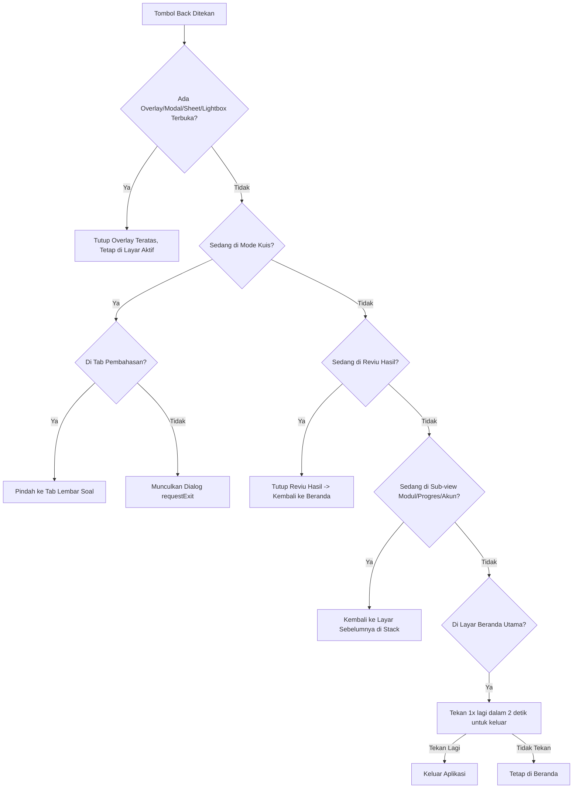

# FLOW-SPEC: TKA Master Mobile & Web Flow Specification

Spesifikasi alur kerja, navigasi back stack, state otentikasi, persistensi data, dan aturan akses TKA Master.

---

## 1. State Auth & Matriks Transisi

Sistem memiliki **3 State Utama**:
1. **Tanpa Sesi (`UNAUTH`)**: Pengunjung mengakses Landing Page (`/`). Belum memilih mode tamu atau login.
2. **Mode Tamu (`GUEST`)**: Pengguna belajar tanpa login di Web App (`/app`).
   - Identitas: "Tamu TKA".
   - Kuota AI Tutor: 5 tanya/hari.
   - Namespace Storage: Terisolasi pada prefix `tka_guest_*`.
   - Tidak memiliki akses ke token `tka_supabase_auth_token` atau profil `tka_user`.
3. **Mode Login (`LOGGED_IN`)**: Pengguna terotentikasi via Google OAuth Supabase.
   - Identitas: Nama & Avatar Google akun siswa.
   - Kuota AI Tutor: 25 tanya/hari (free tier) atau subscriber.
   - Namespace Storage: `tka_user_*` dan database Supabase (tabel `users`, `attempts`, `progress`).

### Matriks Transisi State

| Dari State | Aksi / Trigger | Ke State | Perilaku & Efek Samping |
| :--- | :--- | :--- | :--- |
| **UNAUTH** | Buka Landing Page (`/`) saat ada sesi login valid | **LOGGED_IN** | Auto-redirect ke `/app` via `history.replaceState` (cegah back loop). CTA berubah jadi "Lanjut ke Beranda". |
| **UNAUTH** | Klik "Mulai Latihan" / "Coba tanpa login" | **GUEST** | Masuk ke `/app` mode Tamu. Storage akun tidak disentuh. |
| **UNAUTH** | Klik "Login" / "Login Google" | **LOGGED_IN** | Redirect ke OAuth Google. Setelah callback sukses, masuk ke `/app` via `history.replaceState`. |
| **GUEST** | Klik tombol "Login" di Header / Akun | **LOGGED_IN** | Trigger Google OAuth. Data tamu tetap di namespace `tka_guest_*` dan TIDAK menimpa akun. |
| **GUEST** | Refresh halaman di `/app` | **GUEST** | Tetap mode Tamu. Status `sessionStorage` persistensi sesi tamu tetap terjaga. |
| **LOGGED_IN** | Klik "Keluar" (Logout) & Konfirmasi | **GUEST** | Hapus token `tka_supabase_auth_token`, profil `tka_user`, dan cache sesi akun. Masuk ke mode Tamu bersih (nama/progress akun HILANG dari tampilan). |
| **LOGGED_IN** | Sesi Expired (Token kedaluwarsa & gagal refresh) | **GUEST** | Graceful fallback ke Tamu tanpa crash. Tampilkan notifikasi non-blocking "Sesi berakhir, silakan login kembali untuk menyimpan progres permanen". |
| **LOGGED_IN** | Buka `/` dan klik "Coba sebagai Tamu" | **LOGGED_IN** | Terdeteksi sesi aktif -> Tampilkan dialog/konfirmasi atau arahkan ke Beranda akun aktif. Jika ingin tamu murni, user harus logout terlebih dahulu. |
| **LOGGED_IN** | Refresh halaman di `/app` | **LOGGED_IN** | Sesi tetap aktif, token diverifikasi via Supabase `getSession()`. |

---

## 2. Inventaris Layar, Popup, Sheet & Back Target

Setiap layar, modal, sub-view, dan sheet memiliki target balik yang telah ditentukan:

| No | Tipe Elemen | Nama / ID Elemen | Lokasi | Back HP / Nav Back Menuju Ke |
| :--- | :--- | :--- | :--- | :--- |
| 1 | Halaman | Landing Page (`/`) | Root | Keluar dari aplikasi (browser default) |
| 2 | Layar Utama | Beranda (`#panelBeranda`) | `/app` | Tampilkan toast: "Tekan sekali lagi untuk keluar" (tidak langsung keluar ke landing) |
| 3 | Tab Sub-view | Modul (`#panelModul`) | `/app` | Beranda (`#panelBeranda`) |
| 4 | Tab Sub-view | Progres (`#panelProgres`) | `/app` | Layar sebelumnya (jika dibuka dari Modul -> kembali ke Modul; jika dari Beranda -> ke Beranda) |
| 5 | Tab Sub-view | Akun (`#panelAkun`) | `/app` | Layar sebelumnya (Beranda / Modul) |
| 6 | Layar Ujian | Lembar Soal Ujian | `/app` (Kuis aktif) | Buka dialog konfirmasi exit `exitConfirmModal` |
| 7 | Sub-tab Ujian | Tab Pembahasan (`#tabWorkPembahasan`) | Kuis | Kembali ke sub-tab `Lembar Soal` (`#tabWorkSoal`) |
| 8 | Layar Hasil | Reviu Hasil (`#reviewHasilOverlay`) | Kuis Selesai | Kembali ke Beranda (TIDAK boleh kembali ke lembar soal ujian yang sudah selesai) |
| 9 | Halaman AI | Ruang Diskusi Mapel (`/ruang/<mapel>`) | Standalone | Layar pemanggil sebelumnya (`history.back()` / Beranda / Modul) |
| 10 | Modal Overlay | Atur Mapel (`#subjectModalBackdrop`) | Beranda | Tutup modal -> Tetap di Beranda |
| 11 | Modal Overlay | Daftar Soal (`#modalDaftarSoal`) | Kuis | Tutup modal -> Tetap di Lembar Soal |
| 12 | Modal Overlay | Konfirmasi Selesai (`#modalKonfirmasiSelesai`) | Kuis | Tutup modal -> Tetap di Lembar Soal |
| 13 | Modal Overlay | Konfirmasi Exit (`#exitConfirmModal`) | Kuis | Tutup modal -> Tetap di Lembar Soal |
| 14 | Modal Overlay | Konfirmasi Logout (`#tkaLogoutModal`) | Header / Akun | Tutup modal -> Tetap di layar aktif |
| 15 | Modal Overlay | Lapor Bug (`#modalLaporBug`) | Kuis / Global | Tutup modal -> Tetap di layar aktif |
| 16 | Modal Overlay | Lightbox Gambar (`#imageLightboxModal`) | Soal / Global | Tutup lightbox -> Kembali ke soal |
| 17 | Modal Overlay | Kartu Strategi (`#modalKartuStrategi`) | Reviu Hasil | Tutup modal -> Tetap di Reviu Hasil |
| 18 | Bottom Sheet | AI Tutor (`#cbtSidebarCol`, `.tutor-open`) | Kuis Mobile | Tutup sheet AI Tutor -> Kembali ke Lembar Soal |
| 19 | Dialog | "Login Dulu Yuk" Dialog | Beranda (Tamu) | Tutup dialog -> Tetap di Beranda (catat di sessionStorage agar tidak muncul lagi) |

---

## 3. Aturan Prioritas Back Stack

Urutan evaluasi penanganan tombol Back (Hardware Back Android / Swipe Back iOS / Browser History Pop):

### Rincian Prioritas:
1. **Prioritas 1 (Overlay / Modal / Sheet / Lightbox Teratas)**:
   - Tutup elemen popup teratas (`exitConfirmModal`, `modalDaftarSoal`, `modalKonfirmasiSelesai`, `subjectModalBackdrop`, `tkaLogoutModal`, `imageLightboxModal`, `modalLaporBug`, `cbtSidebarCol.tutor-open`).
   - Setiap penutupan via tombol [X], tombol [Batal], atau klik luar (backdrop) **wajib menyelaraskan history state** agar tidak meninggalkan entry hantu (ghost history entry).
2. **Prioritas 2 (Sub-tab Internal Ujian)**:
   - Jika berada di Tab Pembahasan -> Kembali ke Tab Lembar Soal.
3. **Prioritas 3 (Mode Ujian Berlangsung)**:
   - Setiap upaya navigasi keluar (back HP, klik ikon Beranda kiri atas, pindah tab) memanggil **`requestExit()`**:
     - Dialog: *"Keluar ke beranda? Progress yang belum selesai akan hilang."*
     - Tombol: `[Tetap di sini]` (batal) \| `[Keluar]` (konfirmasi keluar).
   - Tombol back saat dialog ini terbuka -> Menutup dialog dan tetap di kuis.
4. **Prioritas 4 (Sub-view Navigation Stack)**:
   - Modul -> Progress -> Back membawa kembali ke Modul.
   - Beranda -> Progress -> Back membawa kembali ke Beranda.
   - Beranda -> Akun -> Back membawa kembali ke Beranda.
5. **Prioritas 5 (Beranda Utama)**:
   - Di Beranda tidak boleh langsung terpental ke Landing Page.
   - Terapkan mekanisme *"Tekan sekali lagi untuk keluar"* dengan durasi toleransi 2000ms via Snackbar/Toast ringan.

---

## 4. Aturan Simpan Progres & Storage Namespace

### Prinsip Kejujuran Data (Honest Progress):
1. **Dilarang Autosave Sebelum Selesai**:
   - TIDAK ADA penulisan ke database (`attempts`, `progress`, `user_stats`) atau localStorage progress sebelum pengguna menekan tombol **"Selesai Tes"**.
   - Hapus semua status palsu atau teks "Tersimpan" di UI saat kuis berlangsung.
   - Teks jujur: *"Progress baru tersimpan setelah kamu klik Selesai Tes"*.
2. **Perilaku Refresh & Exit di Tengah Ujian**:
   - Jika pengguna me-refresh halaman, keluar via ikon beranda, atau back HP: **Ujian dibatalkan & progress yang belum selesai dibersihkan**.
   - Membuka kembali paket soal tersebut akan **mulai dari soal nomor 1**.
3. **Commit Tunggal pada "Selesai Tes"**:
   - Klik "Selesai Tes" adalah satu-satunya titik komit penyimpanan.
   - Pada titik ini:
     - Catat waktu per soal (hasil rekaman timestamp `Date.now()`).
     - Hitung skor, akurasi, dan generate autopsi.
     - Simpan rekaman ke storage (namespace pengguna atau tamu).
     - Kirim payload ke server (`/api/attempts`).

### Pemisahan Namespace Storage:

| Kategori Data | Akun Login (`LOGGED_IN`) | Akun Tamu (`GUEST`) |
| :--- | :--- | :--- |
| Token Autentikasi | `tka_supabase_auth_token` | *(Tidak ada)* |
| Data Pengguna | `tka_user` | `tka_guest_id` (UUID acak perangkat) |
| Progres Belajar | `tka_user_progress` + DB Supabase | `tka_guest_progress` (localStorage lokal) |
| Riwayat Tes Selesai | `tka_user_attempts` + DB Supabase | `tka_guest_attempts` (localStorage lokal) |
| Kuota AI Tutor | 25 tanya / hari (disinkron ke DB) | 5 tanya / hari (disinkron per IP/device) |
| Draft Sementara Ujian | State in-memory (dibersihkan saat exit) | State in-memory (dibersihkan saat exit) |

---

## 5. Tabel Akses Fitur: Tamu vs Login

| Fitur | Mode Tamu (`GUEST`) | Mode Login (`LOGGED_IN`) | Perilaku Saat Akses |
| :--- | :---: | :---: | :--- |
| Buka Dashboard Beranda | ✅ | ✅ | Tamu melihat banner halus ajakan login (non-blocking). |
| Klik Mapel & Mulai Latihan | ✅ | ✅ | **Identik**: Keduanya langsung masuk pengerjaan soal tanpa popup penghambat. |
| Pengerjaan Soal CBT & Timer | ✅ | ✅ | Fitur penuh, timer timestamp berjalan presisi. |
| AI Tutor di Lembar Soal | ✅ (5x/hari) | ✅ (25x/hari) | Kuota ditampilkan transparan. Tamu habis -> banner ajakan login. |
| Autopsi Hasil Tes | ✅ | ✅ | Ditampilkan setelah "Selesai Tes". |
| Simpan Progres Antar Perangkat | ❌ | ✅ | Tamu hanya tersimpan di perangkat saat ini. Login tersimpan ke cloud. |
| Akses AI Room per Mapel | ✅ | ✅ | Tersedia langsung dari Beranda & Modul untuk kedua mode. |
| Ekspor / Cetak Hasil | ❌ | ✅ | Fitur tambahan akun login. |
