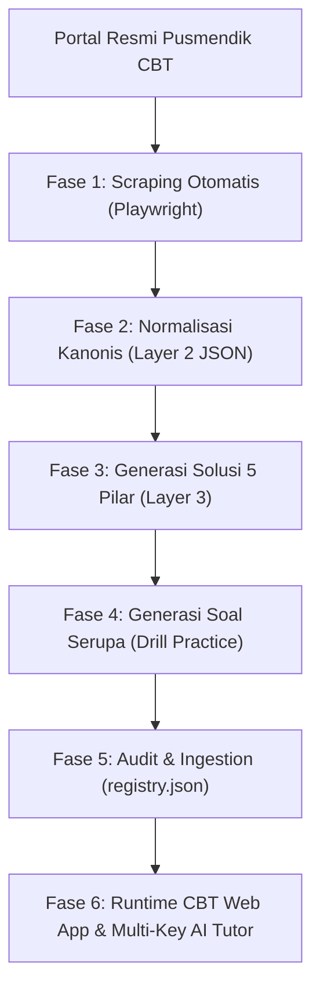
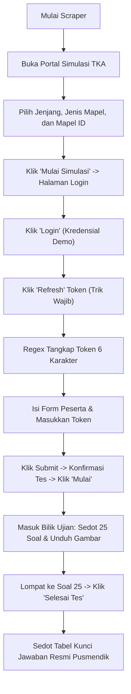
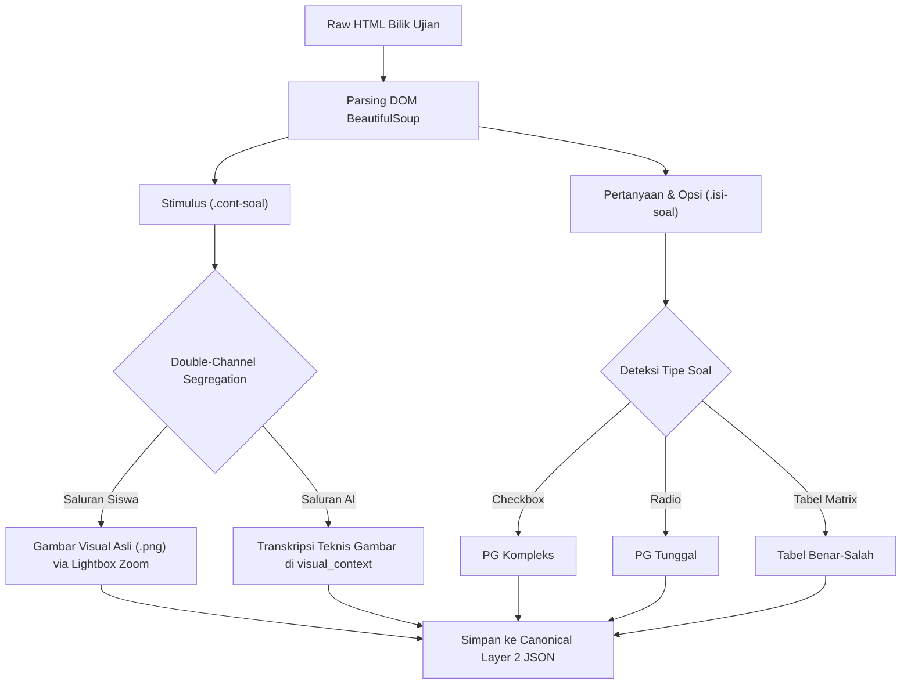
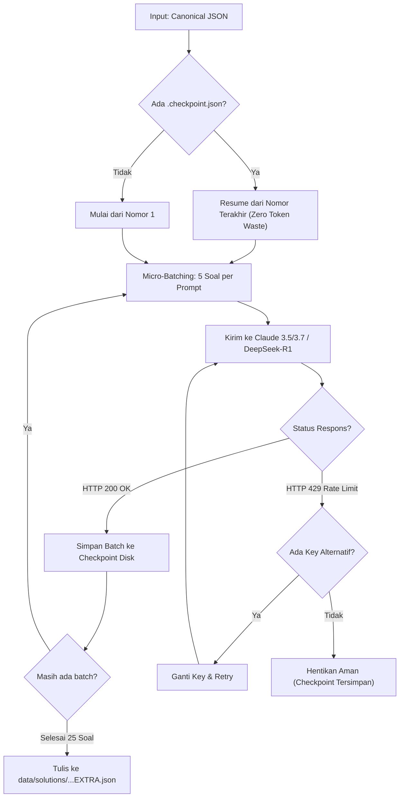
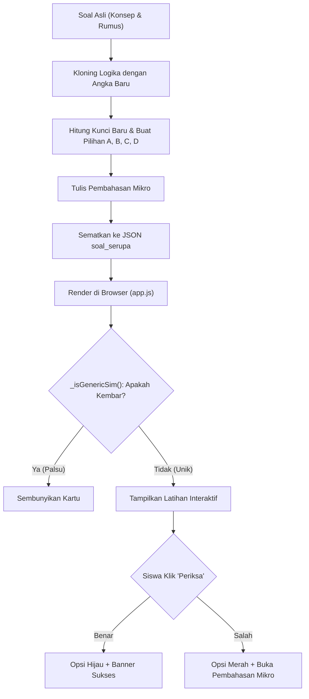
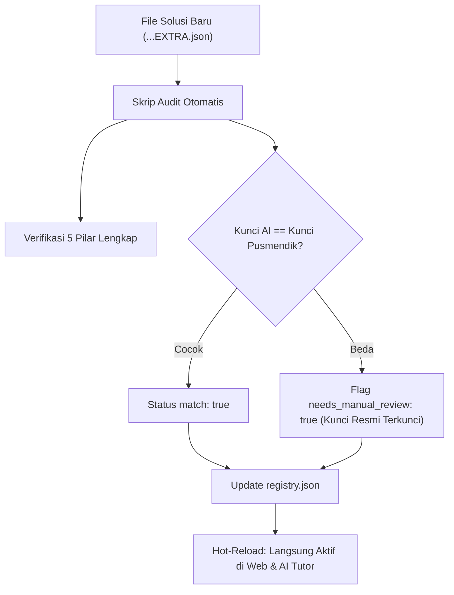
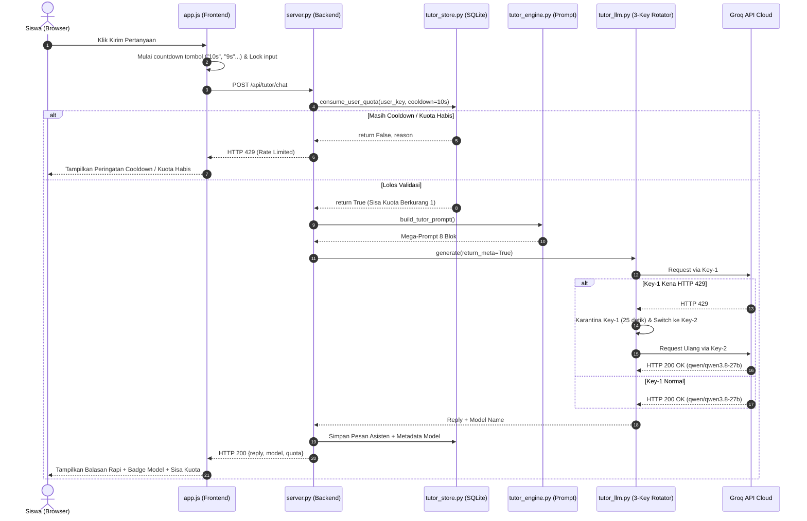

# PRODUCT REQUIREMENTS DOCUMENT (PRD)
# SISTEM SIMULASI TKA, PIPELINE SCRAPING, DATA ENGINE KANONIS, & AI TUTOR

> ⚠️ **ARSIP — dokumen ini sudah tidak mencerminkan kondisi terkini.**
> PRD ini ditulis untuk arsitektur awal (server.py monolit, satu template beranda).
> Kondisi sekarang (Okt 2026) berbeda — lihat bagian **Delta** di bawah dan
> `PLAN.md` sebagai sumber kebenaran status terkini. Jangan jadikan file ini
> acuan implementasi baru.

## Delta — apa yang sudah berubah sejak PRD ditulis

| Area | Dulu (PRD) | Sekarang (Okt 2026) |
|------|------------|---------------------|
| **Kuota** | Belum didefinisikan | Guest 5 / Free(login) 20 / Pro 100 pesan per hari; reset 00:00 WIB; enforcement server-side (`_daily_limit`, `_today_wib`). Lihat PLAN.md Fase 4. |
| **Struktur folder** | Satu template beranda + `server.py` | Beranda dual-mode (Stitch mobile inline + `home_desktop.html` via iframe); panel Modul/Progres/Akun sebagai file mandiri di `workspace_modul/`, `workspace_progres/`, `workspace_akun/` (iframe + postMessage). Lihat `docs/adr/`. |
| **Model AI** | Groq, rotasi 3 key, cooldown 10 dtk | Provider utama Groq/Qwen (multi-key round-robin), Gemini 3.8 Flash opsional, Ollama fallback lokal. User bisa ganti model dari UI (popover pemilih model, persist `localStorage['tka_active_ai_model']`). Lihat PLAN.md Fase 12. |
| **Aturan Emas #2 (kunci)** | "Kunci resmi = MUTLAK, DILARANG ubah" | Direvisi: koreksi kunci **diperbolehkan** dengan flag `needs_manual_review: true` + bukti terdokumentasi di `review_reason` (bukan dilarang mutlak). Lihat revisi di §9 PRD ini. |
| **Cache busting** | — | Manual via `?v=N` di `index.html` (style.css v=47, app.js v=48); `privacy.html`/`terms.html` disamakan ke v=47. |

---

| Dokumen | Product Requirements Document (PRD) |
| :--- | :--- |
| **Lokasi File** | `PRD.md` (Root Workspace) |
| **Versi** | 1.0.0 (Master End-to-End) |
| **Status** | Resmi / Siap Diimplementasikan |

---

# DAFTAR ISI
1. [Master Flowchart: Siklus Hidup End-to-End Sistem](#1-master-flowchart-siklus-hidup-end-to-end-sistem)
2. [Fase 1: Protokol Masuk & Scraping Portal Pusmendik CBT](#2-fase-1-protokol-masuk--scraping-portal-pusmendik-cbt)
3. [Fase 2: Normalisasi Kanonis & Double-Channel Gambar (Layer 2)](#3-fase-2-normalisasi-kanonis--double-channel-gambar-layer-2)
4. [Fase 3: Generasi Pembahasan 5 Pilar & Manajemen Token AI (Layer 3)](#4-fase-3-generasi-pembahasan-5-pilar--manajemen-token-ai-layer-3)
5. [Fase 4: Sistem Soal yang Mirip (Soal Serupa / Drill Practice)](#5-fase-4-sistem-soal-yang-mirip-soal-serupa--drill-practice)
6. [Fase 5: Audit, Verifikasi Kunci Otoritatif, & Registry Hot-Swapping](#6-fase-5-audit-verifikasi-kunci-otoritatif--registry-hot-swapping)
7. [Fase 6: Runtime Serving Engine (Client CBT, Mega-Prompt, & 3-Key Groq Rotation)](#7-fase-6-runtime-serving-engine-client-cbt-mega-prompt--3-key-groq-rotation)
8. [Fase 7: Struktur Folder & Skema Database SQLite](#8-fase-7-struktur-folder--skema-database-sqlite)

---

# 1. Master Flowchart: Siklus Hidup End-to-End Sistem

Berikut adalah bagan alir utama yang menghubungkan seluruh subsistem dari pintu gerbang Pusmendik hingga web aplikasi pengguna:

### Diagram Visual (Bisa Dibaca Langsung di Mode Teks):
```text
┌────────────────────────────────────────────────────────────────────────┐
│                      PORTAL RESMI PUSMENDIK CBT                        │
│             https://pusmendik.kemendikdasmen.go.id/tka/                │
└───────────────────────────────────┬────────────────────────────────────┘
                                    │
                                    ▼
┌────────────────────────────────────────────────────────────────────────┐
│                   FASE 1: SCRAPER AUTOMATION (PLAYWRIGHT)              │
│  1. Pilih Jenjang (SMA/SMP/SD) & Jenis Mapel (Wajib/Pilihan)           │
│  2. Bypass Login Demo CBT & Ambil Token via Tombol "Refresh"           │
│  3. Submit Form Data Peserta -> Masuk ke Bilik Ujian 25 Soal           │
│  4. Sedot Raw HTML Soal + Unduh Seluruh Gambar ke Lokal                │
│  5. Jump ke Soal 25 -> Selesaikan Ujian -> Sedot Kunci Resmi Pusmendik │
└───────────────────────────────────┬────────────────────────────────────┘
                                    │
                                    ▼
┌────────────────────────────────────────────────────────────────────────┐
│              FASE 2: NORMALISASI DATA KANONIS (LAYER 2)                │
│  1. Parsing HTML: Pisahkan Stimulus, Pertanyaan, dan Tabel Opsi        │
│  2. Ekstraksi Formula Matematika dari Atribut data-latex Resmi         │
│  3. Double-Channel Image Segregation:                                  │
│     ├── Channel Siswa : Gambar asli lokal (.png) via Lightbox Zoom     │
│     └── Channel AI    : Transkripsi teknis disimpan di visual_context  │
│  4. Normalisasi Tipe: PG Tunggal, PG Kompleks, Tabel Benar-Salah       │
│  5. Simpan ke: data/canonical/mapel_paket_n.json                       │
└───────────────────────────────────┬────────────────────────────────────┘
                                    │
                                    ▼
┌────────────────────────────────────────────────────────────────────────┐
│               FASE 3: GENERASI SOLUSI 5 PILAR (LAYER 3)                │
│  1. Micro-Batching: Dicicil per 5 soal agar token tidak habis          │
│  2. Model Reasoning (Claude 3.5/3.7 Sonnet / DeepSeek-R1)              │
│  3. Bangun 5 Pilar: Konsep, Glosarium, Alur Pikir, Langkah, Tips       │
│  4. Kunci Jawaban Resmi Pusmendik dikunci sebagai Ground Truth         │
│  5. Checkpoint Disk (.checkpoint.json) -> Auto-Resume jika terputus    │
└───────────────────────────────────┬────────────────────────────────────┘
                                    │
                                    ▼
┌────────────────────────────────────────────────────────────────────────┐
│               FASE 4: GENERASI SOAL SERUPA (DRILL PRACTICE)            │
│  1. Kloning Konsep Asli dengan Nilai Angka/Skenario Cerita Baru        │
│  2. Hitung Kunci Baru & Buat Opsi Pengecoh yang Logis                  │
│  3. Sediakan Pembahasan Mikro khusus untuk Soal Serupa                 │
│  4. Anti-Pattern Guard (_isGenericSim): Tolak template kembar lama!   │
└───────────────────────────────────┬────────────────────────────────────┘
                                    │
                                    ▼
┌────────────────────────────────────────────────────────────────────────┐
│             FASE 5: AUDIT, VERIFIKASI & REGISTRY INGESTION             │
│  1. Validasi Skema JSON (Semua field wajib 5 pilar terisi)             │
│  2. Cross-Check Kunci: Kunci AI vs Kunci Resmi Pusmendik               │
│     ├── Jika Cocok : match: true                                       │
│     └── Jika Beda  : Flag needs_manual_review: true (Kunci tak diubah) │
│  3. Daftarkan File Solusi Baru di data/solutions/registry.json         │
│  4. Hot-Reload Aktif Otomatis tanpa restart server / ubah kode frontend│
└───────────────────────────────────┬────────────────────────────────────┘
                                    │
                                    ▼
┌────────────────────────────────────────────────────────────────────────┐
│                  FASE 6: RUNTIME SERVING & AI TUTOR                    │
│  1. Web App CBT (index.html, style.css, app.js)                        │
│  2. Tab Tata Cara: Render Kartu 5 Pilar + Formula KaTeX                │
│  3. Kartu Latihan: Interaksi Evaluasi Mandiri Siswa (Benar/Salah)      │
│  4. Sidebar AI Tutor:                                                  │
│     ├── Proteksi User: Cooldown 10s + Kuota Harian (10x Free / 100x Sub│
│     ├── Mega-Prompt Assembly: Injeksi L2 + L3 + Kunci + Riwayat        │
│     ├── Queue Concurrency: Maksimal 6 request paralel ke Groq          │
│     └── Rotasi 3 Key Groq: Auto-quarantine 25s bila kena HTTP 429     │
│  5. Balasan Rapi dengan Formula KaTeX + Badge Model Aktual Dinamis     │
└────────────────────────────────────────────────────────────────────────┘
```

### Versi Mermaid (Preview Mode):


---

# 2. Fase 1: Protokol Masuk & Scraping Portal Pusmendik CBT

### Flowchart Rinci Alur Masuk & Scraping:
```text
[Buka Browser Playwright]
       │
       ▼
[Navigasi ke: https://pusmendik.kemendikdasmen.go.id/tka/simulasi_tka/]
       │
       ▼
[Pilih Dropdown #jenjang: 'sma' | 'smp' | 'sd']
       │
       ▼
[Pilih Dropdown #jenis_mapel: '1' (Wajib) | '2' (Pilihan)]
       │
       ▼
[Klik Dropdown Kustom #mapel_toggle -> Klik Opsi .mapel-option[data-value='...']]
       │
       ▼
[Klik Tombol 'Mulai Simulasi' -> Dialihkan ke Halaman /login/]
       │
       ▼
[Klik Tombol 'Login' -> Kredensial Demo Terisi Otomatis]
       │
       ▼
[Masuk ke Halaman: /konfirmasi_data/]
       │
       ▼
[Wajib: Klik Tombol 'Refresh' pada Box Token (Tunggu 1.5 detik)]
       │
       ▼
[Regex Token 6 Karakter: r"Token\s*[:=]\s*([A-Z0-9]{6})"]
       │
       ▼
[Isi Form: Nama='Peserta Simulasi', Tgl='01', Bulan='01', Tahun='2005', Token=Hasil Regex]
       │
       ▼
[Klik 'Submit' -> Dialihkan ke Halaman /konfirmasi_tes/]
       │
       ▼
[Klik Tombol 'Mulai' -> Masuk ke Bilik Ujian CBT]
       │
       ▼
[Tunggu Kontainer .soal-soal Termuat Penuh]
       │
       ├─────────────────────────────────────────┐
       ▼                                         ▼
[Sedot Seluruh innerHTML 25 Soal]       [Unduh Seluruh Gambar ke Lokal]
       │                                         │
       └────────────────────┬────────────────────┘
                            │
                            ▼
[Lompat ke Soal Nomor 25 -> Klik 'Selesai Tes' -> Konfirmasi 'Ya, Selesai']
                            │
                            ▼
[Masuk ke Halaman Rekap Hasil Ujian Pusmendik]
                            │
                            ▼
[Ekstrak Seluruh Kunci Jawaban Resmi dari Tabel Hasil Ujian]
                            │
                            ▼
[Simpan ke File: raw_html_soal.html & kunci_resmi.json]
```

### Versi Mermaid:


---

# 3. Fase 2: Normalisasi Kanonis & Double-Channel Gambar (Layer 2)

### Flowchart Rinci Double-Channel & Parsing Soal:
```text
┌────────────────────────────────────────────────────────┐
│                   RAW EXAM HTML PUSMENDIK              │
└───────────────────────────┬────────────────────────────┘
                            │
                            ▼
            [BeautifulSoup: Loop Setiap .soal-soal]
                            │
       ┌────────────────────┴────────────────────┐
       ▼                                         ▼
[Blok Stimulus (.cont-soal)]              [Blok Pertanyaan (.isi-soal)]
 • Bersihkan wrapper col-lg-6              • Ekstrak teks pertanyaan bersih
 • Ekstrak tag img & simpan lokal          • Ekstrak tabel opsi (A s.d. E)
 • Ekstrak atribut data-latex              • Deteksi tipe: PG, Kompleks, B-S
       │                                         │
       └────────────────────┬────────────────────┘
                            │
                            ▼
        [DOUBLE-CHANNEL IMAGE PROCESSING]
        ┌───────────────────┴───────────────────┐
        ▼                                       ▼
 [CHANNEL 1: SISWA (HUMAN)]              [CHANNEL 2: AI (VISION)]
 • Siswa HANYA melihat gambar            • Transkripsikan isi gambar:
   asli lokal (.png).                      - Nilai sumbu grafik X & Y
 • Fitur Klik Zoom (Lightbox).             - Bentuk kurva & gradien
 • DILARANG membocorkan teks               - Angka ukuran / data tabel
   transkripsi bahasa Inggris            • Simpan di field "visual_context"
   ke pandangan siswa!                   • Murni sebagai mata bagi AI
        │                                       │
        └───────────────────┬───────────────────┘
                            │
                            ▼
    [Rakit Objek Soal Kanonis Lengkap (Layer 2 Single Truth)]
                            │
                            ▼
     [Simpan ke: data/canonical/sma/mapel_paket_n.json]
```

### Versi Mermaid:


---

# 4. Fase 3: Generasi Pembahasan 5 Pilar & Manajemen Token AI (Layer 3)

### Flowchart Rinci Pengerjaan Batch & Auto-Resume:
```text
[Mulai Generator Solusi: data/canonical/mapel_paket_n.json]
                         │
                         ▼
           [Periksa File: .checkpoint.json]
                         │
             ┌───────────┴───────────┐
             ▼                       ▼
   [Ada File Checkpoint]    [Belum Ada Checkpoint]
   Baca soal yang sudah     Mulai pengerjaan dari
   selesai (misal no 1-10)  soal nomor 1
             │                       │
             └───────────┬───────────┘
                         │
                         ▼
        [Bagi Soal ke Micro-Batch (5 Soal per Siklus)]
        Batch 1: Soal 1-5   | Batch 2: Soal 6-10
        Batch 3: Soal 11-15 | Batch 4: Soal 16-20 | Batch 5: Soal 21-25
                         │
                         ▼
        [Rakit Prompt Pedagogis 5 Pilar + Kunci Resmi]
                         │
                         ▼
        [Panggil Model Reasoning: Claude 3.5/3.7 / DeepSeek-R1]
                         │
             ┌───────────┴───────────┐
             ▼                       ▼
     [Respons Berhasil 200]   [Galat 429 / Kuota Token Habis]
     • Validasi Schema JSON   • Cek API Key Cadangan
     • Tulis ke checkpoint    • Jika ada: Switch key & Cooldown 25s
             │                • Jika habis: Simpan checkpoint disk
             │                  dan pause aman (BISA DI-RESUME!)
             ▼
     [Apakah Ada Batch Berikutnya?]
             │
     ┌───────┴───────┐
     ▼               ▼
   [Ya]            [Tidak (Selesai 25 Soal)]
 Ulangi ke      Konsolidasikan seluruh batch ke:
 Batch Baru     data/solutions/MAPEL_PAKET_N_EXTRA.json
```

### Versi Mermaid:


---

# 5. Fase 4: Sistem Soal yang Mirip (Soal Serupa / Drill Practice)

### Flowchart Rinci Evaluasi Soal Serupa:
```text
┌────────────────────────────────────────────────────────┐
│                   SOAL ASLI PUSMENDIK                  │
│     Konsep: Operasi Irisan & Gabungan Himpunan         │
│     Angka : A={1..5}, B={genap}, C={prima <= 10}       │
└───────────────────────────┬────────────────────────────┘
                            │
                            ▼
        [PROSES KLONING LOGIKA ISOMORFIK]
 • Pertahankan Konsep Inti 100% SAMA
 • Ubah Nilai Numerik/Variabel:
   P={1..7}, Q={ganjil}, R={prima <= 7}
 • Hitung Ulang Jawaban Benar dari Nol -> Kunci Baru: "A"
 • Buat Opsi Pilihan A, B, C, D dengan Pengecoh Realistis
 • Buat Pembahasan Mikro Ringkas (3 Baris)
                            │
                            ▼
       [Sematkan ke Objek JSON: "soal_serupa"]
                            │
                            ▼
           [INTERAKSI SISWA DI BROWSER]
                            │
                            ▼
        [Pemeriksaan Anti-Pattern: _isGenericSim()]
         Apakah teks kembar di lebih dari 1 soal?
               ┌────────────┴────────────┐
               ▼                         ▼
            [Ya]                       [Tidak]
   Sembunyikan kartu latihan      Tampilkan Pertanyaan &
   agar tidak menyesatkan!        Pilihan Opsi A, B, C, D
                                         │
                                         ▼
                             [Siswa Memilih Opsi]
                                         │
                                         ▼
                       [Klik: 'Periksa Jawaban Latihan']
                                         │
                         ┌───────────────┴───────────────┐
                         ▼                               ▼
                  [Jawaban Benar]                 [Jawaban Salah]
               • Opsi berubah HIJAU            • Opsi siswa berubah MERAH
               • Banner Sukses                 • Opsi benar berubah HIJAU
                                               • Tampilkan Pembahasan Mikro
```

### Versi Mermaid:


---

# 6. Fase 5: Audit, Verifikasi Kunci Otoritatif, & Registry Hot-Swapping

### Flowchart Rinci Verifikasi Kunci & Registry:
```text
┌────────────────────────────────────────────────────────┐
│     FILE SOLUSI BARU: MAPEL_PAKET_N_EXTRA.json        │
└───────────────────────────┬────────────────────────────┘
                            │
                            ▼
            [Jalankan Skrip Audit Integritas]
                            │
       ┌────────────────────┴────────────────────┐
       ▼                                         ▼
[Uji Kelengkapan 5 Pilar]                 [Uji Kesesuaian Kunci Resmi]
• concept_kunci tidak kosong              • Bandingkan kunci hasil AI vs
• glossary berisi istilah                   kunci resmi Pusmendik
• steps berisi langkah nyata              • Kunci resmi = prioritas utama
       │                                    (bukan mutlak)
       └────────────────────┬────────────────────┘
                            │
                            ▼
             [Apakah Kunci AI Sesuai Kunci Resmi?]
               ┌────────────┴────────────┐
               ▼                         ▼
           [Cocok]                   [Berbeda]
      Tandai status:            Tandai flag:
      match: true               needs_manual_review: true
                                Tulis alasan di review_reason.
                                Koreksi kunci BOLEH jika ada bukti kuat
                                (gambar sumber terbaca / hitung ulang
                                terverifikasi); flag review tetap aktif
                                sampai dikonfirmasi.
               │                         │
               └────────────┬────────────┘
                            │
                            ▼
           [Daftarkan File di: registry.json]
           "mapel_paket_n": {
              "active_source": "MAPEL_PAKET_N_EXTRA.json"
           }
                            │
                            ▼
         [HOT-RELOAD INSTAN DI RUNTIME SERVER]
 • server.py & solution_loader membaca registry secara dinamis.
 • Tab Tata Cara & AI Tutor LANGSUNG beralih ke solusi baru
   tanpa perlu restart server dan tanpa ubah sebaris pun kode frontend!
```

### Versi Mermaid:


---

# 7. Fase 6: Runtime Serving Engine (Client CBT, Mega-Prompt, & 3-Key Groq Rotation)

### Flowchart Rinci Request Chat Siswa ke AI Tutor:
```text
[Siswa Mengetik Pertanyaan di Sidebar AI Tutor & Klik Kirim]
                             │
                             ▼
            [Pemeriksaan Cooldown Lokal di Browser]
            Apakah countdown 10 detik sedang aktif?
                 ┌───────────┴───────────┐
                 ▼                       ▼
               [Ya]                    [Tidak]
         Abaikan klik &           Mulai hitung mundur tombol
         tunggu hitungan          ("10s", "9s"...) & Lock input
                                         │
                                         ▼
                        [POST /api/tutor/chat ke Server]
                                         │
                                         ▼
                 [Validasi Kuota & Cooldown di Database SQLite]
                       consume_user_quota(user_key)
                 ┌───────────────────────┴───────────────────────┐
                 ▼                                               ▼
         [Ditolak Server]                                 [Disetujui Server]
   • Masih cooldown -> HTTP 429                   • Kuota harian terpotong 1x
   • Kuota harian habis -> HTTP 429               • Simpan pesan ke DB SQLite
                                                                 │
                                                                 ▼
                                                  [Rakit Mega-Prompt 8 Blok]
                                                  Injeksi Soal (L2) + Solusi (L3)
                                                  + Kunci + Riwayat Chat
                                                                 │
                                                                 ▼
                                                [Antrean Concurrency Semaphore]
                                                Maksimal 6 panggilan paralel ke Groq
                                                                 │
                                                                 ▼
                                                [Rotasi 3 API Key Groq]
                                                Key 1 -> Key 2 -> Key 3
                                                                 │
                                                                 ▼
                                                [Kirim ke Model: qwen/qwen3.8-27b]
                                                                 │
                                                 ┌───────────────┴───────────────┐
                                                 ▼                               ▼
                                         [HTTP 200 Sukses]               [HTTP 429 Limit]
                                      Simpan balasan ke DB            Karantina key 25 detik,
                                      + Ambil nama model aktual       otomatis alihkan ke key
                                                 │                    berikutnya secara instan!
                                                 ▼
                                     [Kirim JSON ke Browser]
                                     • Balasan teks rapi KaTeX
                                     • Badge nama model aktual
                                     • Sisa kuota harian terupdate
                                     (Tampil dalam ~1.5 detik!)
```

### Versi Sequence Diagram (Mermaid):


---

# 8. Fase 7: Struktur Folder & Skema Database SQLite

### Struktur Folder Baku:
```text
SCRAPE_TKA/
├── core/                         # Server & Engine Utama
│   ├── server.py                 # HTTP Server & Router API
│   ├── tutor_engine.py           # Mega-Prompt & Guardrails
│   ├── tutor_llm.py              # Provider LLM & Rotasi 3 Key
│   ├── tutor_store.py            # SQLite Manager (Users, Kuota, Chat)
│   └── solution_loader.py        # Dynamic Solution Registry Router
│
├── pipeline/                     # Skrip Otomasi Scraping & Generasi
│   ├── 01_scraper_exam.py        # Playwright: Bilik Ujian & Gambar
│   ├── 02_scraper_kunci.py       # Playwright: Selesaikan Ujian & Kunci
│   ├── 03_build_canonical.py     # Parser: Raw HTML -> Layer 2 Canonical JSON
│   ├── 04_generate_layer3.py     # Batch Generator: Solusi 5 Pilar & Soal Serupa
│   └── 05_validate_integrity.py  # Audit Integritas & Cross-Check Kunci
│
├── web/                          # Frontend User Interface
│   ├── index.html                # UI CBT Pusmendik + Sidebar AI Tutor
│   ├── style.css                 # Desain Typography, Chip Model, KaTeX
│   └── app.js                    # Navigasi CBT, Engine Matematika, Chat Stream
│
├── data/                         # Database & Asset Data
│   ├── ai_tutor.db               # Database SQLite
│   ├── raw_html/                 # Backup Tangkapan Mentah HTML Ujian
│   ├── media/                    # Seluruh Gambar Stimulus & Pilihan Jawaban
│   ├── canonical/                # Layer 2: Single-Truth Canonical JSONs
│   └── solutions/                # Layer 3: Pembahasan 5 Pilar & registry.json
│
└── tests/                        # Automated Pytest Suite (63 Passed)
```

### Skema Database SQLite (`data/ai_tutor.db`):
```sql
-- Tabel 1: Pelacakan Kuota & Cooldown Pengguna
CREATE TABLE IF NOT EXISTS ai_tutor_users (
    user_key           TEXT PRIMARY KEY,             -- Cookie HMAC anonim atau ID Login
    tier               TEXT NOT NULL DEFAULT 'free', -- 'free' (10x/hari) | 'subscriber' (100x/hari)
    daily_date         TEXT,                         -- 'YYYY-MM-DD' untuk auto-reset harian
    daily_count        INTEGER NOT NULL DEFAULT 0,   -- Jumlah pertanyaan hari ini
    last_request_time  REAL NOT NULL DEFAULT 0,      -- Timestamp unix untuk validasi cooldown 10 detik
    created_at         TEXT NOT NULL,
    updated_at         TEXT NOT NULL
);

-- Tabel 2: Sesi Percakapan per Soal
CREATE TABLE IF NOT EXISTS ai_tutor_conversations (
    id                    INTEGER PRIMARY KEY AUTOINCREMENT,
    user_key              TEXT NOT NULL,
    canonical_question_id TEXT NOT NULL,
    subject               TEXT NOT NULL,
    paket                 INTEGER NOT NULL,
    question_number       INTEGER NOT NULL,
    title                 TEXT,
    summary               TEXT,                         -- Ringkasan obrolan panjang
    message_count         INTEGER NOT NULL DEFAULT 0,
    created_at            TEXT NOT NULL,
    updated_at            TEXT NOT NULL,
    status                TEXT NOT NULL DEFAULT 'active'
);

-- Tabel 3: Riwayat Balasan Chat & Nama Model
CREATE TABLE IF NOT EXISTS ai_tutor_messages (
    id              INTEGER PRIMARY KEY AUTOINCREMENT,
    conversation_id INTEGER NOT NULL REFERENCES ai_tutor_conversations(id),
    role            TEXT NOT NULL CHECK (role IN ('user','assistant','system')),
    content         TEXT NOT NULL,
    seq             INTEGER NOT NULL,
    request_id      TEXT,                               -- Idempotency protection
    created_at      TEXT NOT NULL,
    metadata        TEXT                                -- JSON: {"model": "qwen/qwen3.8-27b", ...}
);
```

---

# 9. Matriks 8 Aturan Emas Keberhasilan (The Golden Rules)

| No | Komponen | Aturan Emas yang Menjamin Keberhasilan |
| :---: | :--- | :--- |
| **1** | **Scraping** | Wajib klik tombol `Refresh` token sebelum submit formulir peserta ujian. |
| **2** | **Kunci Jawaban** | Diserap langsung dari tabel rekap hasil ujian Pusmendik (Ground Truth Otoritatif). Koreksi **diperbolehkan** hanya dengan `needs_manual_review: true` + bukti di `review_reason` — bukan dilarang mutlak. |
| **3** | **Gambar Siswa** | Tampilan siswa murni menampilkan gambar asli; transkripsi teks teknis disembunyikan khusus untuk AI. |
| **4** | **Rumus KaTeX** | Diekstrak dari atribut resmi `data-latex` agar simbol matematika tidak rusak oleh OCR. |
| **5** | **Pengerjaan Solusi**| Dicicil 5 soal per batch dengan checkpoint disk agar tidak terkena batas token. |
| **6** | **Soal Serupa** | Dilarang memakai template kembar; wajib kloning konsep unik dengan angka baru. |
| **7** | **AI Concurrency** | Dibatasi maksimal 6 request simultan ke Groq; siswa diberi jeda cooldown 10 detik. |
| **8** | **Rotasi Key** | Otomatis rotasi 3 API key Groq; jika terkena HTTP 429, key dikarantina 25 detik secara transparan. |
