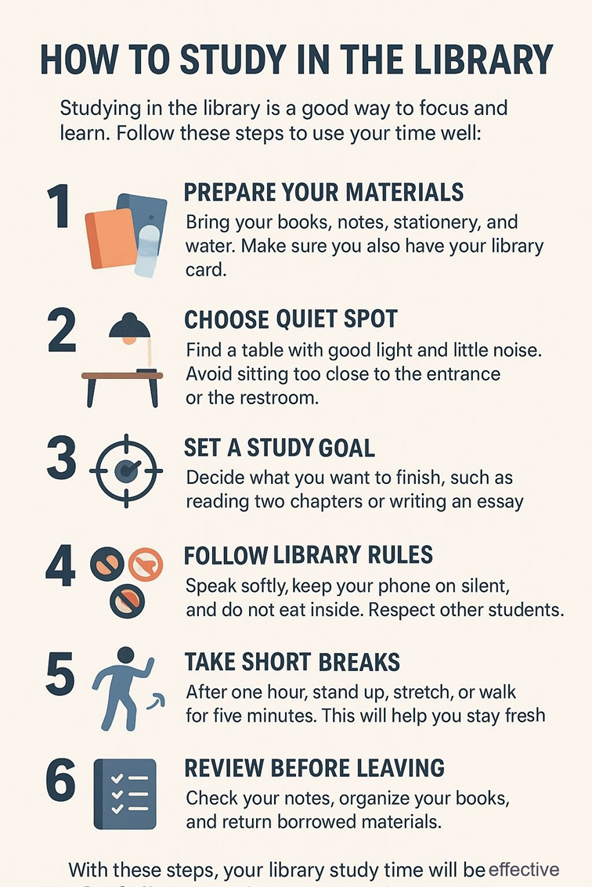

# Kumpulan Soal Simulasi TKA - Bahasa Inggris Paket 1
**Jenjang:** SMK / SMA / MA / Sederajat (Mata Pelajaran Wajib)
**Total Soal:** 20 butir
**Sumber:** Portal Pusmendik Kemendikdasmen (Simulasi ANBK / TKA)

---

## Soal No. 1 `[Pilihan Ganda]`

### Stimulus / Bacaan:
Teks untuk soal nomor 1 s.d. 5!
King Hung Vuong VI had a beautiful daughter. He did not want her to marry just any prince. So, he made an announcement that he was looking for the right husband for her. Many princes came from faraway lands, but none of them was a good match for the princess.
Son Tinh was the Spirit of the Mountain, and Thuy Tinh was the Spirit of the Waters. One day, they both appeared as young noblemen and asked to marry the princess. They were equally talented, powerful, and respected. The King found it hard to choose, so he decided to give them a test. He said that the one who brought the proper wedding gifts first the next morning would marry his daughter.
The next day, Son Tinh arrived early with his gifts. The King kept his promise and gave the princess to him. Thuy Tinh was angry about losing. He challenged Son Tinh to fight for the princess. But Son Tinh refused, believing he had already won fairly. Furious, Thuy Tinh used his power to call the rivers and streams to rise. Soon, the land was covered with floods that destroyed crops and homes.
Son Tinh stayed calm in his mountain palace. Whenever the water rose, he made his mountains higher. After many days of fighting, Thuy Tinh grew tired and ordered the waters to retreat. Still, he never accepted his defeat. Every year, he tried again to attack, and this is how monsoons came to Vietnam.

### Pertanyaan:
Which of the following outlines shows the correct main points of the story?

### Pilihan Jawaban:
- **[A]** King Hung Vuong VI wanted the best husband for his daughter. Many princes came but none was suitable. Son Tinh and Thuy Tinh both wanted to marry her. The King gave them a test. Thuy Tinh arrived first with the wedding gifts. The princess was given to Thuy Tinh.
- **[B]** King Hung Vuong VI had a beautiful daughter. He announced he was looking for the right husband. Son Tinh and Thuy Tinh appeared and asked to marry her. The King gave them a test with wedding gifts. Son Tinh arrived first and married the princess. Thuy Tinh attacked with floods but was defeated.
- **[C]** King Hung Vuong VI asked his daughter to choose her husband. The princess liked both Son Tinh and Thuy Tinh. The King delayed his decision for many days. Finally, he asked them to fight each other. Thuy Tinh lost the battle and left the land. The country never suffered from floods again.
- **[D]** King Hung Vuong VI searched for a husband for his daughter. Son Tinh and Thuy Tinh wanted to marry her. The King gave them a challenge. Thuy Tinh lost the test and became angry. He called the waters to rise and destroy the land. Son Tinh drowned in the floods.
- **[E]** The King wanted a nobleman for his daughter. He invited many princes to the palace. Son Tinh and Thuy Tinh competed for the princess. Son Tinh refused the challenge of gifts. The King chose Thuy Tinh as the winner. Thuy Tinh ruled peacefully without floods.

---

## Soal No. 2 `[Pilihan Ganda]`

### Stimulus / Bacaan:
Teks untuk soal nomor 1 s.d. 5!
King Hung Vuong VI had a beautiful daughter. He did not want her to marry just any prince. So, he made an announcement that he was looking for the right husband for her. Many princes came from faraway lands, but none of them was a good match for the princess.
Son Tinh was the Spirit of the Mountain, and Thuy Tinh was the Spirit of the Waters. One day, they both appeared as young noblemen and asked to marry the princess. They were equally talented, powerful, and respected. The King found it hard to choose, so he decided to give them a test. He said that the one who brought the proper wedding gifts first the next morning would marry his daughter.
The next day, Son Tinh arrived early with his gifts. The King kept his promise and gave the princess to him. Thuy Tinh was angry about losing. He challenged Son Tinh to fight for the princess. But Son Tinh refused, believing he had already won fairly. Furious, Thuy Tinh used his power to call the rivers and streams to rise. Soon, the land was covered with floods that destroyed crops and homes.
Son Tinh stayed calm in his mountain palace. Whenever the water rose, he made his mountains higher. After many days of fighting, Thuy Tinh grew tired and ordered the waters to retreat. Still, he never accepted his defeat. Every year, he tried again to attack, and this is how monsoons came to Vietnam.

### Pertanyaan:
Why did Thuy Tinh attack Son Tinh after the wedding?

### Pilihan Jawaban:
- **[A]** He was jealous of Son Tinh’s victory
- **[B]** He believed the King had lied to him.
- **[C]** He thought the princess loved him more.
- **[D]** He wanted to show off his power to the king.
- **[E]** He had promised to fight until death.

---

## Soal No. 3 `[Pilihan Ganda]`

### Stimulus / Bacaan:
Teks untuk soal nomor 1 s.d. 5!
King Hung Vuong VI had a beautiful daughter. He did not want her to marry just any prince. So, he made an announcement that he was looking for the right husband for her. Many princes came from faraway lands, but none of them was a good match for the princess.
Son Tinh was the Spirit of the Mountain, and Thuy Tinh was the Spirit of the Waters. One day, they both appeared as young noblemen and asked to marry the princess. They were equally talented, powerful, and respected. The King found it hard to choose, so he decided to give them a test. He said that the one who brought the proper wedding gifts first the next morning would marry his daughter.
The next day, Son Tinh arrived early with his gifts. The King kept his promise and gave the princess to him. Thuy Tinh was angry about losing. He challenged Son Tinh to fight for the princess. But Son Tinh refused, believing he had already won fairly. Furious, Thuy Tinh used his power to call the rivers and streams to rise. Soon, the land was covered with floods that destroyed crops and homes.
Son Tinh stayed calm in his mountain palace. Whenever the water rose, he made his mountains higher. After many days of fighting, Thuy Tinh grew tired and ordered the waters to retreat. Still, he never accepted his defeat. Every year, he tried again to attack, and this is how monsoons came to Vietnam.

### Pertanyaan:
After reading the text, we can see that Son tinh and Thuy tinh are different, but they also have some similarities. Decide if each trait shows a
similarity
or a
difference
.

### Pilihan Jawaban:
- **[A]** Traits
- **[B]** Both are not humans.
- **[C]** They can control the elements.
- **[D]** They love the king's daughter.

---

## Soal No. 4 `[Pilihan Ganda]`

### Stimulus / Bacaan:
Teks untuk soal nomor 1 s.d. 5!
King Hung Vuong VI had a beautiful daughter. He did not want her to marry just any prince. So, he made an announcement that he was looking for the right husband for her. Many princes came from faraway lands, but none of them was a good match for the princess.
Son Tinh was the Spirit of the Mountain, and Thuy Tinh was the Spirit of the Waters. One day, they both appeared as young noblemen and asked to marry the princess. They were equally talented, powerful, and respected. The King found it hard to choose, so he decided to give them a test. He said that the one who brought the proper wedding gifts first the next morning would marry his daughter.
The next day, Son Tinh arrived early with his gifts. The King kept his promise and gave the princess to him. Thuy Tinh was angry about losing. He challenged Son Tinh to fight for the princess. But Son Tinh refused, believing he had already won fairly. Furious, Thuy Tinh used his power to call the rivers and streams to rise. Soon, the land was covered with floods that destroyed crops and homes.
Son Tinh stayed calm in his mountain palace. Whenever the water rose, he made his mountains higher. After many days of fighting, Thuy Tinh grew tired and ordered the waters to retreat. Still, he never accepted his defeat. Every year, he tried again to attack, and this is how monsoons came to Vietnam.

### Pertanyaan:
What does the phrase
“kept his promise”
in the text mean?

### Pilihan Jawaban:
- **[A]** Forgot about his decision.
- **[B]** Changed his mind about the wedding.
- **[C]** Did what he had promised to do.
- **[D]** Delayed the marriage for many days.
- **[E]** The King asked the princes to bring more gifts.

---

## Soal No. 5 `[Pilihan Ganda Kompleks]`

### Stimulus / Bacaan:
Teks untuk soal nomor 1 s.d. 5!
King Hung Vuong VI had a beautiful daughter. He did not want her to marry just any prince. So, he made an announcement that he was looking for the right husband for her. Many princes came from faraway lands, but none of them was a good match for the princess.
Son Tinh was the Spirit of the Mountain, and Thuy Tinh was the Spirit of the Waters. One day, they both appeared as young noblemen and asked to marry the princess. They were equally talented, powerful, and respected. The King found it hard to choose, so he decided to give them a test. He said that the one who brought the proper wedding gifts first the next morning would marry his daughter.
The next day, Son Tinh arrived early with his gifts. The King kept his promise and gave the princess to him. Thuy Tinh was angry about losing. He challenged Son Tinh to fight for the princess. But Son Tinh refused, believing he had already won fairly. Furious, Thuy Tinh used his power to call the rivers and streams to rise. Soon, the land was covered with floods that destroyed crops and homes.
Son Tinh stayed calm in his mountain palace. Whenever the water rose, he made his mountains higher. After many days of fighting, Thuy Tinh grew tired and ordered the waters to retreat. Still, he never accepted his defeat. Every year, he tried again to attack, and this is how monsoons came to Vietnam.

### Pertanyaan:
What is the main lesson of the story?
There is more than one correct answer. Click on every correct answer!

### Pilihan Jawaban:
- **[A]** Accept defeat gracefully to prevent harm to others.
- **[B]** Be fair and follow the agreed rules in competitions.
- **[C]** Choose peaceful solutions rather than angry reactions.
- **[D]** Prepare honestly and present your gifts properly.
- **[E]** Respect leaders’ decisions and community agreements.

---

## Soal No. 6 `[Pilihan Ganda]`

### Stimulus / Bacaan:
Teks untuk soal nomor 6 s.d. 10!

### Pertanyaan:
The following activities are suggested in the infographic. Categorize them as either preparation or breaks during study.

### Pilihan Jawaban:
- **[A]** Activities
- **[B]** Standing up
- **[C]** Bringing a book
- **[D]** Doing stretch

---

## Soal No. 7 `[Pilihan Ganda Kompleks]`

### Stimulus / Bacaan:
Teks untuk soal nomor 6 s.d. 10!

### Pertanyaan:
How can we decide a certain table is perfect for studying according to the text?
There is more than one correct answer. Click on every correct answer!

### Pilihan Jawaban:
- **[A]** It has good lighting
- **[B]** It provides white noise
- **[C]** It is located near the entrance
- **[D]** It is far from the toilet
- **[E]** It provides stationery

---

## Soal No. 8 `[Pilihan Ganda]`

### Stimulus / Bacaan:
Teks untuk soal nomor 6 s.d. 10!

### Pertanyaan:
Who needs to read this infographic?

### Pilihan Jawaban:
- **[A]** The students of that school
- **[B]** People who happen to visit the school
- **[C]** The librarian of another school
- **[D]** The headmaster of that school
- **[E]** Parents who come to pick up their kids

---

## Soal No. 9 `[Pilihan Ganda Kompleks]`

### Stimulus / Bacaan:
Teks untuk soal nomor 6 s.d. 10!

### Pertanyaan:
Which actions show disrespect for other students?
There is more than one correct answer. Click on every correct answer!

### Pilihan Jawaban:
- **[A]** Speaking loudly to friends.
- **[B]** Keeping the phone silent.
- **[C]** Eating snacks at the desk.
- **[D]** Playing music in the corner.
- **[E]** Moving chairs noisily.

---

## Soal No. 10 `[Pilihan Ganda]`

### Stimulus / Bacaan:
Teks untuk soal nomor 6 s.d. 10!

### Pertanyaan:
You find this infographic in front of your school library. What will you do before your next visit to the library?

### Pilihan Jawaban:
- **[A]** Making sure that I bring my water bottle and lunch with me.
- **[B]** Bringing the books and stationery that I will use.
- **[C]** Organizing the book that I borrowed from the library.
- **[D]** Walking for five minutes so I can focus more when studying.
- **[E]** Making sure you look fresh because you will meet other students.

---

## Soal No. 11 `[Pilihan Ganda]`

### Stimulus / Bacaan:
Exploring Bali's Natural Wonders
Bali, a beautiful island in Indonesia, is known for its stunning landscapes and rich culture. While many come for the beaches and temples, the island also offers natural attractions that amaze nature lovers from around the world. From national parks and waterfalls to terraced rice fields, Bali is full of natural beauty.
In the west lies West Bali National Park, a peaceful area filled with green forests, calm mangrove swamps, and colorful coral reefs along the sea. The air is fresh, and the scenery feels untouched. One of the park’s most special sights is the Bali Starling—a rare white bird with bright blue around its eyes. Its soft song adds magic to the quiet forest. Visitors can walk along clear paths and enjoy the rich variety of plants and animals in this protected area.
Heading north, travelers find the scenic Munduk Waterfall, surrounded by green hills and forests. Water flows gently over rocky cliffs into a cool clear pool. Mist rises into the air, mixing with the calming sound of falling water. The walk to the waterfall passes through narrow paths lined with coffee and clove trees. Their fresh scent fills the air, offering a pleasant and peaceful experience. Munduk is the perfect place to relax and enjoy Bali’s natural charm.
Near the cultural center Ubud, the famous Tegalalang rice terraces stretch across the hills in green steps. These terraces are shaped by generations of farmers who work the land by hand. In the morning, mist rises above the fields, and sunlight reflects off the water in the paddies. Farmers in wide-brimmed hats plant rice carefully, their feet sinking into the soft earth. Water flows gently through small canals, keeping the fields healthy and green. The quiet surroundings and slow rhythm of farm life create a peaceful and inspiring scene.
These natural wonders highlight Bali's dedication in preserving its environmental and cultural treasures. By exploring these sites, tourists not only experience the island's scenic beauty but also support ongoing conservation efforts, helping to ensure that Bali's wonders last for future generations.

### Pertanyaan:
What  is  the  main  purpose  of  visiting  these  places:  to  support conservation or to relax?
Click Conservation or Relaxation for each place!

### Pilihan Jawaban:
- **[A]** Places
- **[B]** Munduk Waterfall
- **[C]** West Bali National Park
- **[D]** Tegalalang Rice Terraces

---

## Soal No. 12 `[Pilihan Ganda]`

### Stimulus / Bacaan:
Exploring Bali's Natural Wonders
Bali, a beautiful island in Indonesia, is known for its stunning landscapes and rich culture. While many come for the beaches and temples, the island also offers natural attractions that amaze nature lovers from around the world. From national parks and waterfalls to terraced rice fields, Bali is full of natural beauty.
In the west lies West Bali National Park, a peaceful area filled with green forests, calm mangrove swamps, and colorful coral reefs along the sea. The air is fresh, and the scenery feels untouched. One of the park’s most special sights is the Bali Starling—a rare white bird with bright blue around its eyes. Its soft song adds magic to the quiet forest. Visitors can walk along clear paths and enjoy the rich variety of plants and animals in this protected area.
Heading north, travelers find the scenic Munduk Waterfall, surrounded by green hills and forests. Water flows gently over rocky cliffs into a cool clear pool. Mist rises into the air, mixing with the calming sound of falling water. The walk to the waterfall passes through narrow paths lined with coffee and clove trees. Their fresh scent fills the air, offering a pleasant and peaceful experience. Munduk is the perfect place to relax and enjoy Bali’s natural charm.
Near the cultural center Ubud, the famous Tegalalang rice terraces stretch across the hills in green steps. These terraces are shaped by generations of farmers who work the land by hand. In the morning, mist rises above the fields, and sunlight reflects off the water in the paddies. Farmers in wide-brimmed hats plant rice carefully, their feet sinking into the soft earth. Water flows gently through small canals, keeping the fields healthy and green. The quiet surroundings and slow rhythm of farm life create a peaceful and inspiring scene.
These natural wonders highlight Bali's dedication in preserving its environmental and cultural treasures. By exploring these sites, tourists not only experience the island's scenic beauty but also support ongoing conservation efforts, helping to ensure that Bali's wonders last for future generations.

### Pertanyaan:
The text mainly talks about Bali’s …

### Pilihan Jawaban:
- **[A]** wildlife species and nature lovers
- **[B]** unique cultural treasures and sites.
- **[C]** stunning nature and remarkable sites.
- **[D]** generations and cultural conservation.
- **[E]** scenic beauty and local farming practices.

---

## Soal No. 13 `[Pilihan Ganda Kompleks]`

### Stimulus / Bacaan:
Exploring Bali's Natural Wonders
Bali, a beautiful island in Indonesia, is known for its stunning landscapes and rich culture. While many come for the beaches and temples, the island also offers natural attractions that amaze nature lovers from around the world. From national parks and waterfalls to terraced rice fields, Bali is full of natural beauty.
In the west lies West Bali National Park, a peaceful area filled with green forests, calm mangrove swamps, and colorful coral reefs along the sea. The air is fresh, and the scenery feels untouched. One of the park’s most special sights is the Bali Starling—a rare white bird with bright blue around its eyes. Its soft song adds magic to the quiet forest. Visitors can walk along clear paths and enjoy the rich variety of plants and animals in this protected area.
Heading north, travelers find the scenic Munduk Waterfall, surrounded by green hills and forests. Water flows gently over rocky cliffs into a cool clear pool. Mist rises into the air, mixing with the calming sound of falling water. The walk to the waterfall passes through narrow paths lined with coffee and clove trees. Their fresh scent fills the air, offering a pleasant and peaceful experience. Munduk is the perfect place to relax and enjoy Bali’s natural charm.
Near the cultural center Ubud, the famous Tegalalang rice terraces stretch across the hills in green steps. These terraces are shaped by generations of farmers who work the land by hand. In the morning, mist rises above the fields, and sunlight reflects off the water in the paddies. Farmers in wide-brimmed hats plant rice carefully, their feet sinking into the soft earth. Water flows gently through small canals, keeping the fields healthy and green. The quiet surroundings and slow rhythm of farm life create a peaceful and inspiring scene.
These natural wonders highlight Bali's dedication in preserving its environmental and cultural treasures. By exploring these sites, tourists not only experience the island's scenic beauty but also support ongoing conservation efforts, helping to ensure that Bali's wonders last for future generations.

### Pertanyaan:
Which parts of the text best support the description of Bali as a "Bali is full of natural beauty"?
There is more than one correct answer. Click on every correct answer!

### Pilihan Jawaban:
- **[A]** A peaceful area filled with green forests, calm mangrove swamps, and colorful coral reefs along the sea.
- **[B]** These terraces are shaped by generations of farmers who work the land by hand.
- **[C]** Water flows gently over rocky cliffs into a cool, clear pool. Mist rises into the air, mixing with the calming sound of falling water.
- **[D]** In the morning, mist rises above the fields, and sunlight reflects off the water in the paddies.
- **[E]** Farmers in wide-brimmed hats plant rice carefully, their feet sinking into the soft earth.

---

## Soal No. 14 `[Pilihan Ganda]`

### Stimulus / Bacaan:
My Experience as an Intern at a Sports Club
Last summer, I had the opportunity to work as an intern at a local sports club. It was my first time working in a professional sports environment, and I was both nervous and excited. The internship went through a few phases, starting from orientation until finally jumping in to help during practices and games.
On my first day, I met the head coach, who welcomed me and explained my tasks. I had to set up cones for drills, bring water for the players, and check the training schedules. The first few days were challenging because I was not used to the morning routine. Every morning I had to wake up early, arrive on time, and follow instructions carefully. I worried about making mistakes, but the coaches were kind and guided me.
In the second month of my internship, I was trained to handle emergency situations. I got the chance to put that knowledge into practice when something unexpected happened. During football practice, a player fell and hurt his ankle. Everyone stopped, and I quickly ran to get the first aid kit. I helped the coach assess the injury and ensured the player stayed calm while we got him seated safely. Luckily, it wasn’t serious, but the experience reinforced an important lesson: staying alert and prepared during emergencies can make a big difference.
At the end of my internship, the coaches held an evaluation and reflection session where they shared the results of their feedback. They highlighted my strengths in teamwork, responsibility, and communication, and even gave me a club T-shirt as a gift. I felt proud because I had improved in these areas. It was a great experience, and
I hope to work in a sports club again in the future.

### Pertanyaan:
During the internship, what did the writer do every morning?

### Pilihan Jawaban:
- **[A]** Made schedules and explained them to the coaches.
- **[B]** Played football with the team and got the first aid kit.
- **[C]** Prepared a club gift, guided the coaches, and gave t-shirts.
- **[D]** Woke up early, arrived on time, and followed the instructions.
- **[E]** Set up cones, brought water, and checked emergency schedules.

---

## Soal No. 15 `[Pilihan Ganda Kompleks]`

### Stimulus / Bacaan:
My Experience as an Intern at a Sports Club
Last summer, I had the opportunity to work as an intern at a local sports club. It was my first time working in a professional sports environment, and I was both nervous and excited. The internship went through a few phases, starting from orientation until finally jumping in to help during practices and games.
On my first day, I met the head coach, who welcomed me and explained my tasks. I had to set up cones for drills, bring water for the players, and check the training schedules. The first few days were challenging because I was not used to the morning routine. Every morning I had to wake up early, arrive on time, and follow instructions carefully. I worried about making mistakes, but the coaches were kind and guided me.
In the second month of my internship, I was trained to handle emergency situations. I got the chance to put that knowledge into practice when something unexpected happened. During football practice, a player fell and hurt his ankle. Everyone stopped, and I quickly ran to get the first aid kit. I helped the coach assess the injury and ensured the player stayed calm while we got him seated safely. Luckily, it wasn’t serious, but the experience reinforced an important lesson: staying alert and prepared during emergencies can make a big difference.
At the end of my internship, the coaches held an evaluation and reflection session where they shared the results of their feedback. They highlighted my strengths in teamwork, responsibility, and communication, and even gave me a club T-shirt as a gift. I felt proud because I had improved in these areas. It was a great experience, and
I hope to work in a sports club again in the future.

### Pertanyaan:
What are the best words to describe the writer’s personality during the internship?
There is more than one correct answer. Click on every correct answer!

### Pilihan Jawaban:
- **[A]** Careful and ready to help
- **[B]** Confident and enjoys working alone
- **[C]** Responsible and willing to learn
- **[D]** Friendly and works well with others
- **[E]** Creative and likes to try new things

---

## Soal No. 16 `[Pilihan Ganda]`

### Stimulus / Bacaan:
My Experience as an Intern at a Sports Club
Last summer, I had the opportunity to work as an intern at a local sports club. It was my first time working in a professional sports environment, and I was both nervous and excited. The internship went through a few phases, starting from orientation until finally jumping in to help during practices and games.
On my first day, I met the head coach, who welcomed me and explained my tasks. I had to set up cones for drills, bring water for the players, and check the training schedules. The first few days were challenging because I was not used to the morning routine. Every morning I had to wake up early, arrive on time, and follow instructions carefully. I worried about making mistakes, but the coaches were kind and guided me.
In the second month of my internship, I was trained to handle emergency situations. I got the chance to put that knowledge into practice when something unexpected happened. During football practice, a player fell and hurt his ankle. Everyone stopped, and I quickly ran to get the first aid kit. I helped the coach assess the injury and ensured the player stayed calm while we got him seated safely. Luckily, it wasn’t serious, but the experience reinforced an important lesson: staying alert and prepared during emergencies can make a big difference.
At the end of my internship, the coaches held an evaluation and reflection session where they shared the results of their feedback. They highlighted my strengths in teamwork, responsibility, and communication, and even gave me a club T-shirt as a gift. I felt proud because I had improved in these areas. It was a great experience, and
I hope to work in a sports club again in the future.

### Pertanyaan:
What will the writer most likely do after finishing the internship?

### Pilihan Jawaban:
- **[A]** Considering a career in a sports medicine
- **[B]** Stop working and focus only on school
- **[C]** Look for another chance to work in a sports club
- **[D]** Study medicine to become a doctor
- **[E]** Train as a professional football player

---

## Soal No. 17 `[Pilihan Ganda Kompleks]`

### Stimulus / Bacaan:
Teks untuk soal nomor 17 s.d. 20!
Social Media Harms Teen Mental Health
In today’s world, social media is a big part of many teenagers’ daily lives. While it has some benefits, such as staying connected with friends, meeting new people, and learning about interesting topics, it also brings serious problems. I strongly believe that social media harms teen mental health, and we must pay more attention to this issue before it becomes even worse.
First, social media often makes teenagers compare themselves to others in an unhealthy way. When teens see pictures of people who seem perfect, they feel that they are not good enough. These feelings can lower self-esteem and lead to sadness, anxiety, or even depression. The problem is that many of these online posts are edited, filtered, or fake, but teens still feel pressure to look or live the same way. They may think that their own life is boring or not successful, which is simply not true.
Second, too much time on social media affects sleep and study habits. Many teenagers use their phones late at night, checking messages or watching videos, which reduces sleep time and quality. Without enough sleep, teens cannot focus well in class, and their grades may suffer. This can increase stress and worry about the future, making them feel overwhelmed.
Finally, online bullying, or cyberbullying, is another serious danger. Unlike face-to-face bullying, it can happen at any time and be shared with many people. Victims of cyberbullying often feel alone, scared, and helpless, and in some cases, it leads to serious mental health problems.
In conclusion, although social media has some good uses, its harm to teen mental health is much greater. Teenagers need support from parents, teachers, and society to use it wisely. Schools should teach students how to use social media in healthy ways, and parents should guide their children to take breaks and spend time offline. By doing this, we can help protect young people’s mental health in this digital age.

### Pertanyaan:
What will happen if teenagers have poor sleep quality?
There is more than one correct answer. Click on every correct answer!

### Pilihan Jawaban:
- **[A]** Teenagers' grades could drop.
- **[B]** Teens struggle to focus in class.
- **[C]** Teens are likely to feel stressed.
- **[D]** Teenagers will be more confident
- **[E]** Teens will become mentally strong.

---

## Soal No. 18 `[Pilihan Ganda Kompleks]`

### Stimulus / Bacaan:
Teks untuk soal nomor 17 s.d. 20!
Social Media Harms Teen Mental Health
In today’s world, social media is a big part of many teenagers’ daily lives. While it has some benefits, such as staying connected with friends, meeting new people, and learning about interesting topics, it also brings serious problems. I strongly believe that social media harms teen mental health, and we must pay more attention to this issue before it becomes even worse.
First, social media often makes teenagers compare themselves to others in an unhealthy way. When teens see pictures of people who seem perfect, they feel that they are not good enough. These feelings can lower self-esteem and lead to sadness, anxiety, or even depression. The problem is that many of these online posts are edited, filtered, or fake, but teens still feel pressure to look or live the same way. They may think that their own life is boring or not successful, which is simply not true.
Second, too much time on social media affects sleep and study habits. Many teenagers use their phones late at night, checking messages or watching videos, which reduces sleep time and quality. Without enough sleep, teens cannot focus well in class, and their grades may suffer. This can increase stress and worry about the future, making them feel overwhelmed.
Finally, online bullying, or cyberbullying, is another serious danger. Unlike face-to-face bullying, it can happen at any time and be shared with many people. Victims of cyberbullying often feel alone, scared, and helpless, and in some cases, it leads to serious mental health problems.
In conclusion, although social media has some good uses, its harm to teen mental health is much greater. Teenagers need support from parents, teachers, and society to use it wisely. Schools should teach students how to use social media in healthy ways, and parents should guide their children to take breaks and spend time offline. By doing this, we can help protect young people’s mental health in this digital age.

### Pertanyaan:
Which of the following additional facts would most likely make the text more persuasive?
There is more than one correct answer. Click on every correct answer!

### Pilihan Jawaban:
- **[A]** Research data showing the number of teenagers experiencing anxiety or depression because of social media.
- **[B]** Personal stories from teenagers who feel happier after reducing their social media use.
- **[C]** Statistics about how many teenagers use social media every day.
- **[D]** A list of the most popular social media platforms among teenagers.
- **[E]** Expert opinions from doctors or psychologists about the dangers of social media for mental health.

---

## Soal No. 19 `[Pilihan Ganda Kompleks]`

### Stimulus / Bacaan:
Teks untuk soal nomor 17 s.d. 20!
Social Media Harms Teen Mental Health
In today’s world, social media is a big part of many teenagers’ daily lives. While it has some benefits, such as staying connected with friends, meeting new people, and learning about interesting topics, it also brings serious problems. I strongly believe that social media harms teen mental health, and we must pay more attention to this issue before it becomes even worse.
First, social media often makes teenagers compare themselves to others in an unhealthy way. When teens see pictures of people who seem perfect, they feel that they are not good enough. These feelings can lower self-esteem and lead to sadness, anxiety, or even depression. The problem is that many of these online posts are edited, filtered, or fake, but teens still feel pressure to look or live the same way. They may think that their own life is boring or not successful, which is simply not true.
Second, too much time on social media affects sleep and study habits. Many teenagers use their phones late at night, checking messages or watching videos, which reduces sleep time and quality. Without enough sleep, teens cannot focus well in class, and their grades may suffer. This can increase stress and worry about the future, making them feel overwhelmed.
Finally, online bullying, or cyberbullying, is another serious danger. Unlike face-to-face bullying, it can happen at any time and be shared with many people. Victims of cyberbullying often feel alone, scared, and helpless, and in some cases, it leads to serious mental health problems.
In conclusion, although social media has some good uses, its harm to teen mental health is much greater. Teenagers need support from parents, teachers, and society to use it wisely. Schools should teach students how to use social media in healthy ways, and parents should guide their children to take breaks and spend time offline. By doing this, we can help protect young people’s mental health in this digital age.

### Pertanyaan:
Which statements from the text support the author’s argument that social media harms teen mental health?
There is more than one correct answer. Click on every correct answer!

### Pilihan Jawaban:
- **[A]** "When teens see pictures of people who seem perfect, they feel that they are not good enough."
- **[B]** "Many teenagers use their phones late at night, which reduces sleep time and quality."
- **[C]** "Schools should teach students how to use social media in healthy ways."
- **[D]** "Social media helps teens stay connected with friends and learn about interesting topics."
- **[E]** "Victims of cyberbullying often feel alone, scared, and helpless."

---

## Soal No. 20 `[Pilihan Ganda Kompleks]`

### Stimulus / Bacaan:
Teks untuk soal nomor 17 s.d. 20!
Social Media Harms Teen Mental Health
In today’s world, social media is a big part of many teenagers’ daily lives. While it has some benefits, such as staying connected with friends, meeting new people, and learning about interesting topics, it also brings serious problems. I strongly believe that social media harms teen mental health, and we must pay more attention to this issue before it becomes even worse.
First, social media often makes teenagers compare themselves to others in an unhealthy way. When teens see pictures of people who seem perfect, they feel that they are not good enough. These feelings can lower self-esteem and lead to sadness, anxiety, or even depression. The problem is that many of these online posts are edited, filtered, or fake, but teens still feel pressure to look or live the same way. They may think that their own life is boring or not successful, which is simply not true.
Second, too much time on social media affects sleep and study habits. Many teenagers use their phones late at night, checking messages or watching videos, which reduces sleep time and quality. Without enough sleep, teens cannot focus well in class, and their grades may suffer. This can increase stress and worry about the future, making them feel overwhelmed.
Finally, online bullying, or cyberbullying, is another serious danger. Unlike face-to-face bullying, it can happen at any time and be shared with many people. Victims of cyberbullying often feel alone, scared, and helpless, and in some cases, it leads to serious mental health problems.
In conclusion, although social media has some good uses, its harm to teen mental health is much greater. Teenagers need support from parents, teachers, and society to use it wisely. Schools should teach students how to use social media in healthy ways, and parents should guide their children to take breaks and spend time offline. By doing this, we can help protect young people’s mental health in this digital age.

### Pertanyaan:
What is the most prominent impression you gain from the text?
There is more than one correct answer. Click on every correct answer!

### Pilihan Jawaban:
- **[A]** Social media makes teenagers unhappy because they compare their lives to unrealistic images online.
- **[B]** Teenagers should completely stop using social media to protect their mental health.
- **[C]** Using social media too much can disturb teenagers' sleep and make it harder for them to focus at school.
- **[D]** Cyberbullying is a serious problem on social media and can make teenagers feel lonely and scared.
- **[E]** The text explains that social media has only negative effects without any positive sides.

---
