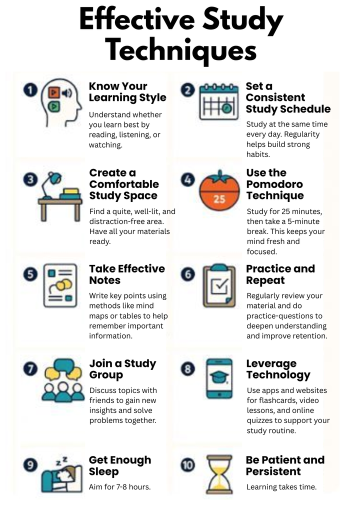
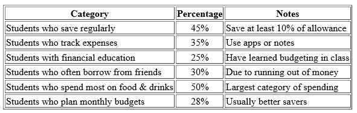
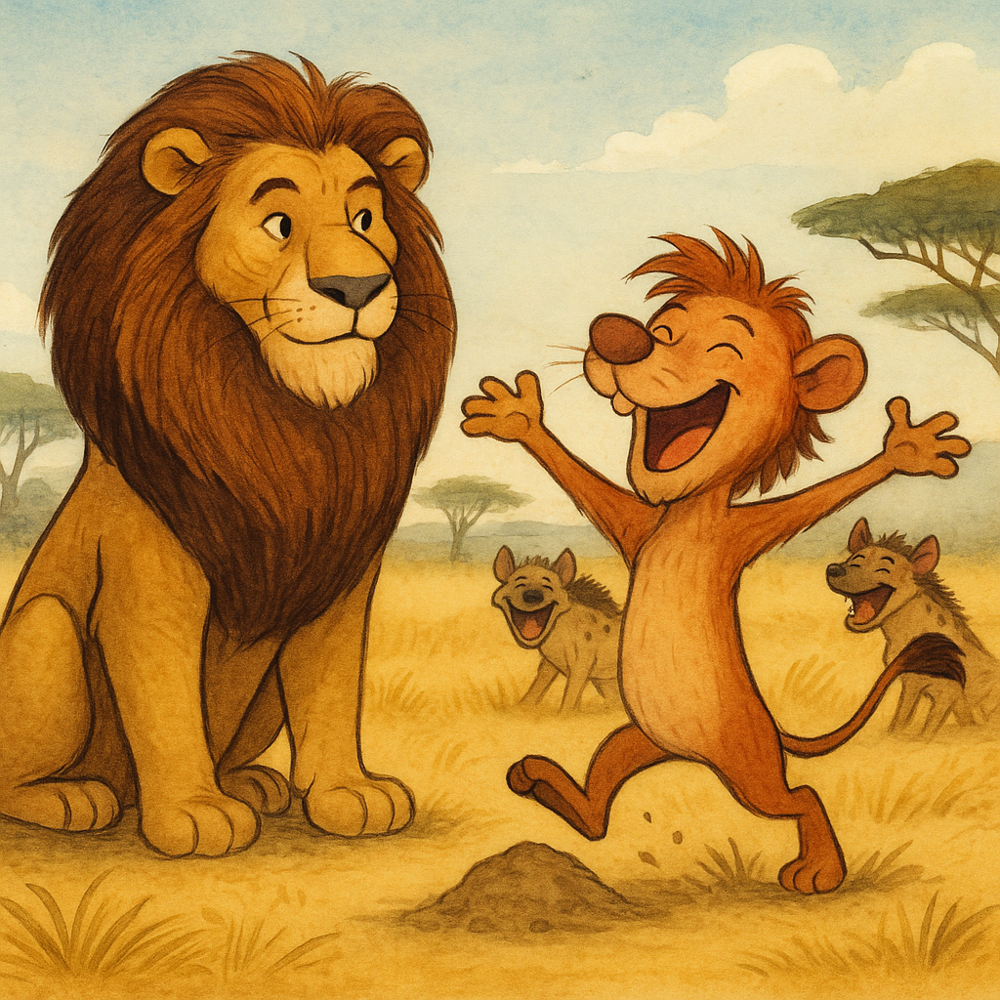

# Kumpulan Soal Simulasi TKA - Bahasa Inggris Paket 2
**Jenjang:** SMK / SMA / MA / Sederajat (Mata Pelajaran Wajib)
**Total Soal:** 25 butir
**Sumber:** Portal Pusmendik Kemendikdasmen (Simulasi ANBK / TKA)

---

## Soal No. 1 `[Pilihan Ganda]`

### Stimulus / Bacaan:
The Lion and the Mouse
Once upon a time, in a thick jungle in Africa, there lived a strong and fierce lion. Every afternoon, the lion would rest under the cool shade of a big tree after walking through the forest.
One day, while he was sleeping, a playful little mouse passed by. The mouse saw the lion’s thick mane and was curious. He climbed up and began to jump around on the lion’s head, playing in his mane.
The lion woke up suddenly and was not happy at all. He quickly caught the mouse in his big paw and roared, “Who dares to wake me up?” He was very angry and almost killed the mouse.
Scared and shaking, the mouse begged the lion, “Please don’t kill me! I didn’t mean to bother you. If you let me go, I promise I’ll help you one day.”
The lion laughed loudly. “You? Help me? That’s funny.” But the lion was feeling kind, so he let the mouse go free.
A few days later, the lion was walking through the jungle again when he fell into a trap. A net set by hunters caught him, and he couldn’t escape. He tried to bite and tear the ropes, but they were too strong. The lion roared loudly, hoping someone would come.
The mouse heard the roar and ran to help. He saw the lion trapped and quickly started to chew the ropes with his sharp teeth. After some time, the net broke, and the lion was free.
The lion looked at the mouse with surprise and said, “Thank you! You really saved my life.”
The mouse smiled and said, “I told you I would help you one day.”
From that moment on, the lion and the mouse became close friends. The lion learned that even small creatures can do great things, and we all need help sometimes.
Source:
https://www.vedantu.com/stories/the-lion-and-the-mouse

### Pertanyaan:
Which option best summarizes the story?

### Pilihan Jawaban:
- **[A]** Beginning: A lion was walking through the jungle. Problem: The mouse got lost and couldn't find food. Solution: The lion gave food to the mouse. Lesson: Always be generous to those in need.
- **[B]** Beginning: A mouse accidentally disturbed a sleeping lion. Problem: The lion was caught in a hunter’s net. Solution: The mouse chewed through the net and set the lion free. Lesson: Even the smallest creature can be a great help.
- **[C]** Beginning: The lion and mouse were best friends. Problem: The lion got hurt in a fight. Solution: The mouse helped him find water. Lesson: Friendship is built on adventure.
- **[D]** Beginning: A mouse was building a home near a tree. Problem: A storm destroyed the tree and trapped the lion. Solution: The mouse called for help from the jungle. Lesson: Teamwork solves big problems.
- **[E]** Beginning: A lion was hungry and searching for food. Problem: He couldn’t catch any prey. Solution: The mouse helped him find food. Lesson: Hunger teaches humility.

---

## Soal No. 2 `[Pilihan Ganda Kompleks]`

### Stimulus / Bacaan:
The Lion and the Mouse
Once upon a time, in a thick jungle in Africa, there lived a strong and fierce lion. Every afternoon, the lion would rest under the cool shade of a big tree after walking through the forest.
One day, while he was sleeping, a playful little mouse passed by. The mouse saw the lion’s thick mane and was curious. He climbed up and began to jump around on the lion’s head, playing in his mane.
The lion woke up suddenly and was not happy at all. He quickly caught the mouse in his big paw and roared, “Who dares to wake me up?” He was very angry and almost killed the mouse.
Scared and shaking, the mouse begged the lion, “Please don’t kill me! I didn’t mean to bother you. If you let me go, I promise I’ll help you one day.”
The lion laughed loudly. “You? Help me? That’s funny.” But the lion was feeling kind, so he let the mouse go free.
A few days later, the lion was walking through the jungle again when he fell into a trap. A net set by hunters caught him, and he couldn’t escape. He tried to bite and tear the ropes, but they were too strong. The lion roared loudly, hoping someone would come.
The mouse heard the roar and ran to help. He saw the lion trapped and quickly started to chew the ropes with his sharp teeth. After some time, the net broke, and the lion was free.
The lion looked at the mouse with surprise and said, “Thank you! You really saved my life.”
The mouse smiled and said, “I told you I would help you one day.”
From that moment on, the lion and the mouse became close friends. The lion learned that even small creatures can do great things, and we all need help sometimes.
Source:
https://www.vedantu.com/stories/the-lion-and-the-mouse

### Pertanyaan:
Which of the following statements best conveys the message of the story?
There is more than one answer. Click on every correct answer!

### Pilihan Jawaban:
- **[A]** We should never wake up a sleeping animal
- **[B]** Even the small and weak can help the strong
- **[C]** It’s always good to ask for help when we need it
- **[D]** Lions are dangerous animals and should be avoided
- **[E]** Never trust anyone who plays with your hair

---

## Soal No. 3 `[Pilihan Ganda]`

### Stimulus / Bacaan:
The Lion and the Mouse
Once upon a time, in a thick jungle in Africa, there lived a strong and fierce lion. Every afternoon, the lion would rest under the cool shade of a big tree after walking through the forest.
One day, while he was sleeping, a playful little mouse passed by. The mouse saw the lion’s thick mane and was curious. He climbed up and began to jump around on the lion’s head, playing in his mane.
The lion woke up suddenly and was not happy at all. He quickly caught the mouse in his big paw and roared, “Who dares to wake me up?” He was very angry and almost killed the mouse.
Scared and shaking, the mouse begged the lion, “Please don’t kill me! I didn’t mean to bother you. If you let me go, I promise I’ll help you one day.”
The lion laughed loudly. “You? Help me? That’s funny.” But the lion was feeling kind, so he let the mouse go free.
A few days later, the lion was walking through the jungle again when he fell into a trap. A net set by hunters caught him, and he couldn’t escape. He tried to bite and tear the ropes, but they were too strong. The lion roared loudly, hoping someone would come.
The mouse heard the roar and ran to help. He saw the lion trapped and quickly started to chew the ropes with his sharp teeth. After some time, the net broke, and the lion was free.
The lion looked at the mouse with surprise and said, “Thank you! You really saved my life.”
The mouse smiled and said, “I told you I would help you one day.”
From that moment on, the lion and the mouse became close friends. The lion learned that even small creatures can do great things, and we all need help sometimes.
Source:
https://www.vedantu.com/stories/the-lion-and-the-mouse

### Pertanyaan:
Why did the lion trust the mouse and decide to let him go instead of eating him?

### Pilihan Jawaban:
- **[A]** The lion was too tired to eat the mouse
- **[B]** The mouse told the lion he might help him one day
- **[C]** The lion was felling happy to see the mouse
- **[D]** The lion heard someone coming and got scared
- **[E]** The mouse promised to bring food for the lion

---

## Soal No. 4 `[Pilihan Ganda Kompleks]`

### Stimulus / Bacaan:
The Lion and the Mouse
Once upon a time, in a thick jungle in Africa, there lived a strong and fierce lion. Every afternoon, the lion would rest under the cool shade of a big tree after walking through the forest.
One day, while he was sleeping, a playful little mouse passed by. The mouse saw the lion’s thick mane and was curious. He climbed up and began to jump around on the lion’s head, playing in his mane.
The lion woke up suddenly and was not happy at all. He quickly caught the mouse in his big paw and roared, “Who dares to wake me up?” He was very angry and almost killed the mouse.
Scared and shaking, the mouse begged the lion, “Please don’t kill me! I didn’t mean to bother you. If you let me go, I promise I’ll help you one day.”
The lion laughed loudly. “You? Help me? That’s funny.” But the lion was feeling kind, so he let the mouse go free.
A few days later, the lion was walking through the jungle again when he fell into a trap. A net set by hunters caught him, and he couldn’t escape. He tried to bite and tear the ropes, but they were too strong. The lion roared loudly, hoping someone would come.
The mouse heard the roar and ran to help. He saw the lion trapped and quickly started to chew the ropes with his sharp teeth. After some time, the net broke, and the lion was free.
The lion looked at the mouse with surprise and said, “Thank you! You really saved my life.”
The mouse smiled and said, “I told you I would help you one day.”
From that moment on, the lion and the mouse became close friends. The lion learned that even small creatures can do great things, and we all need help sometimes.
Source:
https://www.vedantu.com/stories/the-lion-and-the-mouse

### Pertanyaan:
As you read the part where the lion let the mouse go, which of the following endings do you anticipate?
There is more than one answer, click on every correct answer!

### Pilihan Jawaban:
- **[A]** The mouse forgets about the lion and never helps him
- **[B]** The lion gets into trouble and no one helps him
- **[C]** The lion becomes angry at all small animals
- **[D]** The mouse spreads the lion's kindnes to other animals
- **[E]** The mouse becomes the lion’s loyal assistant

---

## Soal No. 5 `[Pilihan Ganda Kompleks]`

### Stimulus / Bacaan:
The Lion and the Mouse
Once upon a time, in a thick jungle in Africa, there lived a strong and fierce lion. Every afternoon, the lion would rest under the cool shade of a big tree after walking through the forest.
One day, while he was sleeping, a playful little mouse passed by. The mouse saw the lion’s thick mane and was curious. He climbed up and began to jump around on the lion’s head, playing in his mane.
The lion woke up suddenly and was not happy at all. He quickly caught the mouse in his big paw and roared, “Who dares to wake me up?” He was very angry and almost killed the mouse.
Scared and shaking, the mouse begged the lion, “Please don’t kill me! I didn’t mean to bother you. If you let me go, I promise I’ll help you one day.”
The lion laughed loudly. “You? Help me? That’s funny.” But the lion was feeling kind, so he let the mouse go free.
A few days later, the lion was walking through the jungle again when he fell into a trap. A net set by hunters caught him, and he couldn’t escape. He tried to bite and tear the ropes, but they were too strong. The lion roared loudly, hoping someone would come.
The mouse heard the roar and ran to help. He saw the lion trapped and quickly started to chew the ropes with his sharp teeth. After some time, the net broke, and the lion was free.
The lion looked at the mouse with surprise and said, “Thank you! You really saved my life.”
The mouse smiled and said, “I told you I would help you one day.”
From that moment on, the lion and the mouse became close friends. The lion learned that even small creatures can do great things, and we all need help sometimes.
Source:
https://www.vedantu.com/stories/the-lion-and-the-mouse

### Pertanyaan:
Which of the following sentences from the story help you understand the lion’s character?
There is more than one answer. Click on every correct answer!

### Pilihan Jawaban:
- **[A]** “The lion always took his afternoon nap under the shade of a big tree in the bushes.”
- **[B]** “He caught the mouse and questioned him for interrupting his nap.”
- **[C]** “The lion was amused at the mouse’s words and decided to spare his life.”
- **[D]** “With his sharp teeth, the mouse nibbled through the net.”
- **[E]** “The lion thanked the mouse immensely for his help.”

---

## Soal No. 6 `[Pilihan Ganda]`

### Stimulus / Bacaan:
Effective Study Technique

### Pertanyaan:
Based on the information given, we can keep our mind focused and fresh by ….

### Pilihan Jawaban:
- **[A]** knowing your learning style
- **[B]** using Pomodoro Technique
- **[C]** using online quizzes apps
- **[D]** by reviewing materials
- **[E]** by creating mind maps

---

## Soal No. 7 `[Pilihan Ganda]`

### Stimulus / Bacaan:
Effective Study Technique

### Pertanyaan:
Based on the infographic, determine whether each study technique listed on the left is categorized as
Time Management
or
Self Management
.

### Pilihan Jawaban:
- **[A]** Technique
- **[B]** Be patient and persistent
- **[C]** Use the Pomodoro technique
- **[D]** Set a consistent study schedule

---

## Soal No. 8 `[Pilihan Ganda]`

### Stimulus / Bacaan:
Effective Study Technique

### Pertanyaan:
From the options provided, choose the sequence that best reflects the information in the infographic “Effective Study Techniques”.

### Pilihan Jawaban:
- **[A]** Set your goal → Watch lessons videos → Sleep well → Have group chat with friends → Eat nutritious meal
- **[B]** Plan study time → Join a study group → Take long breaks → Write a to do list  → Write important points
- **[C]** Know your learning style → Find a quiet area → Set a timetable → Use less gadgets → Be patient and persistent
- **[D]** Know your study style → Plan your study time → Practice and repeat → Take a break → Watch lessons videos
- **[E]** Take notes → Join a study groups → Use different medias → Play music you like → Have good meal while studying

---

## Soal No. 9 `[Pilihan Ganda Kompleks]`

### Stimulus / Bacaan:
Effective Study Technique

### Pertanyaan:
Which of the following statements best reflect the author’s purpose in writing the text?
There is more than one correct answer. Click on every correct answer!

### Pilihan Jawaban:
- **[A]** To help students find fun strategies to play after studying
- **[B]** To offer students guidance on how to learn more efficiently
- **[C]** To encourage students to use simple habits to improve their learning
- **[D]** To explain why studying tips is difficult for most students
- **[E]** To show students that they can manage their time and focus better

---

## Soal No. 10 `[Pilihan Ganda Kompleks]`

### Stimulus / Bacaan:
Effective Study Technique

### Pertanyaan:
If you are preparing for an important exam and want to improve your study routine, which of the following techniques do you think can be implemented effectively in your personal study time?
There is more than one correct answer. Click on every correct answer!

### Pilihan Jawaban:
- **[A]** Only study when you are in a group discussion with others
- **[B]** Use technology during all study sessions in or outside class
- **[C]** Use the Pomodoro Technique to structure your study and break time
- **[D]** Practice and repeat study material regularly to retain information
- **[E]** Create a quiet and comfortable study space to improve focus

---

## Soal No. 11 `[Pilihan Ganda Kompleks]`

### Stimulus / Bacaan:
The Great Barrier Reef
The Great Barrier Reef is one of the most beautiful places in the world. It is located in the Pacific Ocean, near the northeast coast of Australia. The reef is very big. It stretches over 2,000 kilometers and can even be seen from space. There are many small coral islands and clear, warm waters around the reef.
This reef is full of life. There are many kinds of colorful fish, sea turtles, dolphins, and even sharks. Coral of different shapes and colors grows under the water. Sea birds fly over the reef and nest on small islands. People can see this beauty by swimming, diving, or joining a boat tour.
The colors under the water are amazing. Coral comes in red, yellow, green, and blue. Some coral looks like trees, and some looks like big round stones. Small fish swim in and out of the coral like they are playing a game. In some places, soft coral moves with the water like grass in the wind. When the sun shines, the reef looks bright and full of light. It feels like a different world under the sea.
The reef is not only beautiful, but also very important. It helps protect the coast from big waves and storms. It is a home for sea animals and a place where plants can grow. Many people also get food and jobs from the sea near the reef. Without the reef, the ocean would not be the same.
Adapted from:
https://www.britannica.com/place/Great-Barrier-Reef

### Pertanyaan:
Which of the following descriptions are mentioned clearly in the text?
There are more than one correct answer. Click on every correct answer.

### Pilihan Jawaban:
- **[A]** The reef was built by local communities over hundreds of years
- **[B]** The reef is located in the Pacific Ocean near Australia
- **[C]** The reef can help protect the coast from big waves
- **[D]** The reef is home to sea turtles and dolphins
- **[E]** The reef has more than 10,000 coral islands

---

## Soal No. 12 `[Pilihan Ganda]`

### Stimulus / Bacaan:
The Great Barrier Reef
The Great Barrier Reef is one of the most beautiful places in the world. It is located in the Pacific Ocean, near the northeast coast of Australia. The reef is very big. It stretches over 2,000 kilometers and can even be seen from space. There are many small coral islands and clear, warm waters around the reef.
This reef is full of life. There are many kinds of colorful fish, sea turtles, dolphins, and even sharks. Coral of different shapes and colors grows under the water. Sea birds fly over the reef and nest on small islands. People can see this beauty by swimming, diving, or joining a boat tour.
The colors under the water are amazing. Coral comes in red, yellow, green, and blue. Some coral looks like trees, and some looks like big round stones. Small fish swim in and out of the coral like they are playing a game. In some places, soft coral moves with the water like grass in the wind. When the sun shines, the reef looks bright and full of light. It feels like a different world under the sea.
The reef is not only beautiful, but also very important. It helps protect the coast from big waves and storms. It is a home for sea animals and a place where plants can grow. Many people also get food and jobs from the sea near the reef. Without the reef, the ocean would not be the same.
Adapted from:
https://www.britannica.com/place/Great-Barrier-Reef

### Pertanyaan:
The author mentioned “It feels like a different world under the sea”. What does the phrase "a different world under the sea" most likely mean?

### Pilihan Jawaban:
- **[A]** A safe place that has bright reef
- **[B]** A peaceful place where people can live under water
- **[C]** A colorful place that looks the same as the land
- **[D]** A shining reef that is quiet
- **[E]** A calm place that looks beautiful and unique

---

## Soal No. 13 `[Pilihan Ganda]`

### Stimulus / Bacaan:
The Great Barrier Reef
The Great Barrier Reef is one of the most beautiful places in the world. It is located in the Pacific Ocean, near the northeast coast of Australia. The reef is very big. It stretches over 2,000 kilometers and can even be seen from space. There are many small coral islands and clear, warm waters around the reef.
This reef is full of life. There are many kinds of colorful fish, sea turtles, dolphins, and even sharks. Coral of different shapes and colors grows under the water. Sea birds fly over the reef and nest on small islands. People can see this beauty by swimming, diving, or joining a boat tour.
The colors under the water are amazing. Coral comes in red, yellow, green, and blue. Some coral looks like trees, and some looks like big round stones. Small fish swim in and out of the coral like they are playing a game. In some places, soft coral moves with the water like grass in the wind. When the sun shines, the reef looks bright and full of light. It feels like a different world under the sea.
The reef is not only beautiful, but also very important. It helps protect the coast from big waves and storms. It is a home for sea animals and a place where plants can grow. Many people also get food and jobs from the sea near the reef. Without the reef, the ocean would not be the same.
Adapted from:
https://www.britannica.com/place/Great-Barrier-Reef

### Pertanyaan:
Which of the following best represents the main idea implied by the text?

### Pilihan Jawaban:
- **[A]** The reef is useful for fishing and shipping
- **[B]** The reef is large, but not important to people
- **[C]** The reef is a natural treasure that must be cared for
- **[D]** The reef is only for scientists and researchers to explore
- **[E]** The reef is a protected area that should be closed to visitors

---

## Soal No. 14 `[Pilihan Ganda]`

### Stimulus / Bacaan:
The Great Barrier Reef
The Great Barrier Reef is one of the most beautiful places in the world. It is located in the Pacific Ocean, near the northeast coast of Australia. The reef is very big. It stretches over 2,000 kilometers and can even be seen from space. There are many small coral islands and clear, warm waters around the reef.
This reef is full of life. There are many kinds of colorful fish, sea turtles, dolphins, and even sharks. Coral of different shapes and colors grows under the water. Sea birds fly over the reef and nest on small islands. People can see this beauty by swimming, diving, or joining a boat tour.
The colors under the water are amazing. Coral comes in red, yellow, green, and blue. Some coral looks like trees, and some looks like big round stones. Small fish swim in and out of the coral like they are playing a game. In some places, soft coral moves with the water like grass in the wind. When the sun shines, the reef looks bright and full of light. It feels like a different world under the sea.
The reef is not only beautiful, but also very important. It helps protect the coast from big waves and storms. It is a home for sea animals and a place where plants can grow. Many people also get food and jobs from the sea near the reef. Without the reef, the ocean would not be the same.
Adapted from:
https://www.britannica.com/place/Great-Barrier-Reef

### Pertanyaan:
Which detail would best encourage people to visit the Great Barrier Reef?

### Pilihan Jawaban:
- **[A]** Visitors can see an Australian national park
- **[B]** Visitors can stay in hotels around the reef
- **[C]** Visitors can get there by boat or short flights
- **[D]** Visitors can protect the coral and the animals
- **[E]** Visitors can see the coral by diving or swimming

---

## Soal No. 15 `[Pilihan Ganda Kompleks]`

### Stimulus / Bacaan:
The Great Barrier Reef
The Great Barrier Reef is one of the most beautiful places in the world. It is located in the Pacific Ocean, near the northeast coast of Australia. The reef is very big. It stretches over 2,000 kilometers and can even be seen from space. There are many small coral islands and clear, warm waters around the reef.
This reef is full of life. There are many kinds of colorful fish, sea turtles, dolphins, and even sharks. Coral of different shapes and colors grows under the water. Sea birds fly over the reef and nest on small islands. People can see this beauty by swimming, diving, or joining a boat tour.
The colors under the water are amazing. Coral comes in red, yellow, green, and blue. Some coral looks like trees, and some looks like big round stones. Small fish swim in and out of the coral like they are playing a game. In some places, soft coral moves with the water like grass in the wind. When the sun shines, the reef looks bright and full of light. It feels like a different world under the sea.
The reef is not only beautiful, but also very important. It helps protect the coast from big waves and storms. It is a home for sea animals and a place where plants can grow. Many people also get food and jobs from the sea near the reef. Without the reef, the ocean would not be the same.
Adapted from:
https://www.britannica.com/place/Great-Barrier-Reef

### Pertanyaan:
Which parts of the text best support the idea that the Great Barrier Reef is both beautiful and important?
There is more than one correct answer. Click on every correct answer!

### Pilihan Jawaban:
- **[A]** The reef helps protect the coast from big waves
- **[B]** It is home to sea turtles, dolphins, and colorful fish
- **[C]** The coral reefs grow best in cold, deep water
- **[D]** Some areas of the reef are damaged by starfish and warm water
- **[E]** The reef was discovered by sailors in the 1800s

---

## Soal No. 16 `[Pilihan Ganda]`

### Stimulus / Bacaan:
Why Teenagers Should Learn to Manage Their Money
Many young people today often spend money on things they like, such as snacks, clothes, or fun activities. But learning to handle money from a young age is very important. Good money habits can help students make a better future.
Having a clear plan for the future can show teenagers how to use their money. Students should think about short-term goals, like getting a new phone, and long-term goals, like saving for college or starting a business. Writing these goals down can help students stay motivated and focused.
A budget helps students see where their money goes every month. It's important to list basic needs like food and travel, and also other costs like clothes or presents. A budget makes it easier to decide how much money to save, spend, or keep for unexpected problems.
Sometimes, students don't know how much they spend on small things. Keeping track of spending with notes or apps can help students understand their habits. This helps them stay within their budget and make changes if needed.
Teenagers should also learn the difference between saving money and investing money. Saving is safer but slower, while investing has more risk but can earn more money. Knowing both can help students choose the best way for their money goals.
To sum up, students who learn to plan, budget, track, and understand saving choices are more ready for the future. That is why learning about money should start early and be done often.
Table 1. How do students manage their money?
(Adapted from
https://www.onefamily.com/savings/money-management-tips-for-teens/
)

### Pertanyaan:
Based on the text, choose the activity that best fits the description

### Pilihan Jawaban:
- **[A]** Description
- **[B]** Saving money for university
- **[C]** Saving to buy a new phone
- **[D]** Starting a business

---

## Soal No. 17 `[Pilihan Ganda Kompleks]`

### Stimulus / Bacaan:
Why Teenagers Should Learn to Manage Their Money
Many young people today often spend money on things they like, such as snacks, clothes, or fun activities. But learning to handle money from a young age is very important. Good money habits can help students make a better future.
Having a clear plan for the future can show teenagers how to use their money. Students should think about short-term goals, like getting a new phone, and long-term goals, like saving for college or starting a business. Writing these goals down can help students stay motivated and focused.
A budget helps students see where their money goes every month. It's important to list basic needs like food and travel, and also other costs like clothes or presents. A budget makes it easier to decide how much money to save, spend, or keep for unexpected problems.
Sometimes, students don't know how much they spend on small things. Keeping track of spending with notes or apps can help students understand their habits. This helps them stay within their budget and make changes if needed.
Teenagers should also learn the difference between saving money and investing money. Saving is safer but slower, while investing has more risk but can earn more money. Knowing both can help students choose the best way for their money goals.
To sum up, students who learn to plan, budget, track, and understand saving choices are more ready for the future. That is why learning about money should start early and be done often.
Table 1. How do students manage their money?
(Adapted from
https://www.onefamily.com/savings/money-management-tips-for-teens/
)

### Pertanyaan:
According to the text, which of the following actions support smart money management for students?
There is more than one correct answer. Click on every correct answer!

### Pilihan Jawaban:
- **[A]** Tracking daily expenses using a notebook or app
- **[B]** Spending more money than the monthly budget allows
- **[C]** Setting financial goals for the short and long term
- **[D]** Borrowing money whenever there is not enough left
- **[E]** Dividing money into saving, spending, and emergency funds

---

## Soal No. 18 `[Pilihan Ganda Kompleks]`

### Stimulus / Bacaan:
Why Teenagers Should Learn to Manage Their Money
Many young people today often spend money on things they like, such as snacks, clothes, or fun activities. But learning to handle money from a young age is very important. Good money habits can help students make a better future.
Having a clear plan for the future can show teenagers how to use their money. Students should think about short-term goals, like getting a new phone, and long-term goals, like saving for college or starting a business. Writing these goals down can help students stay motivated and focused.
A budget helps students see where their money goes every month. It's important to list basic needs like food and travel, and also other costs like clothes or presents. A budget makes it easier to decide how much money to save, spend, or keep for unexpected problems.
Sometimes, students don't know how much they spend on small things. Keeping track of spending with notes or apps can help students understand their habits. This helps them stay within their budget and make changes if needed.
Teenagers should also learn the difference between saving money and investing money. Saving is safer but slower, while investing has more risk but can earn more money. Knowing both can help students choose the best way for their money goals.
To sum up, students who learn to plan, budget, track, and understand saving choices are more ready for the future. That is why learning about money should start early and be done often.
Table 1. How do students manage their money?
(Adapted from
https://www.onefamily.com/savings/money-management-tips-for-teens/
)

### Pertanyaan:
Who is most likely to be the target audience of this text?
There is more than one correct answer. Click on every correct answer!

### Pilihan Jawaban:
- **[A]** Teenagers who are learning to manage their money
- **[B]** Parents looking for tips on how to control their children’s spending
- **[C]** Students who want to plan for their financial future
- **[D]** High school readers who need to understand saving and budgeting
- **[E]** Bankers and financial experts

---

## Soal No. 19 `[Pilihan Ganda]`

### Stimulus / Bacaan:
Why Teenagers Should Learn to Manage Their Money
Many young people today often spend money on things they like, such as snacks, clothes, or fun activities. But learning to handle money from a young age is very important. Good money habits can help students make a better future.
Having a clear plan for the future can show teenagers how to use their money. Students should think about short-term goals, like getting a new phone, and long-term goals, like saving for college or starting a business. Writing these goals down can help students stay motivated and focused.
A budget helps students see where their money goes every month. It's important to list basic needs like food and travel, and also other costs like clothes or presents. A budget makes it easier to decide how much money to save, spend, or keep for unexpected problems.
Sometimes, students don't know how much they spend on small things. Keeping track of spending with notes or apps can help students understand their habits. This helps them stay within their budget and make changes if needed.
Teenagers should also learn the difference between saving money and investing money. Saving is safer but slower, while investing has more risk but can earn more money. Knowing both can help students choose the best way for their money goals.
To sum up, students who learn to plan, budget, track, and understand saving choices are more ready for the future. That is why learning about money should start early and be done often.
Table 1. How do students manage their money?
(Adapted from
https://www.onefamily.com/savings/money-management-tips-for-teens/
)

### Pertanyaan:
Which information would make the text more informative about student spending habits?

### Pilihan Jawaban:
- **[A]** A paragraph about the history of financial education in schools
- **[B]** A table showing common monthly high school students expenses
- **[C]** A graph comparing saving habits between teenagers and adults
- **[D]** A chart listing popular entertainment choices among students
- **[E]** A paragraph about students' experiences in managing budget

---

## Soal No. 20 `[Pilihan Ganda Kompleks]`

### Stimulus / Bacaan:
Why Teenagers Should Learn to Manage Their Money
Many young people today often spend money on things they like, such as snacks, clothes, or fun activities. But learning to handle money from a young age is very important. Good money habits can help students make a better future.
Having a clear plan for the future can show teenagers how to use their money. Students should think about short-term goals, like getting a new phone, and long-term goals, like saving for college or starting a business. Writing these goals down can help students stay motivated and focused.
A budget helps students see where their money goes every month. It's important to list basic needs like food and travel, and also other costs like clothes or presents. A budget makes it easier to decide how much money to save, spend, or keep for unexpected problems.
Sometimes, students don't know how much they spend on small things. Keeping track of spending with notes or apps can help students understand their habits. This helps them stay within their budget and make changes if needed.
Teenagers should also learn the difference between saving money and investing money. Saving is safer but slower, while investing has more risk but can earn more money. Knowing both can help students choose the best way for their money goals.
To sum up, students who learn to plan, budget, track, and understand saving choices are more ready for the future. That is why learning about money should start early and be done often.
Table 1. How do students manage their money?
(Adapted from
https://www.onefamily.com/savings/money-management-tips-for-teens/
)

### Pertanyaan:
Which of the following statements are supported by clear data or facts in the text and table?
There is more than one correct answer. Click on every correct answer.

### Pilihan Jawaban:
- **[A]** 45% of students save money regularly
- **[B]** Tracking expenses can help understand spending habits
- **[C]** Most students do not care about money at all
- **[D]** Saving 10% of allowance is a good practice
- **[E]** Spending on fun activities is always better than saving

---

## Soal No. 21 `[Pilihan Ganda]`

### Stimulus / Bacaan:
The False Lion King
Once upon a time, in Africa, there lived two lion kings. One was named Hera and the other was Shero. Hera was very strong and handsome. All the animals loved and respected him. He was a great leader. Shero was not like Hera. He had a small mane and a funny, squeaky voice. Shero liked to pretend he was as powerful as Hera. He often copied Hera’s roar, but it made the other animals laugh.
One day, the animals heard that some hyenas were causing trouble near the river. Hera quickly gathered his followers to stop the hyenas. Shero also wanted to come. He wanted to show everyone that he was strong too.
When they reached the river, Hera roared loudly. His roar was so powerful that the hyenas got scared. Shero also tried to roar, but his voice was high and silly. The hyenas laughed at him. Their leader, Hank the Hyena, made jokes about Shero.
Hera stayed calm and smiled. Shero did not give up. He said, “I am just as strong as Hera!” The hyenas laughed even louder. Shero tried to show his power by jumping on a small dirt hill. But he tripped and fell into the ground. The hyenas laughed so much they cried. Even Hera laughed a little.
At the end of the day, the hyenas left, still laughing about Shero. Hera told Shero, “You are not like me, but you make everyone happy with your jokes.” Shero smiled and understood that he had his own special gift.
From that day, Shero became the kingdom’s jester. He and Hera ruled together — one with strength, and one with laughter. The animals learned that both power and fun are important in life.
Adapted from:
https://wikibedtimestories.com/bedtime-short-stories-for-kids/The%20False%20Lion%20King

### Pertanyaan:
Which statement provides the most accurate chronological summary of the story's main events?

### Pilihan Jawaban:
- **[A]** Shero falls into the dirt. The hyenas cause trouble at the river. Hera tells Shero that he is funny. Shero copies Hera’s roar. Shero becomes the kingdom's funny helper.
- **[B]** Hera is a strong lion king. Shero likes to pretend to be strong. The hyenas cause trouble near the river. Hera scares the hyenas, but Shero makes them laugh. Shero learns that making others happy is special.
- **[C]** Hera and Shero are both strong leaders. The hyenas come to help the lions. Shero tells funny stories to the hyenas. Hera is angry with Shero. The lions and hyenas become friends.
- **[D]** Shero is a strong lion king. Hera is jealous of Shero. The hyenas attack the lions. Shero defeats the hyenas. Shero becomes the new king.
- **[E]** Shero wants to be king and fights Hera. The hyenas help Shero. Hera leaves the kingdom. Shero becomes king. Hera returns to forgive Shero.

---

## Soal No. 22 `[Pilihan Ganda Kompleks]`

### Stimulus / Bacaan:
The False Lion King
Once upon a time, in Africa, there lived two lion kings. One was named Hera and the other was Shero. Hera was very strong and handsome. All the animals loved and respected him. He was a great leader. Shero was not like Hera. He had a small mane and a funny, squeaky voice. Shero liked to pretend he was as powerful as Hera. He often copied Hera’s roar, but it made the other animals laugh.
One day, the animals heard that some hyenas were causing trouble near the river. Hera quickly gathered his followers to stop the hyenas. Shero also wanted to come. He wanted to show everyone that he was strong too.
When they reached the river, Hera roared loudly. His roar was so powerful that the hyenas got scared. Shero also tried to roar, but his voice was high and silly. The hyenas laughed at him. Their leader, Hank the Hyena, made jokes about Shero.
Hera stayed calm and smiled. Shero did not give up. He said, “I am just as strong as Hera!” The hyenas laughed even louder. Shero tried to show his power by jumping on a small dirt hill. But he tripped and fell into the ground. The hyenas laughed so much they cried. Even Hera laughed a little.
At the end of the day, the hyenas left, still laughing about Shero. Hera told Shero, “You are not like me, but you make everyone happy with your jokes.” Shero smiled and understood that he had his own special gift.
From that day, Shero became the kingdom’s jester. He and Hera ruled together — one with strength, and one with laughter. The animals learned that both power and fun are important in life.
Adapted from:
https://wikibedtimestories.com/bedtime-short-stories-for-kids/The%20False%20Lion%20King

### Pertanyaan:
What can we learn from the story of Hera and Shero?
There is more than one correct answer. Click for every correct answer!

### Pilihan Jawaban:
- **[A]** Everyone has something special to give, even if they are not the leader
- **[B]** Being funny and making others smile is just as important as being strong
- **[C]** Good friends will support you and help you see your real strengths
- **[D]** Working together is better when people use their different talents
- **[E]** Trying your best to help others is more important than always being perfect

---

## Soal No. 23 `[Pilihan Ganda]`

### Stimulus / Bacaan:
The False Lion King
Once upon a time, in Africa, there lived two lion kings. One was named Hera and the other was Shero. Hera was very strong and handsome. All the animals loved and respected him. He was a great leader. Shero was not like Hera. He had a small mane and a funny, squeaky voice. Shero liked to pretend he was as powerful as Hera. He often copied Hera’s roar, but it made the other animals laugh.
One day, the animals heard that some hyenas were causing trouble near the river. Hera quickly gathered his followers to stop the hyenas. Shero also wanted to come. He wanted to show everyone that he was strong too.
When they reached the river, Hera roared loudly. His roar was so powerful that the hyenas got scared. Shero also tried to roar, but his voice was high and silly. The hyenas laughed at him. Their leader, Hank the Hyena, made jokes about Shero.
Hera stayed calm and smiled. Shero did not give up. He said, “I am just as strong as Hera!” The hyenas laughed even louder. Shero tried to show his power by jumping on a small dirt hill. But he tripped and fell into the ground. The hyenas laughed so much they cried. Even Hera laughed a little.
At the end of the day, the hyenas left, still laughing about Shero. Hera told Shero, “You are not like me, but you make everyone happy with your jokes.” Shero smiled and understood that he had his own special gift.
From that day, Shero became the kingdom’s jester. He and Hera ruled together — one with strength, and one with laughter. The animals learned that both power and fun are important in life.
Adapted from:
https://wikibedtimestories.com/bedtime-short-stories-for-kids/The%20False%20Lion%20King

### Pertanyaan:
The hyenas laugh so much when Shero tries to roar like Hera because ....

### Pilihan Jawaban:
- **[A]** Shero tries to roar in a serious way and surprises the hyenas
- **[B]** Shero’s roar is funny, which the hyenas think he is joking
- **[C]** Hera tells a joke about Shero to make the hyenas laugh
- **[D]** Shero is acting like Hera, and it's absolutely brilliant
- **[E]** Shero trips and falls when trying to show his strength

---

## Soal No. 24 `[Pilihan Ganda Kompleks]`

### Stimulus / Bacaan:
The False Lion King
Once upon a time, in Africa, there lived two lion kings. One was named Hera and the other was Shero. Hera was very strong and handsome. All the animals loved and respected him. He was a great leader. Shero was not like Hera. He had a small mane and a funny, squeaky voice. Shero liked to pretend he was as powerful as Hera. He often copied Hera’s roar, but it made the other animals laugh.
One day, the animals heard that some hyenas were causing trouble near the river. Hera quickly gathered his followers to stop the hyenas. Shero also wanted to come. He wanted to show everyone that he was strong too.
When they reached the river, Hera roared loudly. His roar was so powerful that the hyenas got scared. Shero also tried to roar, but his voice was high and silly. The hyenas laughed at him. Their leader, Hank the Hyena, made jokes about Shero.
Hera stayed calm and smiled. Shero did not give up. He said, “I am just as strong as Hera!” The hyenas laughed even louder. Shero tried to show his power by jumping on a small dirt hill. But he tripped and fell into the ground. The hyenas laughed so much they cried. Even Hera laughed a little.
At the end of the day, the hyenas left, still laughing about Shero. Hera told Shero, “You are not like me, but you make everyone happy with your jokes.” Shero smiled and understood that he had his own special gift.
From that day, Shero became the kingdom’s jester. He and Hera ruled together — one with strength, and one with laughter. The animals learned that both power and fun are important in life.
Adapted from:
https://wikibedtimestories.com/bedtime-short-stories-for-kids/The%20False%20Lion%20King

### Pertanyaan:
If in the beginning of the story, Shero is a strong lion with a loud roar, just like Hera. What would happened in the end of the story?
There is more than one correct answer. Click for every correct answer!

### Pilihan Jawaban:
- **[A]** Shero and Hera would both scare the hyenas away together
- **[B]** Shero would become the king, and Hera would leave the savannah
- **[C]** Shero would get respect from the other animals for his strength
- **[D]** The hyenas would still laugh at Shero because he is funny
- **[E]** Shero would try to take Hera’s place as the only lion king

---

## Soal No. 25 `[Pilihan Ganda Kompleks]`

### Stimulus / Bacaan:
The False Lion King
Once upon a time, in Africa, there lived two lion kings. One was named Hera and the other was Shero. Hera was very strong and handsome. All the animals loved and respected him. He was a great leader. Shero was not like Hera. He had a small mane and a funny, squeaky voice. Shero liked to pretend he was as powerful as Hera. He often copied Hera’s roar, but it made the other animals laugh.
One day, the animals heard that some hyenas were causing trouble near the river. Hera quickly gathered his followers to stop the hyenas. Shero also wanted to come. He wanted to show everyone that he was strong too.
When they reached the river, Hera roared loudly. His roar was so powerful that the hyenas got scared. Shero also tried to roar, but his voice was high and silly. The hyenas laughed at him. Their leader, Hank the Hyena, made jokes about Shero.
Hera stayed calm and smiled. Shero did not give up. He said, “I am just as strong as Hera!” The hyenas laughed even louder. Shero tried to show his power by jumping on a small dirt hill. But he tripped and fell into the ground. The hyenas laughed so much they cried. Even Hera laughed a little.
At the end of the day, the hyenas left, still laughing about Shero. Hera told Shero, “You are not like me, but you make everyone happy with your jokes.” Shero smiled and understood that he had his own special gift.
From that day, Shero became the kingdom’s jester. He and Hera ruled together — one with strength, and one with laughter. The animals learned that both power and fun are important in life.
Adapted from:
https://wikibedtimestories.com/bedtime-short-stories-for-kids/The%20False%20Lion%20King

### Pertanyaan:
Shero is clumsy and funny, this is shown when he ....
There is more than one correct answer. Click for every correct answer!

### Pilihan Jawaban:
- **[A]** scares the hyenas away with his loud and powerful roar
- **[B]** makes the other animals smile by pretending to be a great king
- **[C]** tries to roar like Hera, but his voice is small and makes the hyenas laugh
- **[D]** walks with Hera to confront the hyenas, acting as if he is an important king too
- **[E]** tells the hyenas that he is as mighty as King Hera, even though no one believes him

---
