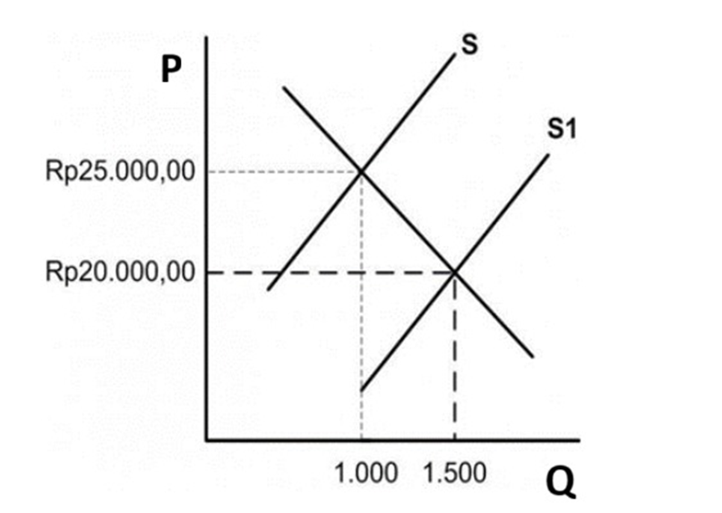
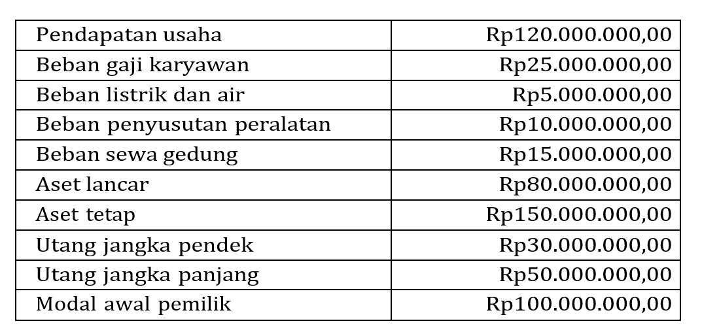
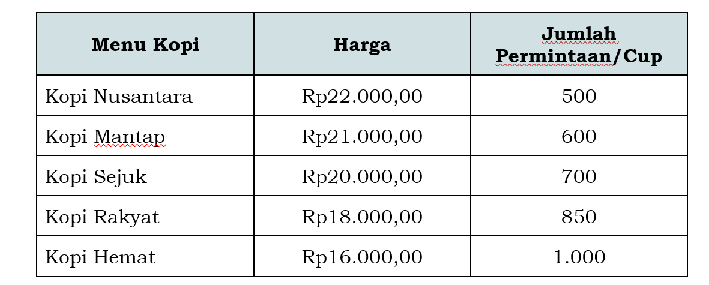
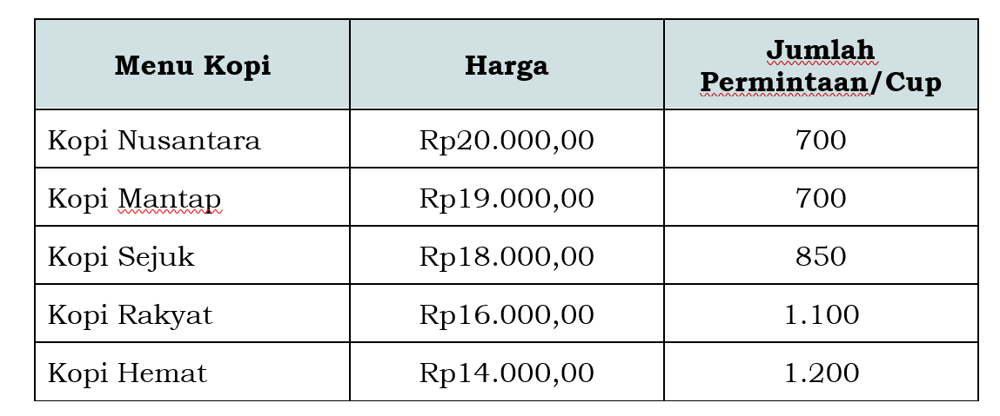

# Kumpulan Soal Simulasi TKA - Ekonomi Paket 1
**Jenjang:** SMK / SMA / MA / Sederajat (Mata Pelajaran Wajib)
**Total Soal:** 20 butir
**Sumber:** Portal Pusmendik Kemendikdasmen (Simulasi ANBK / TKA)

---

## Soal No. 1 `[Pilihan Ganda Kompleks]`

### Stimulus / Bacaan:
Di  kota kecil mengalami perkembangan ekonomi yang pesat akibat meningkatnya kegiatan ekonomi di industri manufaktur. Fenomena ini berdampak pada beberapa aspek kehidupan industri, diantaranya:
Meningkatnya jumlah tenaga kerja yang terserap di sektor industri.
Berkembangnya sektor perdagangan akibat meningkatnya daya beli
Terjadinya kemacetan dan peningkatan polusi akibat meningkatnya transportasi industri.
Meningkatnya harga tanah dan biaya hidup akibat tingginya permintaan akan hunian

### Pertanyaan:
Berdasarkan kondisi tersebut, bagaimana hubungan antara kegiatan ekonomi dan dampak positif terhadap kehidupan industri?
Klik semua jawaban benar. Jawaban benar lebih dari satu.

### Pilihan Jawaban:
- **[A]** Perkembangan industri memberikan dampak positif karena menciptakan banyak lapangan kerja.
- **[B]** Perkembangan ekonomi suatu daerah selalu meningkatkan kesejahteraan industri tanpa konsekuensi industri.
- **[C]** Peningkatan aktivitas ekonomi membawa manfaat sekaligus tantangan yang harus dikelola dengan kebijakan yang tepat.
- **[D]** Kegiatan industri harus dihentikan karena menyebabkan kemacetan dan kenaikan harga tanah.
- **[E]** Terjadi penurunan daya beli industri akibat biaya hidup disekitar manufaktur industri tinggi.

---

## Soal No. 2 `[Pilihan Ganda]`

### Stimulus / Bacaan:
Perhatikan kurva permintaan dan penawaran barang berikut!

### Pertanyaan:
Berdasarkan kurva tersebut, bentuk kurva fungsi permintaan yang benar adalah ....

### Pilihan Jawaban:
- **[A]** Qd = 10P – 500
- **[B]** Qd = -10P + 3500
- **[C]** Qd = 0,1P + 500
- **[D]** Qd = -0,1P + 4.000
- **[E]** Qd = -0,1P + 3.500

---

## Soal No. 3 `[Pilihan Ganda]`

### Stimulus / Bacaan:
Daftar harga tomat di pasar tradisional di Kota B bulan Januari tahun 2024 sebagai berikut:
No.
Harga
Permintaan/Kg
Penawaran/Kg
1.
Rp9.000,00
800
1.000
2.
Rp10.000,00
600
1.200

### Pertanyaan:
Dari data tersebut, maka titik keseimbangan pasar dengan kuantitas (Q); harga (P) adalah ....

### Pilihan Jawaban:
- **[A]** 600; 10.000
- **[B]** 800; 9.000
- **[C]** 900; 8.500
- **[D]** 1.800; 9.000
- **[E]** 1.800; 10.000

---

## Soal No. 4 `[Pilihan Ganda]`

### Stimulus / Bacaan:
Tabel pendapatan Negara Astina, Negara Alengka, dan Negara Amarta selama tahun 2022 dan 2023!
No.
Negara
Pendapatan Nasional (dalam Jutaan rupiah)
Jumlah Penduduk
(dalam Jutaan)
2022
2023
2022
2023
1.
Negara Astina
274.700
283.300
50
51
2.
Negara Alengka
305.000
326.600
30
31
3.
Negara Amarta
878.040
917.700
250
255,5

### Pertanyaan:
Berdasarkan data tersebut, kesimpulan yang dapat di ambil adalah ...

### Pilihan Jawaban:
- **[A]** Urutan pendapatan perkapita dari yang tertinggi pada tahun 2022 yaitu Negara Astina, Negara Alengka, dan Negara Amarta.
- **[B]** Urutan pendapatan perkapita dari yang tertinggi tahun 2023 yaitu Negara Alengka, Negara Amarta, dan Negara Astina.
- **[C]** Urutan pendapatan perkapita dari yang terendah tahun 2023 yaitu Negara Amarta, Negara Alengka, dan Negara Astina.
- **[D]** Negara yang mempunyai kenaikan pendapatan perkapita tertinggi tahun 2022 Negara Amarta.
- **[E]** Negara yang mempunyai pendapatan perkapita tertinggi pada tahun 2022 dan 2023 yaitu Negara Alengka.

---

## Soal No. 5 `[Pilihan Ganda]`

### Stimulus / Bacaan:
Tahun ini pemerintah mulai membangun banyak infrastruktur. Salah satunya adalah pembangunan 13 waduk baru. Waduk tersebut tersebar di seluruh wilayah Indonesia. Sekarang dari 7,2 juta hektare (Ha) luas irigasi pertanian di Indonesia, baru sekitar 11% yang memanfaatkan air tampungan waduk. Sisanya masih memanfaatkan air hujan, sehingga selalu terancam kekeringan saat musim kemarau tiba. Apabila 13 waduk baru tersebut terealisasi, lahan irigasi waduk dapat meningkat dua kali lipat menjadi 1,45 juta Ha.

### Pertanyaan:
Berdasar ilustrasi tersebut, yang merupakan kebijakan pembangunan pemerintah Indonesia dalam hal ….

### Pilihan Jawaban:
- **[A]** penguatan kelembagaan masyarakat dan usaha kecil rumahan
- **[B]** penguatan ketahanan pangan dan stabilisasi produksi pangan nasional
- **[C]** pemanfaatan sumber daya alam dan manusia agar lebih bermanfaat
- **[D]** penguatan sinergi antara SDM, IPTEK dengan industri pangan
- **[E]** pengembangan sektor pertanian dan infrastruktur pedesaan

---

## Soal No. 6 `[Pilihan Ganda]`

### Stimulus / Bacaan:
Berikut data Produk Domestik Bruto (PDB) Negara Nusa Harapan pada 4 tahun terakhir.
Tahun
PDB
2021
Rp7.500 triliun
2022
Rp7.600 triliun
2023
Rp7.800 triliun
2024
Rp8.000 triliun

### Pertanyaan:
Berdasarkan data tersebut, laju pertumbuhan ekonomi Negara Nusa Harapan pada periode 2023-2024 adalah ….

### Pilihan Jawaban:
- **[A]** 1,33%
- **[B]** 2,56%
- **[C]** 2,63%
- **[D]** 5,23%
- **[E]** 6,6%

---

## Soal No. 7 `[Pilihan Ganda]`

### Stimulus / Bacaan:
Banyak masalah yang terdapat pada perbankan, baik internal maupun eksternal. Salah satu masalah eksternal diantaranya kredit macet. Jika tidak segera diatasi, dikhawatirkan kerugian perbankan akan semakin besar.

### Pertanyaan:
Cara yang paling tepat yang dilakukan agar masalah tersebut tidak terulang kembali adalah ….

### Pilihan Jawaban:
- **[A]** memperhatikan perencanaan yang telah dibuat sebagai panduan kegiatan perbankan
- **[B]** meningkatkan transparansi, sistem pengendalian, audit, dan manajemen risiko perbankanx
- **[C]** menyerahkan penyelesaian masalah kepada pemerintah melalui Otoritas Jasa Keuangan
- **[D]** melakukan kerjasama dengan aparat berwenang untuk melakukan penindakan secara hukum
- **[E]** memperketat aturan dalam pemberian kredit dan memberlakukan sanksi bagi yang melanggar

---

## Soal No. 8 `[Pilihan Ganda Kompleks]`

### Stimulus / Bacaan:
PT Mentari bergerak dalam produsen makanan ringan berbahan dasar buah-buahan asli Indonesia, seperti keripik nangka dan keripik salak. Dalam rangka peningkatan kualitas produk dan efisiensi kerja, perusahaan mulai menerapkan sistem manajemen produksi modern, seperti penggunaan mesin modern, pengawasan kualitas produk secara ketat, dan pengelolaan bahan baku yang lebih higienis. Selain itu, perusahaan juga membangun sistem informasi terkait jadwal produksi  agar pesanan konsumen  dapat selesai tepat waktu.

### Pertanyaan:
Berdasarkan ilustrasi tersebut, manakah yang sesuai dengan sistem manajemen produksi?
Klik semua jawaban benar. Jawaban benar lebih dari satu.

### Pilihan Jawaban:
- **[A]** Peningkatkan efisiensi dengan penggunaan mesin modern.
- **[B]** Memanfaatkan media sosial untuk pemasaran produk
- **[C]** Penentuan harga jual berdasarkan harga pesaing
- **[D]** Pengelolaan dan proses bahan baku yang efisien
- **[E]** Pengawasan kualitas secara berkesinambungan

---

## Soal No. 9 `[Pilihan Ganda]`

### Stimulus / Bacaan:
Indonesia adalah negara dengan kekayaan sumber daya alam yang melimpah, seperti batu bara, kelapa sawit, karet, dan produk perikanan. Untuk meningkatkan pertumbuhan ekonomi, pemerintah aktif menjalin kerja sama dagang dengan negara-negara ASEAN, Jepang, dan Uni Eropa.
Meskipun menghadapi tantangan seperti fluktuasi nilai tukar, hambatan impor, dan rendahnya daya saing produk lokal, kerja sama internasional tetap memberi manfaat berupa peningkatan devisa, transfer teknologi, serta pembukaan lapangan kerja baru.

### Pertanyaan:
Tentukan
Benar
atau
Salah
pada pernyataan Hambatan Perdagangan Internasional!

### Pilihan Jawaban:
- **[A]** Hambatan Perdagangan Nasional
- **[B]** Proteksi negara mitra
- **[C]** Kurangnya kualitas produk lokal
- **[D]** Kesepakatan dagang bebas

---

## Soal No. 10 `[Pilihan Ganda]`

### Stimulus / Bacaan:
Transaksi yang terjadi pada perusahaan jasa “Langit Biru” milik Pak Anton di bulan Maret Tahun 2025. Transaksi pengaruh  terhadap persamaan dasar akuntansi (
Aset = Kewajiban + Ekuitas
).

### Pertanyaan:
Tentukan
Benar
atau
Salah
untuk setiap transaksi berdasarkan persamaan akuntansi berikut.

### Pilihan Jawaban:
- **[A]** Pernyataan
- **[B]** Pak Anton menyetorkan uang tunai sebesar Rp60.000.000,00 sebagai modal awal akan menambah asset dan ekuitas.
- **[C]** Perusahaan menyewa kantor untuk 6 bulan ke depan dengan membayar lunas sebesar Rp12.000.000,00 akan menambah asset dan kewajiban.
- **[D]** Perusahaan menerima pendapatan jasa secara tunai sebesar Rp7.000.000,00  menambah aset dan ekuitas.

---

## Soal No. 11 `[Pilihan Ganda Kompleks]`

### Stimulus / Bacaan:
Kota Maju sedang menghadapi masalah serius terkait kelangkaan air bersih akibat musim kemarau panjang selama 5 bulan berturut- turut. Data dari Dinas Lingkungan Hidup menunjukkan:
Ketersediaan air bersih turun 25% dibanding tahun sebelumnya.
Konsumsi air per kapita justru meningkat sebesar 10% karena pertumbuhan penduduk dan aktivitas ekonomi.
Sebagian besar rumah tangga masih menggunakan metode pengambilan air konvensional.
Infrastruktur penyediaan air saat ini belum mampu memenuhi kebutuhan masyarakat secara optimal.
Pemerintah kota mempertimbangkan beberapa opsi solusi untuk jangka pendek dan menengah:
Membatasi penggunaan air dan menaikkan tarif air untuk mendorong masyarakat menghemat penggunaan.
Mengedukasi masyarakat tentang pentingnya konservasi dan penggunaan teknologi hemat air.
Membangun fasilitas pengolahan air bersih baru namun memerlukan waktu dan biaya besar.

### Pertanyaan:
Berdasarkan informasi tersebut, manakah solusi yang sebaiknya diterapkan dan dievaluasi oleh pemerintah untuk mengatasi kelangkaan air bersih di Kota Maju?
Pilihlah jawaban yang benar! Jawaban benar lebih dari satu.

### Pilihan Jawaban:
- **[A]** Pembatasan penggunaan air dan peningkatan tarif menjadi salah satu cara untuk mengendalikan permintaan air secara langsung.
- **[B]** Mengedukasi masyarakat tentang konservasi air dapat membantu menurunkan konsumsi air jangka panjang.
- **[C]** Membangun fasilitas baru adalah solusi terbaik dan paling cepat untuk mengatasi kelangkaan air saat ini.
- **[D]** Pemerintah perlu melakukan evaluasi berkala terhadap efektivitas kebijakan pengendalian penggunaan air.
- **[E]** Pendekatan teknologi hemat air tidak tepat karena masyarakat belum terbiasa menggunakannya.

---

## Soal No. 12 `[Pilihan Ganda]`

### Stimulus / Bacaan:
Pengangguran merupakan salah satu permasalahan krusial yang terjadi di Indonesia. Beberapa wilayah dengan Tingkat pengangguran tertinggi berdasarkan data Badan Pusat Statistik (BPS) pada Agustus 2024 di antaranya Provinsi Jawa Barat (6.75%), Banten (6.68%), Papua (6.48%), Papua Barat Daya (6.48%), dan Kepulauan Riau (6.39%). Pengangguran terjadi disebabkan oleh berbagai faktor diantaranya terdapat kesenjangan antara keterampilan pencari kerja dengan kebutuhan pasar, keterbatasan lapangan kerja serta faktor ekonomi makro.

### Pertanyaan:
Manakah solusi yang dapat diterapkan untuk menyelesaikan permasalahan tersebut?
Tentukan
Benar
atau
Salah
untuk setiap pernyataan berikut!

### Pilihan Jawaban:
- **[A]** Solusi
- **[B]** Peningkatan upah bagi tenaga kerja.
- **[C]** Mendorong investasi daerah melalui insentif pajak dan kemudahan perizinan.
- **[D]** Menyediakan akses pembiayaan, pelatihan, dan pendampingan bagi pelaku UMKM.

---

## Soal No. 13 `[Pilihan Ganda]`

### Stimulus / Bacaan:
Pada akhir tahun 2024, inflasi di Indonesia mulai menunjukkan tren peningkatan yang cukup signifikan. Untuk merespons hal tersebut, Bank Indonesia memutuskan menaikkan suku bunga acuan (BI Rate). Kebijakan ini diambil agar masyarakat mengurangi konsumsi dan menahan laju inflasi.

### Pertanyaan:
Berdasarkan ilustrasi di atas, Bank Indonesia sedang menjalankan fungsi sebagai ....

### Pilihan Jawaban:
- **[A]** penyelamat likuiditas bank
- **[B]** pengawasan sistem keuangan
- **[C]** penjaga stabilitas sistem pembayaran
- **[D]** pelaksana kebijakan moneter
- **[E]** pengelola cadangan devisa

---

## Soal No. 14 `[Pilihan Ganda]`

### Stimulus / Bacaan:
Selama tiga bulan pertama tahun 2024, ekspor Indonesia turun 15% karena permintaan dunia terhadap komoditas utama seperti batu bara dan minyak sawit menurun. Sementara itu, impor barang konsumsi naik 10%. Akibatnya, neraca perdagangan Indonesia mengalami defisit sebesar USD 1,2 miliar. Pemerintah berencana mengambil langkah strategis untuk meningkatkan ekspor dan mengendalikan impor.

### Pertanyaan:
Berdasarkan informasi, kebijakan apa yang dapat diterapkan pemerintah untuk memperbaiki neraca perdagangan tersebut?

### Pilihan Jawaban:
- **[A]** Memberikan insentif ekspor untuk sektor industri strategis dan mengenakan tarif tinggi untuk semua barang impor.
- **[B]** Meningkatkan ekspor produk manufaktur dan mengurangi ketergantungan pada ekspor komoditas mentah.
- **[C]** Menurunkan suku bunga agar masyarakat lebih konsumtif sehingga meningkatkan impor.
- **[D]** Meningkatkan belanja negara produk manufaktur agar mendorong lebih banyak konsumsi barang impor.
- **[E]** Menghentikan semua impor barang modal untuk mengurangi pengeluaran devisa.

---

## Soal No. 15 `[Pilihan Ganda]`

### Stimulus / Bacaan:
Berikut adalah data keuangan PT Sejahtera Makmur per  31 Desember 2023:

### Pertanyaan:
Berdasarkan data tersebut, berapakah laba bersih yang diperoleh perusahaan?

### Pilihan Jawaban:
- **[A]** Rp50.000.000,00.
- **[B]** Rp58.000.000,00.
- **[C]** Rp65.000.000,00.
- **[D]** Rp72.000.000,00.
- **[E]** Rp80.000.000,00.

---

## Soal No. 16 `[Pilihan Ganda Kompleks]`

### Stimulus / Bacaan:
Berikut ini  data permintaan kopi di Kafe Milenial pada Bulan Juni 2024.
Pada Bulan ini, Kafe Milenial memberikan promo sesuai tabel berikut:

### Pertanyaan:
Berdasarkan data tersebut, tentukan pernyataan berikut ini yang benar berdasarkan prinsip ekonomi! Jawaban benar lebih dari satu.

### Pilihan Jawaban:
- **[A]** Penurunan harga kopi meningkatkan jumlah permintaan karena permintaan bersifat elastis terhadap harga.
- **[B]** Penurunan harga selalu menurunkan pendapatan total produsen, karena harga per unit turun.
- **[C]** Adanya penurunan harga kopi dapat meningkatkan loyalitas konsumen dan volume penjualan.
- **[D]** Pendapatan Kafe Milenial menurun karena permintaan kopi bersifat inelastis terhadap harga.
- **[E]** Adanya promo menyebabkan jumlah permintaan kopi meningkat, sehingga tidak sesuai dengan hukum permintaan.

---

## Soal No. 17 `[Pilihan Ganda]`

### Stimulus / Bacaan:
Berdasarkan data Badan Pusat Statistik, Indeks Harga Konsumen (IHK) di suatu wilayah tercatat sebesar 112 pada tahun 2022 dan meningkat menjadi 118 pada tahun 2023. Di sisi lain, IHK pada tahun 2024 naik kembali menjadi 125.

### Pertanyaan:
Berdasarkan data tersebut, manakah pernyataan berikut yang paling tepat mengenai perkembangan laju inflasi dari tahun ke tahun?

### Pilihan Jawaban:
- **[A]** Inflasi tahun 2023 lebih tinggi dibandingkan tahun 2024.
- **[B]** Inflasi tahun 2023 dan 2024 menunjukkan tren penurunan.
- **[C]** Inflasi tahun 2024 lebih tinggi dibandingkan tahun 2023.
- **[D]** Inflasi pada tahun 2023 mencapai tertinggi adalah 7%.
- **[E]** Tingkat inflasi tahun 2024 yaitu 5% lebih rendah dari tahun sebelumnya.

---

## Soal No. 18 `[Pilihan Ganda Kompleks]`

### Stimulus / Bacaan:
Pada triwulan kedua tahun 2024, tingkat inflasi nasional melonjak menjadi 7,5%
year-on-year
, jauh melampaui target inflasi 3%. Kenaikan inflasi disebabkan oleh kombinasi dari:
Gangguan distribusi pangan domestik akibat cuaca ekstrem dan konflik logistik.
Depresiasi nilai tukar rupiah terhadap dolar AS sebesar 12% dalam tiga bulan terakhir.
Lonjakan harga energi global akibat ketegangan geopolitik.
Ekspektasi inflasi yang meningkat di kalangan pelaku usaha dan konsumen, yang tercermin dari kenaikan upah dan harga-harga secara luas.
Di sisi lain, pertumbuhan ekonomi nasional pada saat yang sama melambat ke level 4,2% (di bawah target 5,5%), dan angka pengangguran terbuka naik menjadi 6,8%

### Pertanyaan:
Berdasarkan ilustrasi tersebut, manakah kebijakan moneter yang tepat untuk mengatasi masalah tersebut? Jawaban benar lebih dari satu.

### Pilihan Jawaban:
- **[A]** Menaikkan suku bunga acuan (BI Rate).
- **[B]** Menurunkan Giro Wajib Minimum (GWM) perbankan.
- **[C]** Menjual Surat Berharga Negara (SBN) di pasar terbuka.
- **[D]** Melakukan intervensi di pasar valas untuk menstabilkan rupiah.
- **[E]** Meningkatkan jumlah uang beredar untuk menjaga konsumsi masyarakat.

---

## Soal No. 19 `[Pilihan Ganda Kompleks]`

### Stimulus / Bacaan:
PT Perkebunan Nusantara (PTPN) merupakan sebuah Badan Usaha Milik Negara (BUMN) di sektor perkebunan, melakukan ekspansi usaha dengan membuka lahan baru dan membangun pabrik pengolahan sawit di beberapa daerah tertinggal. Langkah ini menciptakan lapangan kerja baru bagi masyarakat sekitar, meningkatkan pendapatan petani lokal melalui kemitraan, serta meningkatkan ekspor hasil perkebunan ke mancanegara.

### Pertanyaan:
Berdasarkan ilustrasi tersebut, manakah dampak dari peran badan usaha PTPN terhadap perekonomian Indonesia? Jawaban benar lebih dari satu.

### Pilihan Jawaban:
- **[A]** Meningkatkan kesempatan kerja di wilayah tertinggal.
- **[B]** Meningkatkan potensi impor hasil perkebunan.
- **[C]** Mendorong pemerataan pembangunan antarwilayah.
- **[D]** Meningkatkan penerimaan devisa negara dari ekspor.
- **[E]** Melemahkan daya saing petani lokal dalam jangka panjang.

---

## Soal No. 20 `[Pilihan Ganda Kompleks]`

### Stimulus / Bacaan:
Perusahaan dagang “Toko Berkah” milik Bapak Rahmat melakukan beberapa transaksi selama minggu pertama bulan Februari 2025. Manakah transaksi-transaksi yang mempengaruhi komponen ekuitas dalam persamaan dasar akuntansi?

### Pertanyaan:
Pilihlah jawaban yang benar! Jawaban benar lebih dari satu.

### Pilihan Jawaban:
- **[A]** Menyetorkan modal awal ke rekening perusahaan sebesar Rp75.000.000,00.
- **[B]** Membeli persediaan barang dagang secara kredit senilai Rp30.000.000,00.
- **[C]** Membayar sewa toko bulan Februari sebesar Rp5.000.000,00.
- **[D]** Menjual barang dagangan senilai Rp15.000.000,00 secara tunai (harga pokok penjualan: Rp9.000.000,00).
- **[E]** Membayar utang usaha sebesar Rp10.000.000,00.

---
