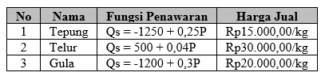
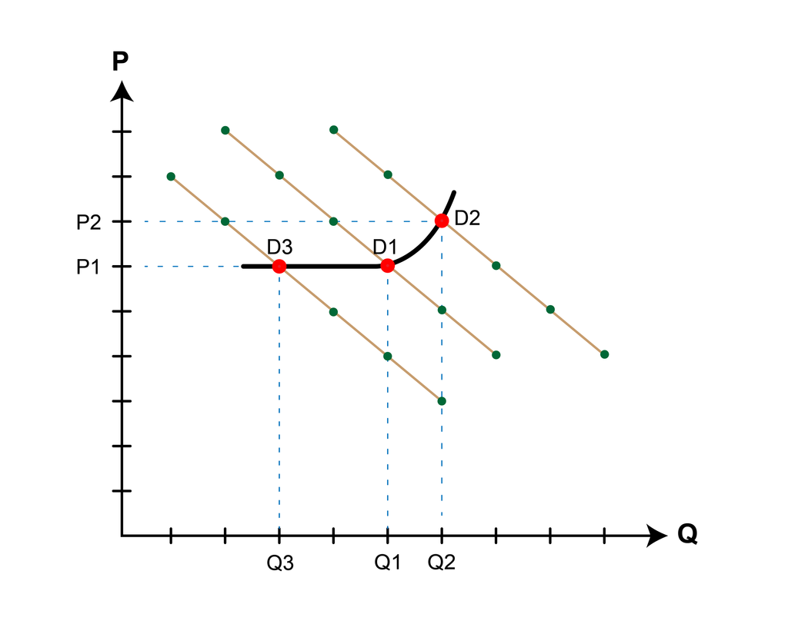
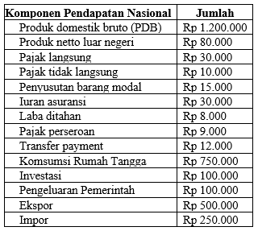
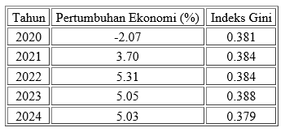
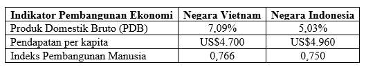
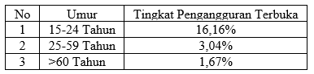
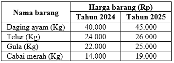
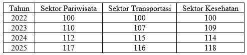
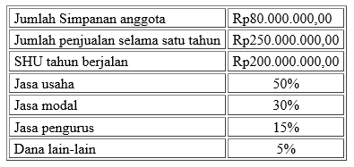
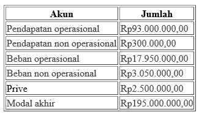

# Kumpulan Soal Simulasi TKA - Ekonomi Paket 2
**Jenjang:** SMK / SMA / MA / Sederajat (Mata Pelajaran Wajib)
**Total Soal:** 29 butir
**Sumber:** Portal Pusmendik Kemendikdasmen (Simulasi ANBK / TKA)

---

## Soal No. 1 `[Pilihan Ganda]`

### Stimulus / Bacaan:
Safia baru saja menyelesaikan pendidikan S1. Setelah lulus kuliah, ia dihadapkan pada tiga pilihan, yaitu bekerja di salah satu perusahaan kolega orang tuanya dengan gaji Rp10.000.000,00 per bulan, menempuh pendidikan S2 di dalam negeri dengan jalur beasiswa dan mendapatkan uang saku sebesar Rp2.000.000,00 setiap bulannya, serta membuka usaha di bidang kuliner yaitu steak tendaan bersama salah satu temannya dengan perkiraan omset sebesar Rp16.000.000,00 per bulan.

### Pertanyaan:
Berapakah jumlah biaya peluang yang dikorbankan oleh Safia apabila ia memilih untuk membuka usaha di bidang kuliner?

### Pilihan Jawaban:
- **[A]** Rp18.000.000,00.
- **[B]** Rp16.000.000,00.
- **[C]** Rp12.000.000,00.
- **[D]** Rp10.000.000,00.
- **[E]** Rp2.000.000,00.

---

## Soal No. 2 `[Pilihan Ganda]`

### Stimulus / Bacaan:
Perusahaan minuman sehat “Segar Abadi” mengalami kenaikan harga bahan baku utama seperti jahe, madu, dan lemon akibat gagal panen di daerah penghasil. Jika perusahaan tetap menggunakan bahan yang sama, biaya produksi meningkat dan keuntungan menurun. Namun jika mengganti bahan baku dengan bahan sintetis, harga bisa ditekan, tetapi kualitas produk menurun dan kepercayaan konsumen bisa terganggu.

### Pertanyaan:
Berdasarkan ilustrasi tersebut, manakah tindakan yang paling tepat diambil oleh perusahaan dengan mempertimbangkan prinsip ekonomi?

### Pilihan Jawaban:
- **[A]** Mencari alternatif bahan baku alami dari daerah lain dengan harga lebih kompetitif.
- **[B]** Mengganti bahan alami dengan bahan sintetis agar biaya produksi murah dan harga produk tetap.
- **[C]** Mengurangi produksi agar tidak mengalami kerugian besar sampai harga bahan baku kembali normal.
- **[D]** Menurunkan kualitas produk untuk menjaga keuntungan dan keberlangsungan perusahaan.
- **[E]** Menaikkan harga jual dua kali lipat agar perusahaan tetap memperoleh keuntungan dan keberlangsungan usaha tetap terjaga.

---

## Soal No. 3 `[Pilihan Ganda]`

### Pertanyaan:
Perusahaan “Adiwastra Jaya” merupakan perusahaan yang memproduksi berbagai macam pakaian jadi dalam jumlah besar sehingga perusahaan tersebut memiliki tenaga kerja yang cukup banyak. Ketika pemerintah menetapkan Kenaikan Upah Minimum Provinsi (UMP) tahun 2025 sebesar 6,5% dari UMP tahun sebelumnya, maka biaya produksi Perusahaan “Adiwastra Jaya” mengalami kenaikan. Kenaikan biaya produksi tersebut akan berdampak pada keseimbangan pasar yaitu ....

### Pilihan Jawaban:
- **[A]** harga naik dan jumlah barang tetap
- **[B]** harga naik dan jumlah barang turun
- **[C]** harga naik dan jumlah barang naik
- **[D]** harga turun dan jumlah barang naik
- **[E]** harga turun dan jumlah barang turun

---

## Soal No. 4 `[Pilihan Ganda]`

### Stimulus / Bacaan:
Toko “Kue Impian” merupakan toko bahan-bahan kue yang terkenal di daerahnya. Toko ini menjual berbagai macam kebutuhan untuk membuat kue seperti halnya tepung, telur, dan gula. Berikut ini fungsi penawaran dan harga dari ketiga bahan tersebut.

### Pertanyaan:
Jika semua harga jual dari ketiga bahan tersebut naik sebesar Rp3.000,00/kg maka berapakah jumlah tepung, telur, dan gula yang ditawarkan Toko “Kue Impian”?

### Pilihan Jawaban:
- **[A]** Tepung 3.250kg, Telur 1.820kg, dan Gula 5.700kg.
- **[B]** Tepung 3.250kg, Telur 1.700kg, dan Gula 5.700kg.
- **[C]** Tepung 3.250kg, Telur 1.700kg, dan Gula 4.800kg.
- **[D]** Tepung 2.500kg, Telur 1.700kg, dan Gula 4.800kg.
- **[E]** Tepung 2.500kg, Telur 1.820kg, dan Gula 4.800kg.

---

## Soal No. 5 `[Pilihan Ganda Kompleks]`

### Pertanyaan:
Pasar komoditas barang konsumsi X memiliki fungsi permintaan Qd = -20P + 500 dan fungsi penawaran Qs = 5P + 100. Pemerintah menetapkan pajak untuk barang tersebut yaitu sebesar Rp25,00 per unit. Manakah kesimpulan yang tepat berdasarkan kondisi tersebut?
Klik jawaban yang benar dari setiap pernyataan. Jawaban benar lebih dari satu.

### Pilihan Jawaban:
- **[A]** Kuantitas keseimbangan sebelum pajak yaitu sebesar 80 unit dan setelah pajak sebesar 180 unit.
- **[B]** Terjadi penurunan harga barang sebesar Rp4,00 .
- **[C]** Terjadi kenaikan harga barang sebesar Rp3,00.
- **[D]** Kuantitas barang mengalami penurunan sebanyak 60 unit.
- **[E]** Titik harga keseimbangan sebelum pajak yaitu Rp16,00 dan setelah pajak yaitu 19.

---

## Soal No. 6 `[Pilihan Ganda]`

### Stimulus / Bacaan:
Perhatikan kurva permintaan sepeda motor berikut ini.

### Pertanyaan:
Pada awalnya, kurva permintaan sepeda motor berada pada titik D1. Sepeda motor dan BBM merupakan barang komplementer sehingga ketika terjadi kenaikan harga BBM, maka analisis perubahan permintaan sepeda motor yang baru adalah....

### Pilihan Jawaban:
- **[A]** kurva permintaan sepeda motor bergerak ke atas (D2)
- **[B]** kurva permintaan sepeda motor bergerak kebawah (D3)
- **[C]** jumlah permintaan sepeda motor bergeser ke kanan (Q2)
- **[D]** jumlah permintaan sepeda motor bergeser ke kiri (Q3)
- **[E]** jumlah permintaan tetap, tidak mengalami perubahan (Q1)

---

## Soal No. 7 `[Pilihan Ganda]`

### Stimulus / Bacaan:
Berikut ini data pendapatan nasional dari Negara “Alamanda” tahun 2025 (dalam miliar):

### Pertanyaan:
Berdasarkan data tersebut, besarnya
Disposible Income
(DI) adalah ….

### Pilihan Jawaban:
- **[A]** Rp1.030.000 miliar
- **[B]** Rp1.166.000 miliar
- **[C]** Rp1.190.000 miliar
- **[D]** Rp1.220.000 miliar
- **[E]** Rp1.284.000 miliar

---

## Soal No. 8 `[Pilihan Ganda Kompleks]`

### Stimulus / Bacaan:
Pertumbuhan ekonomi adalah aspek yang mendukung serta meningkatkan kemakmuran rakyat dalam suatu negara.

### Pertanyaan:
Berdasarkan pernyataan tersebut, manakah faktor yang dapat memengaruhi pertumbuhan ekonomi suatu negara?
Klik jawaban benar pada setiap pernyataan. Jawaban benar lebih dari satu.

### Pilihan Jawaban:
- **[A]** Munculnya inovasi dan penggunaan teknologi terbaru dalam kegiatan ekonomi.
- **[B]** Peningkatan dan pemerataan akses pendidikan di seluruh wilayah.
- **[C]** Meningkatnya akses layanan perbankan terutama dalam penyaluran kredit usaha.
- **[D]** Peningkatan pemberian bantuan sosial untuk masyarakat menengah bawah.
- **[E]** Kestabilan harga barang kebutuhan pokok dalam perekonomian negara

---

## Soal No. 9 `[Pilihan Ganda]`

### Stimulus / Bacaan:
Perhatikan data pertumbuhan ekonomi dan indeks gini di Indonesia tahun 2020 hingga 2024 berdasarkan data dari Badan Pusat Statistik (BPS):

### Pertanyaan:
Berdasarkan data di atas, lakukan analisis bagaimana keterkaitan pertumbuhan ekonomi dengan kesejahteraan masyarakat Indonesia dengan menentukan pernyataan berikut
benar
atau
salah
!

### Pilihan Jawaban:
- **[A]** Pernyataan
- **[B]** Peningkatan pertumbuhan ekonomi dari tahun 2021 hingga 2023 diikuti oleh peningkatan Indeks Gini, yang menunjukkan bahwa ketimpangan pendapatan.
- **[C]** Penurunan Indeks Gini pada tahun 2024 menunjukkan bahwa pertumbuhan ekonomi yang stabil mulai dirasakan lebih merata oleh masyarakat.
- **[D]** Setiap kali pertumbuhan ekonomi meningkat, Indeks Gini selalu menurun, menandakan distribusi pendapatan yang lebih merata.

---

## Soal No. 10 `[Pilihan Ganda Kompleks]`

### Stimulus / Bacaan:
Berikut ini merupakan informasi terkait kondisi perekonomian negara Vietnam dan Indonesia pada tahun 2024.

### Pertanyaan:
Berdasarkan informasi tersebut manakah pernyataan yang tepat terkait kondisi pembangunan ekonomi di kedua negara?
Klik jawaban benar pada setiap pernyataan. Jawaban benar lebih dari satu.

### Pilihan Jawaban:
- **[A]** Nilai Indeks Pembangunan Manusia (IPM) kedua negara termasuk dalam kategori tinggi yang mencerminkan tingginya tingkat pendidikan, tingkat kesehatan, dan kesejahteraan penduduknya.
- **[B]** Tingkat laju pertumbuhan ekonomi pada Negara Indonesia lebih pesat dibandingkan dengan Negara Vietnam meningkat sebesar 2%.
- **[C]** Kedua negara termasuk dalam kategori negara berpendapatan menengah atas meskipun tingkat kesejahteraan penduduk negara Indonesia lebih tinggi dibandingkan negara Vietnam.
- **[D]** Tingkat kesejahateraan pada penduduk Negara Vietnam lebih tinggi dibandingkan penduduk Negara Indonesia.
- **[E]** Kapasitas produksi barang dan jasa kedua negara tersebut terbilang pesat sehingga mencerminkan terjadinya pembangunan ekonomi.

---

## Soal No. 11 `[Pilihan Ganda]`

### Stimulus / Bacaan:
Perhatikan pernyataan tentang kondisi pengangguran berikut ini.
Mely baru saja lulus kuliah jurusan ekonomi pembangunan dari salah satu universitas ternama di kotanya, dan sedang berusaha mendapatkan pekerjaan pertamanya.
Yoga seorang lulusan SMA yang sedang mencoba melamar beberapa pekerjaan, namun Yoga belum juga mendapatkan panggilan akibat tidak memenuhi kualifikasi perusahaan.
Pratiwi mengundurkan diri dari pekerjaannya sebagai pegawai pemerintah daerah karena harus pindah ke luar kota mengikuti keluarganya.
Bagas menolak untuk menerima pekerjaan sebagai staf keuangan salah satu perusahaan karena upah yang ditawarkan perusahaan tidak sesuai dengan harapannya.
Andi mengalami pemutusan hubungan kerja karena perusahaan tempatnya bekerja mengalami kerugian akibat menurunnya permintaan barang yang diproduksi perusahaannya.

### Pertanyaan:
Tentukan
Benar
atau
Salah
pernyataan berikut ini terkait jenis pengangguran yang dialami oleh masing-masing individu.

### Pilihan Jawaban:
- **[A]** Pernyataan
- **[B]** Mely dan Yoga merupakan pengangguran siklis.
- **[C]** Mely dan Bagas merupakan pengangguran friksional.
- **[D]** Andy dan Pratiwi merupakan pengangguran struktural.

---

## Soal No. 12 `[Pilihan Ganda]`

### Stimulus / Bacaan:
Perhatikan data BPS per Februari 2025 tentang Tingkat Pengangguran Terbuka (TPT) berdasarkan umur berikut ini!
Meskipun Tingkat Pengangguran Terbuka (TPT) secara nasional menurun menjadi 4,76%, kelompok usia muda (15-24 Tahun) tetap menjadi penyumbang tertinggi pengangguran dengan TPT mencapai 16,16%. Kondisi ini menunjukkan adanya permasalah serius terkait ketidaksesuaian antara keterampilan lulusan muda dan kebutuhan dunia kerja.

### Pertanyaan:
Berdasarkan informasi, solusi apa yang paling tepat untuk mengatasi permasalahan tersebut?

### Pilihan Jawaban:
- **[A]** Memberikan bantuan keuangan rutin kepada lulusan muda hingga mendapat pekerjaan tetap.
- **[B]** Menurunkan batas usia minimum bekerja agar remaja dapat memasuki dunia kerja lebih awal.
- **[C]** Mewajibkan perusahaan swasta mempekerjakan lulusan muda tanpa persyaratan memiliki pengalaman kerja.
- **[D]** Membangun lebih banyak industri padat karya di daerah dengan tingkat pengangguran muda yang tinggi.
- **[E]** Menyediakan pelatihan keterampilan di bidang kewirausahaan industri melalui integrasi dalam sistem pendidikan.

---

## Soal No. 13 `[Pilihan Ganda]`

### Stimulus / Bacaan:
Pada kuartal pertama tahun ini, Badan Pusat Statistik (BPS) mencatat lonjakan harga pada sejumlah bahan pokok seperti beras, minyak goreng, telur ayam, dan cabai rawit di berbagai daerah di Indonesia. Kenaikan harga ini terjadi menjelang bulan Ramadan, di mana konsumsi masyarakat meningkat pesat. Di sisi lain, hasil panen beberapa komoditas menurun akibat curah hujan yang sangat tinggi dan banjir di sejumlah sentra pertanian.

### Pertanyaan:
Berdasarkan ilustrasi tersebut, faktor utama yang menyebabkan inflasi adalah ….

### Pilihan Jawaban:
- **[A]** melemahnya nilai tukar Rupiah terhadap dolar Amerika Serikat
- **[B]** kenaikan upah buruh dan harga bahan baku industri
- **[C]** peningkatan biaya distribusi karena kenaikan harga Bahan Bakar Minyak (BBM)
- **[D]** penurunan produksi akibat perpindahan tenaga kerja ke sektor jasa
- **[E]** peningkatan permintaan barang yang lebih cepat dari pasokannya

---

## Soal No. 14 `[Pilihan Ganda]`

### Stimulus / Bacaan:
Perhatikan data harga bahan pokok di daerah Adidaya berikut ini.

### Pertanyaan:
Besarnya nilai Indeks Harga Konsumen (IHK) tahun 2025 dengan metode agregatif sederhana adalah ....

### Pilihan Jawaban:
- **[A]** 115%
- **[B]** 111,62%
- **[C]** 110%
- **[D]** 95,6%
- **[E]** 90,9%

---

## Soal No. 15 `[Pilihan Ganda]`

### Stimulus / Bacaan:
Perhatikan data Indeks Harga Konsumen (IHK) berikut, berdasarkan tiga sektor dalam empat periode. Dengan tahun 2022 sebagai indeks harga tahun dasar.

### Pertanyaan:
Berdasarkan tabel tersebut, manakah sektor yang paling berdampak terhadap tingkat inflasi?

### Pilihan Jawaban:
- **[A]** Sektor pariwisata memberikan dampak tertinggi terhadap inflasi karena mengalami kenaikan IHK sebesar 17% selama periode 2022–2025.
- **[B]** Sektor transportasi menjadi penyumbang inflasi terbesar karena memiliki lonjakan indeks paling tajam pada tahun 2024.
- **[C]** Kenaikan indeks sektor kesehatan relatif rendah, sehingga tidak signifikan terhadap inflasi nasional.
- **[D]** Semua sektor mengalami kenaikan IHK yang sama, sehingga dampaknya terhadap inflasi dianggap setara.
- **[E]** Sektor kesehatan memberikan dampak terbesar karena mengalami kenaikan indeks harga tertinggi selama periode 2022–2025.

---

## Soal No. 16 `[Pilihan Ganda Kompleks]`

### Pertanyaan:
Bank Sentral bertanggung jawab agar keuangan suatu negara tetap stabil. Berikut ini mana yang merupakan peran dan fungsi Bank Indonesia?
Klik jawaban benar pada setiap pernyataan. Jawaban benar lebih dari satu.

### Pilihan Jawaban:
- **[A]** Mengatur suku bunga acuan untuk mengendalikan inflasi
- **[B]** Menyediakan layanan giro, tabungan, dan deposito untuk masyarakat
- **[C]** Mengawasi kelancaran sistem pembayaran nasional
- **[D]** Menyalurkan kredit langsung kepada pelaku usaha kecil
- **[E]** Menjaga stabilitas sistem keuangan nasional

---

## Soal No. 17 `[Pilihan Ganda Kompleks]`

### Stimulus / Bacaan:
Di Indonesia, momen Hari Raya telah menjadi bagian penting dari siklus ekonomi tahunan. Pada periode ini, terjadi peningkatan aktivitas ekonomi masyarakat yang ditandai dengan percepatan peredaran uang dan peningkatan konsumsi rumah tangga. Efek kenaikan upah dari THR (Tunjangan Hari Raya) mendorong peningkatan konsumsi yang kemudian berimbas pada kenaikan harga. Hari Raya juga identik dengan meningkatnya belanja di kalangan masyarakat. Hampir setiap rumah tangga mengalokasikan anggaran konsumsi untuk berbagai hal. Berbagai aktivitas masyarakat di masa Lebaran ini terpotret dari arus perputaran uang yang lebih cepat dibandingkan dengan hari biasa sehingga memicu terjadinya inflasi.

### Pertanyaan:
Berdasarkan ilustrasi tersebut, kebijakan moneter apa yang sesuai untuk mengantisipasi kondisi tersebut? Klik semua jawaban benar! Jawaban benar lebih dari satu.

### Pilihan Jawaban:
- **[A]** Menaikkan suku bunga simpanan untuk mendorong peningkatan tabungan masyarakat di perbankan.
- **[B]** Menjual surat berharga untuk menarik dana masyarakat dan mendukung pembiayaan fiskal.
- **[C]** Menurunkan suku bunga simpanan guna mengalihkan preferensi masyarakat dari menabung ke investasi.
- **[D]** Melonggarkan kebijakan kredit untuk meningkatkan akses pembiayaan bagi sektor rumah tangga dan industri.
- **[E]** Menurunkan rasio cadangan wajib minimum (reserve requirement) agar bank memiliki ruang likuiditas lebih besar untuk menyalurkan kredit dan investasi.

---

## Soal No. 18 `[Pilihan Ganda Kompleks]`

### Stimulus / Bacaan:
Pertumbuhan ekonomi Indonesia pada kuartal I-2025 hanya mencapai 4,87%, mengalami penurunan dibanding kuartal-kuartal sebelumnya. Penurunan ini terutama disebabkan oleh lesunya konsumsi rumah tangga, yang hanya tumbuh 4,89% (YOY), meskipun kontribusinya terhadap PDB masih sangat besar, yaitu sekitar 54,53%. Penurunan konsumsi ini erat kaitannya dengan melemahnya daya beli dan penyusutan kelas menengah dari 57,33 juta orang pada 2019 menjadi hanya 47,85 juta orang pada 2024. Untuk merespons situasi tersebut, Bank Indonesia (BI) mengambil langkah menurunkan rasio Cadangan Wajib Minimum (GWM).

### Pertanyaan:
Manakah pernyataan berikut yang tepat menggambarkan konsekuensi dan efektivitas dari kebijakan tersebut? Klik semua jawaban benar! Jawaban benar lebih dari satu.

### Pilihan Jawaban:
- **[A]** Langkah yang diambil BI dapat memperluas ruang likuiditas perbankan sehingga memperkuat kemampuan pembiayaan terhadap konsumsi rumah tangga.
- **[B]** Kebijakan yang dilakukan BI berisiko gagal meningkatkan konsumsi jika tidak dibarengi dengan perbaikan sisi permintaan seperti kenaikan pendapatan riil Masyarakat.
- **[C]** Kebijakan yang dilakukan BI dapat menjadi sinyal ekspansi moneter, namun dampaknya terbatas bila perbankan memilih menahan kredit karena kehati-hatian terhadap risiko gagal bayar.
- **[D]** Langkah BI ini akan secara otomatis meningkatkan konsumsi karena dana murah akan terserap langsung oleh rumah tangga menengah bawah.
- **[E]** Kebijakan yang diambil BI dengan pengawasan alokasi kredit dapat membuat dana justru terserap ke sektor spekulatif seperti aset finansial dan property.

---

## Soal No. 19 `[Pilihan Ganda]`

### Stimulus / Bacaan:
Rokok, minuman beralkohol, dan kendaraan berbahan bakar fosil merupakan barang yang dikategorikan sebagai
demerit goods
karena dapat membahayakan kesehatan. Oleh karena, pemerintah menerapkan kebijakan fungsi regulasi pajak, yakni menaikkan tarif pajak atas produk-produk yang memiliki eksternalitas negatif. Sebagai pelengkap, pemerintah juga memberikan insentif pajak kepada industri yang mengembangkan alternatif ramah lingkungan seperti kendaraan listrik dan produk substitusi non-alkohol.

### Pertanyaan:
Berdasarkan ilustrasi tersebut, dampak yang paling tepat dari penerapan fungsi regulasi pajak adalah....

### Pilihan Jawaban:
- **[A]** terhambatnya ekspansi industri berbasis energi fosil akibat insentif yang tidak merata
- **[B]** perubahan preferensi konsumsi masyarakat menuju barang yang lebih sehat dan ramah lingkungan
- **[C]** meningkatnya ketergantungan fiskal terhadap sektor barang dengan dampak eksternalitas tinggi
- **[D]** penurunan pendapatan masyarakat akibat meningkatnya harga barang konsumsi umum
- **[E]** peningkatan keuntungan produsen barang substitusi sebagai akibat dari kenaikan permintaan

---

## Soal No. 20 `[Pilihan Ganda Kompleks]`

### Stimulus / Bacaan:
Pak Andi seorang karyawan swasta. Gaji bulanannya dipotong secara otomatis untuk membayar Pajak Penghasilan (PPh) Pasal 21, yang disetorkan oleh perusahaannya ke kas negara. Ia memiliki Nomor Pokok Wajib Pajak (NPWP) dan rutin melaporkan SPT Tahunan secara
online
. Sedangkan Ibu Rani seorang pemilik toko kelontong. Ia menjual barang-barang kebutuhan rumah tangga dan secara berkala menyetorkan Pajak Pertambahan Nilai (PPN) atas penjualannya serta membayar PPh Final UMKM. Uang pajak yang disetorkan oleh Pak Andi dan Ibu Rani digunakan untuk membangun fasilitas umum seperti puskesmas dan sekolah, serta membayar gaji pegawai Aparatur Sipil Negara (ASN).

### Pertanyaan:
Berdasarkan ilustrasi tersebut, manakah pernyataan berikut yang benar terkait jenis pajak, peran, fungsi, dan prinsip pajak? Tentukan jawaban yang benar. Jawaban benar lebih dari satu.

### Pilihan Jawaban:
- **[A]** Pak Andi membayar pajak langsung, sedangkan Ibu Rani membayar pajak tidak langsung. Keduanya menerapkan prinsip kemudahan dalam pembayaran pajak.
- **[B]** Pajak yang dibayarkan keduanya menunjukkan penerapan fungsi budgeter karena uang pajak digunakan untuk membiayai pengeluaran negara.
- **[C]** Pak Andi membayar pajak tidak langsung dengan prinsip kemudahan, sedangkan Ibu Rani membayar pajak langsung dengan prinsip efisiensi karena rendahnya biaya yang dikeluarkan untuk membayar pajak.
- **[D]** Pajak yang dibayarkan keduanya menunjukkan penerapan fungsi distribusi karena uang yang diterima pemerintah dialokasikan ke berbagai sektor pembangunan dan perluasan lapangan pekerjaan.
- **[E]** Pak Andi dan Ibu Rani membayar pajak langsung dengan prinsip keadilan karena besarnya jumlah pajak yang dibayarkan keduanya sama tanpa memperhatikan objek pajaknya.

---

## Soal No. 21 `[Pilihan Ganda Kompleks]`

### Pertanyaan:
Taliukir adalah sebuah perusahaan yang bergerak di bidang kerajinan tangan berbahan dasar kulit, seperti tas, dompet, dan sabuk. CV. Taliukir sangat mengutamakan kualitas produk yang dibuat secara tradisional, sehingga setiap produk memiliki sentuhan unik dan nilai seni tinggi. Produk mereka beredar di pasar menengah atas dan turis. Meskipun produknya berkualitas, CV. Taliukir kesulitan mendapatkan modal besar untuk mengembangkan usaha, seperti membeli mesin modern untuk efisiensi produksi massal atau membuka cabang di kota besar. Selain itu pasokan kulit berkualitas tinggi mulai langka dan harganya terus naik. Hal ini disebabkan semakin ketatnya regulasi lingkungan yang membatasi industri penyamakan kulit dan peningkatan permintaan dari industri
fesyen
global. Solusi yang bisa dilakukan untuk mengatasi permasalahan tersebut yaitu ….
Pilihlah jawaban benar pada setiap pernyataan. Jawaban benar lebih dari satu.

### Pilihan Jawaban:
- **[A]** menghentikan produksi kerajinan kulit dan beralih ke kerajinan dengan bahan baku lain yang lebih mudah didapat.
- **[B]** membentuk kerjasama dengan peternak sapi atau industri pengolahan kulit mentah untuk memastikan pasokan kulit, dan mencari investor dengan skema bagi hasil.
- **[C]** menimbun kulit berkualitas tinggi dalam jumlah besar saat tersedia, meskipun harganya mahal, dan mengajukan pinjaman bank dengan agunan aset pribadi pemilik CV.
- **[D]** berinvestasi dalam riset dan pengembangan untuk menemukan bahan kulit sintetis berkualitas tinggi yang menyerupai kulit asli.
- **[E]** mengurangi standar kualitas produk agar bisa menggunakan bahan baku kulit dengan kualitas lebih rendah dan biaya produksi lebih murah.

---

## Soal No. 22 `[Pilihan Ganda]`

### Stimulus / Bacaan:
CV Surya Karya, sebuah badan usaha jasa interior, menghadapi masalah keuangan dalam tiga bulan terakhir. Meski pendapatan meningkat karena banyaknya proyek, perusahaan justru mengalami kesulitan membayar gaji karyawan dan tagihan vendor tepat waktu. Setelah dilakukan penelusuran, diketahui bahwa manajer keuangan sering menggunakan dana masuk untuk membayar utang lama tanpa membuat perencanaan arus kas yang jelas. Selain itu, tidak ada pemisahan dana antara proyek satu dengan proyek lainnya, sehingga dana dari satu proyek sering digunakan untuk kebutuhan proyek lain. Akibatnya, banyak pengeluaran tidak terkontrol dan laporan keuangan sulit disusun secara akurat.

### Pertanyaan:
Berdasarkan uraian tersebut, solusi yang paling tepat untuk mengatasi permasalahan manajemen keuangan yang terjadi adalah...

### Pilihan Jawaban:
- **[A]** menambah jumlah staf administrasi keuangan agar pengelolaan dana lebih terdistribusi.
- **[B]** mengajukan pinjaman jangka pendek ke bank agar kebutuhan operasional segera terpenuhi.
- **[C]** meningkatkan pemasaran agar pemasukan lebih besar dan menutupi kekurangan kas.
- **[D]** menyusun sistem pengelolaan arus kas yang terencana dan pemisahan dana untuk setiap proyek.
- **[E]** mengurangi proyek yang dikerjakan agar fokus pengelolaan keuangan tidak tersebar.

---

## Soal No. 23 `[Pilihan Ganda]`

### Stimulus / Bacaan:
Perhatikan data laporan keuangan Koperasi Kilau Gemitang berikut ini.

### Pertanyaan:
Berdasarkan data tersebut, jika jumlah pengurus koperasi sebanyak 20 orang, dan Pak Faiz merupakan salah satu pengurus dengan total simpanan Rp1.000.000,00 serta transaksi penjualan Rp2.000.000,00, maka total SHU yang diterima pak Faiz pada akhir tahun 2025 adalah ....

### Pilihan Jawaban:
- **[A]** Rp4.550.000,00
- **[B]** Rp3.400.000,00
- **[C]** Rp3.230.000,00
- **[D]** Rp3.050.000,00
- **[E]** Rp3.000.000,00

---

## Soal No. 24 `[Pilihan Ganda]`

### Pertanyaan:
Beberapa negara di Asia Tenggara termasuk Indonesia membentuk sebuah organisasi yang bertujuan mempererat hubungan politik, ekonomi, dan sosial di kawasan mereka. Sementara itu, Indonesia juga menjalin perjanjian perdagangan barang dan jasa dengan Korea Selatan yang hanya melibatkan kedua negara tersebut. Di sisi lain, ada organisasi global yang anggotanya berasal dari berbagai negara di seluruh dunia yang fokus pada masalah perdagangan internasional. Berdasarkan ilustrasi tersebut, apa jenis kerja sama internasional yang tepat?

### Pilihan Jawaban:
- **[A]** Kerja sama bilateral untuk ASEAN, kerja sama regional untuk perjanjian Indonesia-Korea, dan kerja sama multilateral untuk organisasi perdagangan global.
- **[B]** Kerja sama multilateral untuk ASEAN, kerja sama bilateral untuk perjanjian Indonesia-Korea, dan kerja sama multilateral untuk organisasi perdagangan global.
- **[C]** Kerja sama regional untuk ASEAN, kerja sama multilateral untuk perjanjian Indonesia-Korea, dan kerja sama bilateral untuk organisasi perdagangan global.
- **[D]** Kerja sama bilateral untuk ASEAN, kerja sama multilateral untuk perjanjian Indonesia-Korea, dan kerja sama regional untuk organisasi perdagangan global.
- **[E]** Kerja sama regional untuk ASEAN, kerja sama bilateral untuk perjanjian Indonesia-Korea, dan kerja sama multilateral untuk organisasi perdagangan global.

---

## Soal No. 25 `[Pilihan Ganda]`

### Stimulus / Bacaan:
Selama beberapa tahun terakhir, Negara X mengalami defisit neraca perdagangan yang semakin memburuk. Sebagai negara berkembang, negara X bergantung pada ekspor sumber daya alam seperti kelapa sawit, batubara, dan karet. Nilai ekspor negara tersebut stagnan bahkan cenderung mengalami penurunan karena rendahnya kualitas dan inovasi produk domestik. Rendahnya nilai ekspor juga dipengaruhi oleh tingginya biaya logistik sehingga menyebabkan harga produk ekspor menjadi tinggi. Di sisi lain, negara X juga dibanjiri produk impor. Tingginya
volume
impor barang konsumsi seperti tekstil dan makanan olahan menyebabkan produk lokal kehilangan daya saing. Sementara itu, Pemerintah ingin mengambil kebijakan perdagangan internasional yang tepat untuk menyeimbangkan kembali kondisi tersebut dan melindungi industri nasional.

### Pertanyaan:
Berdasarkan ilustrasi tersebut, manakah kebijakan perdagangan internasional yang paling tepat untuk mengatasi permasalahan Negara X?

### Pilihan Jawaban:
- **[A]** Meningkatkan kuota impor barang konsumsi agar harga barang di dalam negeri lebih stabil dan tercukupinya kebutuhan masyarakat.
- **[B]** Menghapus semua hambatan perdagangan agar negara lebih terbuka terhadap investasi asing, sehingga terciptanya lapangan pekerjaan.
- **[C]** Memberikan subsidi dan insentif kepada industri lokal serta melakukan diversifikasi produk agar lebih kompetitif di pasar global.
- **[D]** Menurunkan nilai tukar mata uang secara drastis untuk mendorong ekspor, sehingga neraca perdagangan kembali surplus.
- **[E]** Menurunkan tarif impor agar masyarakat menikmati barang konsumsi impor dengan harga murah sehingga daya beli masyarakat meningkat.

---

## Soal No. 26 `[Pilihan Ganda Kompleks]`

### Stimulus / Bacaan:
Pada Oktober 2023,
American Shrimp Processors Association
(ASPA) mengajukan petisi kepada Departemen Perdagangan Amerika Serikat (USDOC) dan Komisi Perdagangan Internasional Amerika Serikat (USITC). Petisi tersebut menuduh bahwa Indonesia melakukan praktik dumping dan menerima subsidi tidak adil dalam ekspor udang tropis beku, yang dianggap merugikan industri udang lokal di Amerika Serikat. Akibat tuduhan ini, ekspor udang Indonesia menghadapi risiko dikenai bea masuk anti-dumping dan
countervailing duty
(tarif subsidi). Jika tuduhan tersebut berlanjut dan pemerintah Amerika Serikat mengenakan bea masuk tambahan terhadap udang Indonesia.

### Pertanyaan:
Manakah yang merupakan dampak logis terhadap daya saing ekspor udang Indonesia ke Amerika Serikat?
Klik setiap pernyataan jawaban benar.Jawaban benar lebih dari satu.

### Pilihan Jawaban:
- **[A]** Harga jual udang Indonesia menjadi lebih rendah di pasar Amerika Serikat dibandingkan pesaing seperti India atau Ekuador.
- **[B]** Dapat menurunkan kepercayaan pembeli dan mencoreng reputasi produk perikanan Indonesia di pasar global.
- **[C]** Eksportir Indonesia harus meningkatkan sertifikasi perdagangan untuk menghindari diskriminasi tarif di masa mendatang.
- **[D]** Dapat menjadi peluang bagi Indonesia untuk mendominasi pasar udang beku karena dianggap memiliki harga yang kompetitif.
- **[E]** Dapat memicu negara tujuan lain untuk melakukan penyelidikan serupa terhadap produk ekspor Indonesia.

---

## Soal No. 27 `[Pilihan Ganda Kompleks]`

### Stimulus / Bacaan:
Perhatikan beberapa transaksi keuangan berikut yang terjadi di PT Solusi Jasa Mandiri bergerak di perusahaan jasa konsultan teknologi:
Diterima pembayaran tunai sebesar Rp10.000.000,00 dari klien atas jasa yang telah diberikan.
Dibayar sewa kantor untuk 3 bulan ke depan sebesar Rp6.000.000,00 secara tunai.
Membeli peralatan kantor senilai Rp12.000.000,00 secara kredit.
Pemilik menambahkan investasi pribadi ke dalam perusahaan sebesar Rp15.000.000,00 melalui rekening bank perusahaan.
Menerima tagihan listrik bulan ini sebesar Rp800.000,00 yang belum dibayar.

### Pertanyaan:
Berdasarkan transaksi tersebut, manakah yang menyebabkan perubahan pada aset maupun kewajiban dalam persamaan dasar akuntansi?
Klik pada semua jawaban yang benar! Jawaban benar lebih dari satu.

### Pilihan Jawaban:
- **[A]** Transaksi 1
- **[B]** Transaksi 2
- **[C]** Transaksi 3
- **[D]** Transaksi 4
- **[E]** Transaksi 5

---

## Soal No. 28 `[Pilihan Ganda]`

### Stimulus / Bacaan:
Data keuangan Bengkel Tuan Akhtar periode Desember 2024 sebagai berikut:
Kas Rp10.000.000,00
Piutang Rp7.000.000,00
Sewa dibayar dimuka Rp6.000.000,00
Peralatan Rp8.500.000,00
Utang usaha Rp8.000.000,00
Modal Rp23.500.000,00.

### Pertanyaan:
Apabila perusahaan membayar utang sebesar Rp2.000.000,00 dan biaya bunga sebesar Rp50.000,00 maka perubahan persamaan dasar akuntansi yang benar adalah ....

### Pilihan Jawaban:
- **[A]** harta berkurang menjadi Rp23.450.000,00, utang berkurang menjadi Rp6.000.000,00, dan modal bertambah menjadi Rp29.450.000,00
- **[B]** harta berkurang menjadi Rp29.450.000,00, utang berkurang menjadi Rp6.000.000,00, dan modal berkurang menjadi Rp23.450.000,00
- **[C]** harta berkurang menjadi Rp29.500.000,00, utang berkurang menjadi Rp6.000.000,00, dan modal tetap sebesar Rp23.500.000,00
- **[D]** harta bertambah menjadi Rp31.500.000,00, utang bertambah menjadi Rp8.000.000,00, dan modal tetap sebesar Rp23.500.000,00
- **[E]** harta bertambah menjadi Rp33.550.000,00, utang bertambah menjadi Rp10.000.000,00, dan modal bertambah menjadi Rp23.550.000,00

---

## Soal No. 29 `[Pilihan Ganda]`

### Stimulus / Bacaan:
Diketahui data keuangan rental kendaraan “Sat Set” pada bulan Desember 2024 sebagai berikut!

### Pertanyaan:
Berdasarkan data tersebut, besarnya modal awal adalah ….

### Pilihan Jawaban:
- **[A]** Rp120.200.000,00
- **[B]** Rp122.700.000,00
- **[C]** Rp125.200.000,00
- **[D]** Rp267.300.000,00
- **[E]** Rp269.800.000,00

---
