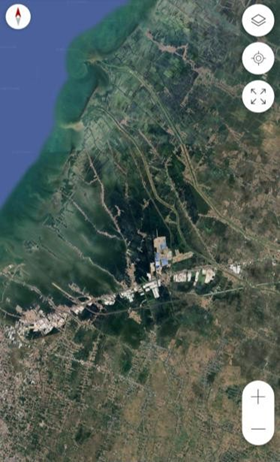
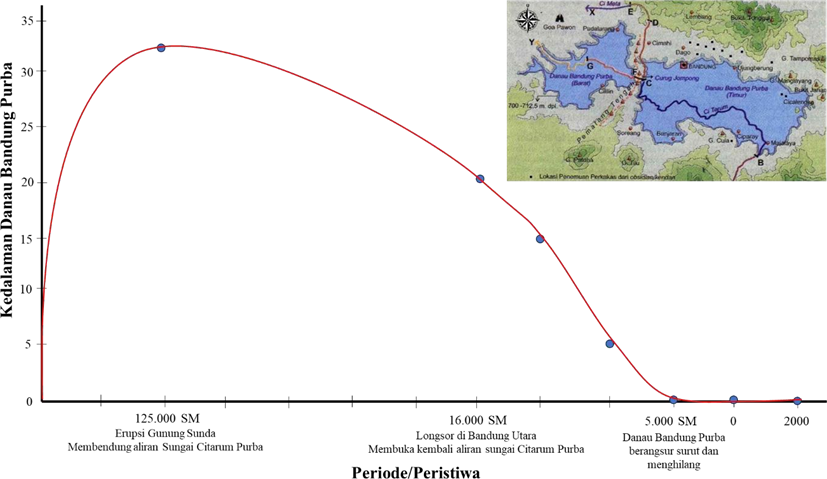
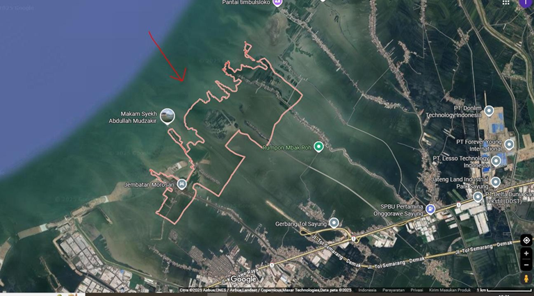
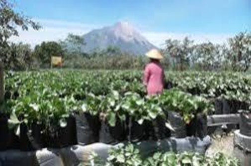
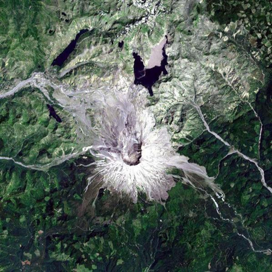
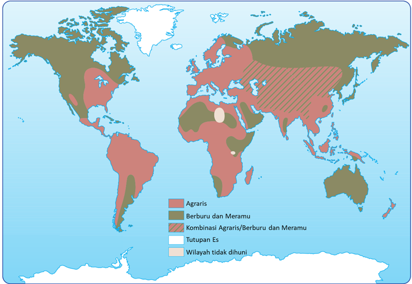

# Kumpulan Soal Simulasi TKA - Geografi Paket 1
**Jenjang:** SMK / SMA / MA / Sederajat (Mata Pelajaran Wajib)
**Total Soal:** 10 butir
**Sumber:** Portal Pusmendik Kemendikdasmen (Simulasi ANBK / TKA)

---

## Soal No. 1 `[Pilihan Ganda Kompleks]`

### Stimulus / Bacaan:
Perhatikan gambar tangkapan citra satelit berikut!
berdasarkan tangkapan citra satelit tersebut, seorang kepala daerah mengidentifikasi terdapatnya indikasi banjir pada wilayah yang berbatasan dengan laut.

### Pertanyaan:
Berdasarkan informasi tersebut, seorang peneliti akan menindaklanjuti permasalahan tersebut. Rumusan masalah manakah yang tepat?

### Pilihan Jawaban:
- **[A]** Bagaimana pengaruh bencana terhadap perekonomian penduduk?
- **[B]** Apa saja jenis-jenis bencana alam yang berdampak luas terhadap masyarakat?
- **[C]** Bagaimana hubungan antara pasang air laut dengan topografi wilayah?
- **[D]** Mengapa siswa perlu mengetahui pentingnya menjaga lingkungan secara berkelanjutan?
- **[E]** Bagaimana bentuk mitigasi bencana beserta dengan contohnya yang konkret di sekolah?

---

## Soal No. 2 `[Pilihan Ganda]`

### Stimulus / Bacaan:
Danau Bandung Purba
Danau Bandung purba terbentuk sekitar 125.000 tahun lalu ketika material erupsi Gunung Sunda membendung aliran Sungai Citarum Purba. Kedalaman rata-rata danau Bandung Purba saat itu sekitar 20-30 meter. Peristiwa gempa bumi dan longsor akibat erosi di antara Curug Cukangrahong dan Curug Halimun sekitar 16.000 tahun lalu berakibat air danau ini mengalir ke utara. Dampaknya adalah air danau mulai terkuras kemudian membuat bentang lahan Cekungan Bandung menjadi rawa dan berangsur-angsur mengering. Danau Bandung Purba juga menjadi wilayah yang dihuni oleh manusia sejak lama dengan ditemukan adanya perkakas obsidian yang tersebar di sekitarnya.

### Pertanyaan:
Tentukan apakah pernyataan tentang fenomena Bandung Purba terkait aktivitas manusia berikut
Benar
atau
Salah
!

### Pilihan Jawaban:
- **[A]** Pernyataan
- **[B]** Data menunjukkan bahwa Bandung pernah berada di bawah permukaan air.
- **[C]** Manusia mulai menempati kawasan Danau Bandung Purba setelah mengering.
- **[D]** Manusia mulai mengembangkan pertanian di utara danau.

---

## Soal No. 3 `[Pilihan Ganda]`

### Stimulus / Bacaan:
Studi Kasus Abrasi Pantai Demak
Sumber: googlemap.com
Kawasan pesisir di Desa Bedono, Kabupaten Demak, Jawa Tengah, mengalami abrasi parah sejak tahun 1990-an akibat kombinasi faktor alami dan aktivitas manusia (lihat gambar). Sekitar 6 km² daratan tenggelam, memaksa ratusan keluarga meninggalkan rumah mereka. Kerusakan ini diperparah oleh konversi hutan mangrove menjadi tambak udang tanpa mempertimbangkan daya dukung lingkungan. Data Dinas Lingkungan Hidup tahun 2022 mencatat bahwa hanya sekitar 20% dari luasan mangrove awal yang masih bertahan, menyebabkan kerusakan ekosistem pesisir dan memperparah risiko bencana.
Sejak 2015, berbagai upaya rehabilitasi dilakukan oleh pemerintah daerah, LSM, dan masyarakat setempat. Program restorasi mangrove ditargetkan menanam kembali 150.000 bibit mangrove hingga tahun 2025. Selain itu, dikembangkan konsep ekowisata berbasis konservasi, di mana masyarakat diberdayakan sebagai pengelola kawasan wisata edukasi mangrove. Hasil awal monitoring tahun 2023 menunjukkan bahwa 65% dari bibit mangrove yang ditanam berhasil tumbuh, mengurangi kecepatan abrasi rata-rata sebesar 10% per tahun di beberapa titik kritis. Program ini juga meningkatkan pendapatan tambahan masyarakat hingga 20% melalui sektor ekowisata.

### Pertanyaan:
Tentukan fakta berikut ini
Benar
atau
Salah
terkait keberlanjutan pengelolaan SDA berdasarkan prinsip konservasi dan restorasi lingkungan!

### Pilihan Jawaban:
- **[A]** Fakta
- **[B]** Kerusakan hutan mangrove di Desa Bedono disebabkan oleh faktor alami.
- **[C]** Contoh pengelolaan berkelanjutan adalah ekowisata berbasis konservasi.
- **[D]** Penanaman mangrove terbukti dapat mengurangi abrasi pantai.

---

## Soal No. 4 `[Pilihan Ganda]`

### Stimulus / Bacaan:
Perhatikan gambar berikut!
Gambar tersebut menunjukkan tanaman sayuran seperti kubis, wortel, dan kentang tumbuh dengan baik di lahan sekitar gunung berapi. Sebagian lahan pernah tertimbun abu vulkanik dari letusan beberapa tahun sebelumnya. Petani menyebut tanah di wilayah tersebut sangat cocok untuk pertanian karena kandungan mineralnya tinggi.

### Pertanyaan:
Tentukan
Benar
atau
Salah
untuk setiap pernyataan berikut terkait hubungan antara letusan gunung api dengan kondisi lahan!

### Pilihan Jawaban:
- **[A]** Hubungan Letusan Gunung Api dengan Kondisi Lahan
- **[B]** Abu vulkanik yang jatuh ke permukaan tanah akan memperkaya unsur hara seperti kalium dan fosfor yang bermanfaat bagi tanaman.
- **[C]** Letusan gunung berapi selalu merusak seluruh lahan pertanian dan membuatnya tidak dapat digunakan selama puluhan tahun.
- **[D]** Lahan bekas aliran lava tidak pernah bisa dimanfaatkan kembali untuk pertanian.

---

## Soal No. 5 `[Pilihan Ganda]`

### Stimulus / Bacaan:
Perhatikan gambar citra satelit berikut dengan seksama!

### Pertanyaan:
Berdasarkan gambar di atas, produk analisis yang dapat dihasilkan dari olahan citra tersebut adalah ….

### Pilihan Jawaban:
- **[A]** peta jenis vegetasi
- **[B]** peta kawasan rawan bencana
- **[C]** peta stratigrafi batuan
- **[D]** peta oksigen terlarut
- **[E]** peta penggunaan lahan

---

## Soal No. 6 `[Pilihan Ganda]`

### Stimulus / Bacaan:
Wilayah Jakarta diproyeksikan akan berkembang menjadi kawasan megapolitan yang melibatkan wilayah di luar Jabodetabek pasca menjadi Ibukota. Pertumbuhan penduduk yang terus meningkat, khususnya akibat migrasi dari berbagai daerah, menyebabkan tekanan terhadap ruang, infrastruktur, dan layanan publik di wilayah Jakarta dan sekitarnya. Keadaan ini mendorong perluasan wilayah fungsional kota hingga menjangkau kawasan yang lebih luas, termasuk kota-kota di provinsi tetangga (Jawa Barat dan Banten).

### Pertanyaan:
Berdasarkan dinamika pertumbuhan penduduk yang terus meningkat akibat migrasi, bagaimana kemungkinan pola pergerakan penduduk di wilayah megapolitan Jakarta akan berkembang di masa depan?

### Pilihan Jawaban:
- **[A]** Urbanisasi akan menurun karena masyarakat mulai kembali ke desa akibat tekanan hidup di kota besar.
- **[B]** Penduduk akan akan bermigrasi secara merata di seluruh wilayah kota karena program industri padat modal.
- **[C]** Pergerakan penduduk cenderung terkonsentrasi di pusat kota karena akses pekerjaan dan layanan publik yang lebih baik.
- **[D]** Pergerakan penduduk akan membentuk pola peri-urbanisasi, yaitu menyebar ke wilayah pinggiran dan kota-kota satelit di luar Jabodetabek.
- **[E]** Dinamika penduduk hanya akan terjadi di kawasan industri besar karena fasilitas penunjangnya paling lengkap.

---

## Soal No. 7 `[Pilihan Ganda]`

### Stimulus / Bacaan:
Wilayah-wilayah di dunia pada sekitar tahun 1500 menunjukkan hubungan erat antara kondisi geografis, termasuk bioma dan iklim, dengan cara manusia memenuhi kebutuhan hidupnya. Aktivitas agraris berkembang pesat di kawasan tropis dengan tanah subur dan curah hujan tinggi, seperti Asia Tenggara, termasuk Nusantara (kini Indonesia), yang dikelilingi oleh hutan hujan tropis. Dalam konteks ini, bioma hutan hujan tropis menyediakan sumber daya alam yang melimpah, mulai dari lahan subur untuk bertani hingga keanekaragaman flora dan fauna yang dapat dimanfaatkan untuk pangan, obat-obatan, dan bahan bangunan. Masyarakat di kepulauan Indonesia mengembangkan sistem pertanian padi sawah, perkebunan rempah-rempah, dan pemanfaatan hasil hutan sebagai bagian dari strategi adaptasi terhadap lingkungannya. Hal ini mencerminkan bahwa persebaran bioma tidak hanya memengaruhi cara hidup, tetapi juga menjadi fondasi penting bagi kesejahteraan masyarakat melalui pemanfaatan sumber daya hayati yang berkelanjutan. Dengan demikian, aktivitas manusia pada masa itu menjadi cerminan awal dari proses pemanfaatan alam yang terstruktur, yang dalam perkembangan selanjutnya menjadi bagian dari sistem ekonomi dan budaya suatu wilayah.

### Pertanyaan:
Tentukan fakta berikut
Benar
atau
Salah
terkait kondisi manfaat flora dan fauna terhadap aktivitas manusia pada masa lalu!

### Pilihan Jawaban:
- **[A]** Fakta
- **[B]** Wilayah tropis telah mengembangkan pertanian menetap karena curah hujan tinggi.
- **[C]** Wilayah lingkar kutub menjadi pusat kelompok berburu dan meramu.
- **[D]** Kelompok masyarakat di lintang sedang cenderung berburu berdasarkan musim.

---

## Soal No. 8 `[Pilihan Ganda Kompleks]`

### Stimulus / Bacaan:
Perhatikan data Perdagangan dan Kerja Sama regional berikut!
Indonesia
Malaysia
Thailand
Vietnam
Singapura
Perdagangan Internasional (Miliar USD)
Ekspor Migas (Miliar USD)
52
40
30
20
18
Ekspor Non-Migas (Miliar USD)
263
250
490
440
822
Impor Migas (Miliar USD)
63
50
35
25
16
Impor Non-Migas (Miliar USD)
117
110
465
420
824
Pariwisata
Jumlah Wisatawan Asing (Juta Orang)
10,5
15,3
28
8,5
19
Asal Wisatawan Terbanyak
Malaysia, Tiongkok
Singapura, Indonesia
Tiongkok, Malaysia
Korea Selatan, Jepang
Indonesia, Malaysia
Kerja Sama Regional dan Global (jumlah kesepakatan)
Kerja Sama Ekonomi
5
4
5
3
6
Kerja Sama Lingkungan
4
3
2
2
3
Kerja Sama Sosial
3
4
3
2
3
Kerja Sama Politik
4
3
2
3
4

### Pertanyaan:
Berdasarkan data pariwisata Indonesia dan negara ASEAN tahun 2024, pilih semua pernyataan yang benar terkait pola kunjungan wisatawan dan pengaruh letak geografis Indonesia!

### Pilihan Jawaban:
- **[A]** Sebagian besar wisatawan asing ke Indonesia berasal dari kawasan ASEAN dan Asia Timur, mendukung konektivitas regional.
- **[B]** Meningkatnya kunjungan wisatawan dari Tiongkok mencerminkan perluasan pasar wisata Indonesia di luar ASEAN.
- **[C]** Jumlah wisatawan asing Indonesia lebih besar dari Thailand karena pengaruh posisi geografis Indonesia yang lebih strategis.
- **[D]** Lokasi Indonesia yang berada di jalur internasional memperbesar peluang akses wisatawan dari berbagai kawasan dunia.
- **[E]** Dominasi wisatawan dari Asia menunjukkan bahwa ASEAN belum menarik wisatawan dari kawasan Eropa secara signifikan.

---

## Soal No. 9 `[Pilihan Ganda]`

### Stimulus / Bacaan:
Setiap musim hujan, wilayah Kota Bekasi kerap dilanda banjir yang menyebabkan kemacetan lalu lintas, kerusakan rumah warga, dan terganggunya aktivitas ekonomi. Berdasarkan data BMKG, curah hujan di wilayah ini cukup tinggi pada bulan Januari hingga Maret. Selain itu, sistem drainase yang buruk, tingginya alih fungsi lahan menjadi permukiman, dan pendangkalan sungai dan tumpukan sampah memperparah kondisi banjir. Pemerintah setempat telah melakukan beberapa upaya seperti normalisasi sungai dan pembangunan waduk.

### Pertanyaan:
Konsep geografi yang paling tepat digunakan untuk menjelaskan penyebab banjir tersebut adalah … .

### Pilihan Jawaban:
- **[A]** Interaksi, interdependensi, dan diferensiasi
- **[B]** Diferensiasi area, lokasi dan interaksi
- **[C]** Keterkaitan antara faktor fisik dan manusia
- **[D]** Aglomerasi, interaksi, dan lokasi bencana
- **[E]** Jarak, lokasi, dan keterkaitan lingkungan

---

## Soal No. 10 `[Pilihan Ganda]`

### Stimulus / Bacaan:
Sebuah aplikasi berbasis peta digunakan oleh masyarakat Kota B untuk mencari rute tercepat menuju lokasi vaksinasi COVID-19 dengan mempertimbangkan tingkat kemacetan.

### Pertanyaan:
Teknologi geospasial apa yang paling berperan dalam aplikasi tersebut?

### Pilihan Jawaban:
- **[A]** Remote sensing untuk mendeteksi suhu tubuh pengguna.
- **[B]** GIS menampilkan dan mengelola data lokasi serta rute optimal.
- **[C]** Peta kontur untuk menghindari wilayah berbukit.
- **[D]** Sistem manual berbasis input teks dari pengguna.
- **[E]** Sensor cahaya untuk mendeteksi kepadatan lalu lintas.

---
