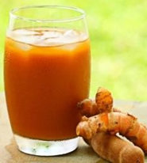

# Kumpulan Soal Simulasi TKA - Kewirausahaan Paket 1
**Jenjang:** SMK / SMA / MA / Sederajat (Mata Pelajaran Wajib)
**Total Soal:** 10 butir
**Sumber:** Portal Pusmendik Kemendikdasmen (Simulasi ANBK / TKA)

---

## Soal No. 1 `[Pilihan Ganda]`

### Stimulus / Bacaan:
Perhatikan deskripsi produk berikut ini!
“Sari Kunyit Asam ‘Segar Sehat’ merupakan minuman herbal tradisional dalam kemasan botol plastik 250 ml. Produk ini ditujukan untuk konsumen muda yang peduli kesehatan. Komposisinya mencantumkan kunyit, asam jawa, gula aren, dan tanpa bahan pengawet. Produk ini diproduksi oleh UMKM lokal dan telah memiliki izin PIRT.”

### Pertanyaan:
Berdasarkan informasi tersebut, unsur desain label produk yang tepat digunakan untuk menarik konsumen dan sesuai ketentuan label adalah....

### Pilihan Jawaban:
- **[A]** Ilustrasi bunga yang artistik, logo modern, nama produk dalam bahasa asing.
- **[B]** Merek dagang, berat bersih, nomor PIRT, slogan motivasi, dan gambar kartun.
- **[C]** Informasi bahan utama sari kunyit asam, nomor PIRT, nama produk, dan tanggal kadaluarsa.
- **[D]** Desain warna mencolok, kutipan testimoni pelanggan, simbol bintang lima, dan barcode.
- **[E]** Gambar kunyit dan asam, kalimat promosi menarik, dan pernyataan "terbukti menyembuhkan".

---

## Soal No. 2 `[Pilihan Ganda]`

### Stimulus / Bacaan:
Sebuah kelompok siswa SMK merancang usaha kerajinan dari bahan daur ulang, berupa tas dan dompet yang dibuat dari limbah plastik. Dalam proposal usaha mereka, dijelaskan bahwa produk tersebut ditujukan kepada konsumen berusia 15–30 tahun, baik laki-laki maupun perempuan, yang memiliki kesadaran tinggi terhadap isu lingkungan.
Penjualan dilakukan secara langsung di sekolah dan komunitas lokal, serta secara daring melalui berbagai platform media sosial. Kelompok ini juga menyajikan keunggulan produk mereka dibanding kompetitor, seperti desain yang unik, proses produksi ramah lingkungan, dan harga yang terjangkau bagi pelajar.

### Pertanyaan:
Informasi tersebut merupakan rancangan yang terdapat dalam proposal usaha pada komponen....

### Pilihan Jawaban:
- **[A]** Rencana operasional.
- **[B]** Rencana produksi.
- **[C]** Profil usaha.
- **[D]** Strategi pemasaran.
- **[E]** Analisis peluang usaha.

---

## Soal No. 3 `[Pilihan Ganda]`

### Stimulus / Bacaan:
Dania menjalankan usaha produksi pakaian dengan menggunakan nama dan logo yang menyerupai milik sebuah merek terkenal. Strategi ini ia pilih agar produknya lebih cepat dikenal dan menarik minat konsumen. Namun, tindakan tersebut justru menimbulkan kebingungan di kalangan masyarakat dan berpotensi merugikan perusahaan asli. Akibatnya, ia dianggap telah melanggar hak kekayaan intelektual.

### Pertanyaan:
Apa yang dapat Dania lakukan agar masalah tersebut dapat terselesaikan dan usahanya tetap dapat berjalan?
Tentukan Benar atau Salah untuk setiap pernyataan berikut!

### Pilihan Jawaban:
- **[A]** Pernyataan
- **[B]** Menciptakan desain logo yang orisinil dan meminta pendampingan hukum untuk memastikan legalitas usaha.
- **[C]** Menghentikan seluruh produk yang diketahui melanggar hak kekayaan intelektual.
- **[D]** Mengganti nama produk tanpa mengubah logo agar terhindar pelanggaran hak kekayaan intelektual.

---

## Soal No. 4 `[Pilihan Ganda Kompleks]`

### Stimulus / Bacaan:
Andi, Citra, dan Feti memiliki usaha minuman kopi instan berbahan alami tanpa pengawet. Produk tersebut dikemas dalam bentuk serbuk siap seduh dan ditujukan untuk remaja dan dewasa yang menginginkan kopi praktis dan sehat. Mereka memasarkan produk secara langsung melalui toko kelontong dan minimarket, serta memanfaatkan media sosial untuk promosi digital. Sesekali, mereka juga berpartisipasi dalam bazar guna meningkatkan penjualan.
Setelah peluncuran awal yang mendapat respon positif, penjualan mengalami penurunan yang signifikan dalam dua bulan terakhir. Mereka pun mengidentifikasi beberapa kendala sebagai berikut:
Harga produk dianggap terlalu tinggi dibandingkan merek kopi komersial yang sudah dikenal luas.
Informasi pada kemasan masih terbatas.
Penjualan melalui media sosial belum mencapai target.
Distribusi produk masih belum menjangkau berbagai lokasi penjualan potensial.

### Pertanyaan:
Berdasarkan situasi tersebut, manakah strategi yang dapat diterapkan agar usaha kopi tersebut dapat berkembang dan berkelanjutan?
Pilihlah jawaban yang benar! Jawaban benar lebih dari satu.

### Pilihan Jawaban:
- **[A]** Mendesain ulang kemasan agar lebih menarik serta mencantumkan informasi manfaat kesehatan dan cara penyajiannya.
- **[B]** Membuka peluang distribusi di koperasi masyarakat, kafe lokal, dan platform e-commerce.
- **[C]** Menurunkan harga jual agar dapat bersaing dengan produk komersial dengan mengurangi kualitas bahan baku.
- **[D]** Memperluas promosi digital dengan bekerja sama dengan konten kreator untuk meningkatkan penjualan.
- **[E]** Meningkatkan penjualan langsung melalui toko dan minimarket karena sudah memiliki pelanggan tetap.

---

## Soal No. 5 `[Pilihan Ganda]`

### Stimulus / Bacaan:
Sebuah tim wirausaha muda ingin membuat aplikasi layanan laundry online. Mereka telah melakukan diskusi dan survei dengan calon pengguna dan mengidentifikasi kebutuhan utama, seperti penjadwalan penjemputan, notifikasi status cucian, dan metode pembayaran digital. Mereka juga sudah membuat sketsa desain aplikasi secara sederhana berdasarkan hasil identifikasi kebutuhan tersebut.

### Pertanyaan:
Tahapan selanjutnya yang dapat dilakukan oleh tim tersebut adalah....

### Pilihan Jawaban:
- **[A]** Menyusun rencana promosi aplikasi layanan laundry online untuk mengenalkan kepada masyarakat.
- **[B]** Menentukan harga aplikasi layanan laundry online agar dapat bersaing dengan layanan sejenis.
- **[C]** Membangun prototipe awal untuk menguji fitur dan fungsi aplikasi layanan laundry online .
- **[D]** Menganalisis kekuatan dan kelemahan aplikasi layanan yang sejenis sebagai acuan pengembangan.
- **[E]** Melakukan survei tambahan untuk memilih warna dan desain tampilan aplikasi.

---

## Soal No. 6 `[Pilihan Ganda]`

### Stimulus / Bacaan:
PT Mandala Foods perusahaan yang memproduksi makanan beku seperti nugget sayur, sosis tempe, dan bakso ikan. Menjelang libur akhir tahun, permintaan meningkat hingga 3 kali lipat dari bulan-bulan sebelumnya. Untuk mengantisipasi lonjakan ini, manajemen merancang perencanaan produksi jangka pendek.

### Pertanyaan:
Bagaimana perencanaan yang dilakukan PT Mandala Foods agar semua aspek berjalan dengan baik?
Tentukan Benar atau Salah pasa setiap pernyataan berikut!

### Pilihan Jawaban:
- **[A]** Pernyataan
- **[B]** Penyediaan bahan baku harus dipastikan tepat waktu agar proses produksi tidak terhambat
- **[C]** Penetapan target jumlah produksi sebaiknya bersifat tetap agar proses produksi berjalan stabil.
- **[D]** Jadwal kerja karyawan harian perlu diatur sebagai bagian dari sistem penjadwalan produksi.

---

## Soal No. 7 `[Pilihan Ganda]`

### Stimulus / Bacaan:
Kelompok siswa SMK membuka usaha kuliner inovatif bernama NASPO (Nasi Populer), yang menjual nasi ayam bumbu bakar kemasan instan siap panaskan. Mereka menargetkan segmen pasar pekerja kantoran yang sering tidak sempat makan siang di luar.
Untuk memenuhi permintaan pelanggan selama 5 hari kerja, mereka memproduksi 250 boks NASPO per minggu. Berikut adalah rincian biaya produksi:
Komponen Biaya Produksi
Jumlah
Bahan baku langsung (per 250 box)
Beras: Rp350.000,00
Ayam dan bumbu: Rp550.000,00
Kemasan
foodgrade
: Rp250.000,00
Tenaga kerja langsung
2 orang × Rp150.000,00 × 2 hari = Rp600.000,00
Overhead
produksi
Listrik & air: Rp150.000,00
Gas & peralatan: Rp200.000,00
Biaya transportasi logistik: Rp100.000,00
Mereka juga mencatat bahwa sekitar 10 boks rusak atau tidak layak jual akibat kesalahan pengemasan dan overcook, sehingga hanya 240 boks yang layak dijual ke konsumen.

### Pertanyaan:
Berdasarkan informasi tersebut, berapakah biaya produksi per unit (per boks) NASPO yang layak jual?

### Pilihan Jawaban:
- **[A]** Rp8.800,00
- **[B]** Rp9.000,00
- **[C]** Rp9.170,00
- **[D]** Rp9.780,00
- **[E]** Rp10.000,00

---

## Soal No. 8 `[Pilihan Ganda]`

### Stimulus / Bacaan:
Sebuah kelompok murid SMK memproduksi sabun cuci piring ramah lingkungan. Produk tersebut mereka jual langsung ke teman-teman sekolah, guru, dan tetangga tanpa melalui perantara. Mereka juga membuka pemesanan lewat media sosial.

### Pertanyaan:
Berdasarkan contoh tersebut, jenis saluran distribusi yang digunakan oleh murid termasuk dalam ….

### Pilihan Jawaban:
- **[A]** distribusi dua tingkat
- **[B]** distribusi melalui agen
- **[C]** distribusi langsung
- **[D]** distribusi grosir
- **[E]** distribusi eksklusif

---

## Soal No. 9 `[Pilihan Ganda Kompleks]`

### Stimulus / Bacaan:
Perusahaan Raffa yang bergerak di bidang manufaktur menyusun proposal usaha dengan rencana produksi yang dilakukan secara bertahap, dimulai dari pemilahan bahan baku, proses pengolahan, pengemasan, hingga pelabelan produk. Bahan baku utama diperoleh dari mitra lokal, sehingga mempermudah proses pengiriman ke pabrik. Untuk meningkatkan efisiensi, kegiatan produksi dijadwalkan setiap hari kerja, dengan target awal sebanyak 200 unit per bulan menggunakan peralatan semi-manual yang sesuai dengan skala usaha kecil menengah.

### Pertanyaan:
Apa alasan aspek produksi dalam rencana usaha tersebut dianggap layak?
Pilihlah jawaban yang benar! Jawaban benar lebih dari satu.

### Pilihan Jawaban:
- **[A]** Penggunaan peralatan semi manual dikarenakan tenaga kerja berasal dari warga lokal.
- **[B]** Penggunaan bahan baku utama berasal dari wilayah setempat dapat menyebabkan efisiensi biaya.
- **[C]** Target produksi disusun dengan mempertimbangkan kapasitas peralatan yang digunakan.
- **[D]** Produksi dijadwalkan pada hari kerja untuk memastikan efektivitas pelaksanaan.
- **[E]** Produksi dilakukan bertahap berdasarkan strategi perusahaan untuk menyesuaikan ritme kerja dan pengawasan mutu.

---

## Soal No. 10 `[Pilihan Ganda]`

### Stimulus / Bacaan:
Perusahaan Y-Mobile pernah menjadi pelopor dalam komunikasi mobile dengan fitur unggulan dan desain fisik yang khas. Namun, perusahaan ini gagal beradaptasi terhadap perubahan tren teknologi ketika kompetitor mulai memperkenalkan fitur yang lebih canggih. Y-Mobile tetap bertahan dengan desain lama dan mengandalkan loyalitas pelanggan lama. Akibatnya, perusahaan tertinggal jauh dan akhirnya kehilangan pangsa pasar secara signifikan.
Perusahaan kemudian mengidentifikasi penyebab utama kegagalan sebagai berikut:
Keterlambatan dalam merespons inovasi teknologi.
Kegagalan membangun ekosistem digital yang kompetitif.
Ketergantungan berlebihan pada model produk lama dan basis pelanggan tradisional.

### Pertanyaan:
Manakah pernyataan berikut ini yang merupakan solusi tepat untuk mengatasi penyebab kegagalan tersebut?
Tentukan Benar atau Salah pada setiap pernyataan berikut!

### Pilihan Jawaban:
- **[A]** Pernyataan
- **[B]** Mengembangkan sistem operasi sendiri yang mendukung aplikasi modern.
- **[C]** Menurunkan harga produk lama untuk menjangkau pasar yang lebih luas.
- **[D]** Mempertahankan desain fisik lama untuk pelanggan setia.

---
