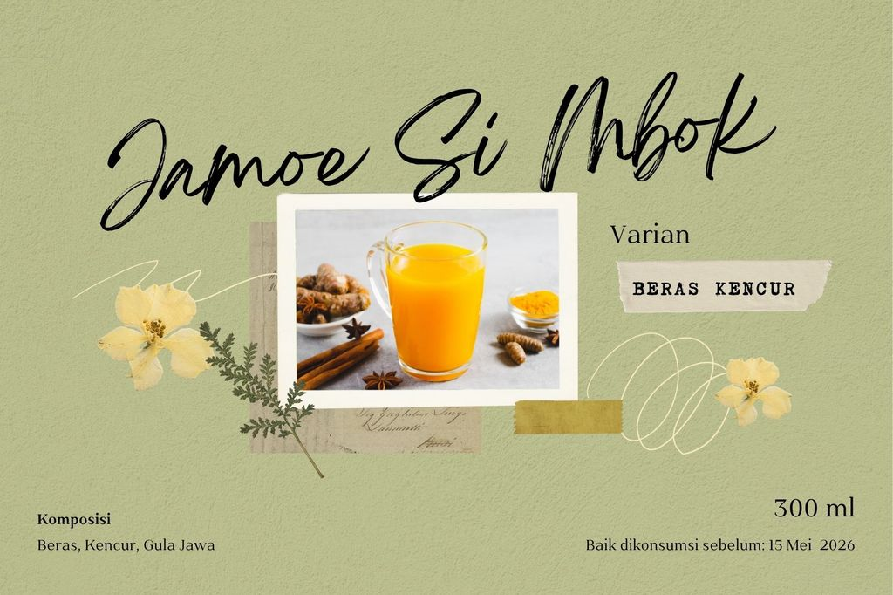
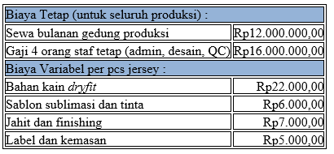
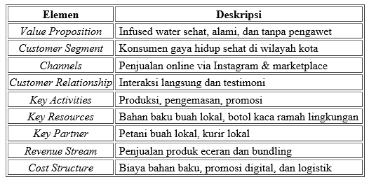
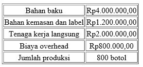
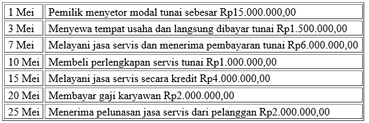
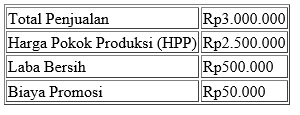
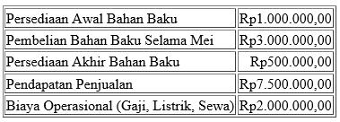

# Kumpulan Soal Simulasi TKA - Kewirausahaan Paket 2
**Jenjang:** SMK / SMA / MA / Sederajat (Mata Pelajaran Wajib)
**Total Soal:** 30 butir
**Sumber:** Portal Pusmendik Kemendikdasmen (Simulasi ANBK / TKA)

---

## Soal No. 1 `[Pilihan Ganda]`

### Stimulus / Bacaan:
Kelompok murid SMK jurusan Tata Boga memproduksi kue kering (cookies) dalam skala rumahan untuk dipasarkan secara daring. Selama proses distribusi ke luar kota, mereka menerima keluhan dari pelanggan bahwa cookies banyak yang remuk dan melempem saat diterima. Setelah dievaluasi, diketahui bahwa kemasan hanya menggunakan plastik tipis biasa dan tanpa lapisan kedap udara.

### Pertanyaan:
Berdasarkan kasus tersebut, teknik pengemasan yang paling tepat untuk menjaga kualitas dan bentuk produk cookies adalah…

### Pilihan Jawaban:
- **[A]** Menggunakan kantong plastik tebal ziplock dan menambahkan bubble wrap untuk daya tahan
- **[B]** Mengemas cookies dalam plastik tipis bening agar isi mudah terlihat oleh pelanggan
- **[C]** Mengemas cookies dalam kotak karton bergelombang tanpa pelapis plastik, tapi menggunakan kertas tisu
- **[D]** Menggunakan plastik OPP dan menyisipkan silica gel untuk mengurangi kelembapan dalam kemasan
- **[E]** Menambahkan label “ Fragile ” dan “ Keep Dry ” di luar kemasan serta menggunakan kertas tisu sebagai pelapis

---

## Soal No. 2 `[Pilihan Ganda]`

### Stimulus / Bacaan:
Tim wirausaha muda sedang merancang produksi roti isi cokelat kemasan sebagai bagian dari kegiatan promosi. Mereka menargetkan produksi sebanyak 500 pcs dalam waktu 4 hari kerja sesuai pemesanan oleh konsumen.
Bahan baku utama yang disiapkan sejak awal terdiri dari:
- 25 kg tepung terigu
- 10 kg pasta cokelat
- Bahan pelengkap lainnya dalam jumlah cukup
Setiap hari, 4 orang bekerja selama 5 jam. Namun, pada hari pertama hanya 90 roti berhasil diproduksi. Hal ini karena dua kendala utama:
Waktu fermentasi adonan yang lebih lama dari perkiraan
Kapasitas oven terbatas, hanya bisa menampung 15 loyang per siklus
Kondisi ini membuat tim khawatir target produksi tidak tercapai tepat waktu agar konsumen tidak kecewa.

### Pertanyaan:
Keputusan produksi yang tepat untuk memastikan target tercapai adalah ....

### Pilihan Jawaban:
- **[A]** Menambah jam kerja harian agar fermentasi dan pemanggangan bisa diatur lebih fleksibel
- **[B]** Mengganti jenis adonan agar tidak memerlukan proses fermentasi dan pemanggangan
- **[C]** Menambah jumlah bahan baku agar cadangan tetap tersedia jika produksi roti terhambat
- **[D]** Mengurangi target produksi menjadi 400 pcs agar lebih realistis
- **[E]** Mengganti isian roti dari cokelat ke selai agar proses lebih cepat

---

## Soal No. 3 `[Pilihan Ganda]`

### Stimulus / Bacaan:
Sekelompok Murid SMK membuat produk tempat pensil berbahan bambu yang diberi lukisan motif etnik. Produk ini unik, ramah lingkungan, dan ditujukan untuk pelajar dan pecinta kerajinan lokal. Penjualan selama bazar sekolah cukup baik, namun menurun setelah bazar berakhir. Mereka juga berencana meningkatkan penjualan sampai luar sekolah. Berdasarkan hasil evaluasi, perlu dilakukan perbaikan strategi pemasaran.

### Pertanyaan:
Tentukan
Benar/Salah
pernyataan berikut ini berdasarkan strategi yang paling tepat dalam memasarkan produk agar penjualan meningkat.

### Pilihan Jawaban:
- **[A]** Pernyataan
- **[B]** Menunggu bazar berikutnya untuk fokus menjual produk agar tidak menambah biaya promosi.
- **[C]** Melakukan penjualan melalui grup chat murid agar penjualan meningkat.
- **[D]** Membuat akun media sosial dan mengunggah konten produk secara rutin

---

## Soal No. 4 `[Pilihan Ganda Kompleks]`

### Stimulus / Bacaan:
Anatama seorang wirausaha muda yang memproduksi sabun organik alami tanpa bahan kimia. Produk tersebut memiliki target pasar konsumen yang memiliki kesadaran menggunakan produk alami dengan rentang usia antara 20–40 tahun. Ia berencana menyusun strategi pemasaran secara online agar produknya menjangkau pasar yang lebih luas.

### Pertanyaan:
Manakah strategi pemasaran online berikut yang paling relevan untuk diterapkan dalam memasarkan produk sabun organik tersebut?
Tentukan jawaban yang benar. Jawaban benar lebih dari satu!

### Pilihan Jawaban:
- **[A]** Membagikan konten edukatif dan visual di media sosial tentang manfaat sabun organik
- **[B]** Menyusun artikel blog tentang manfaat sabun alami dan mengoptimalkannya agar mudah ditemukan di mesin pencari
- **[C]** Menyusun kampanye online yang mengajak konsumen membagikan pengalaman mereka menggunakan produk
- **[D]** Mengirim broadcast massage sebagai bagian promosi ke nomor acak sebanyak mungkin agar menjangkau audiens luas
- **[E]** Membuat siaran langsung rutin di platform video daring untuk membahas tren bisnis global

---

## Soal No. 5 `[Pilihan Ganda]`

### Stimulus / Bacaan:
Intan dan teman-temannya membuat minuman herbal botol berlabel “Segar Rempah” dengan varian jahe, kunyit, dan serai. Produk ini telah uji coba di lingkungan sekolah dan pasar tradisional dekat sekolah, dan mendapat respon positif dari guru, pegawai, dan pembeli umum.
Dari uji coba tersebut diperoleh informasi sebagai berikut:
- Target pasar utama: konsumen usia 30–50 tahun yang peduli kesehatan.
- Lokasi: sekolah, dan lingkungan di sekitar sekolah
- Kompetitor: produk minuman kemasan pabrikan dengan harga lebih tinggi.
- Keunggulan produk: lebih segar, tanpa pengawet, dan harga lebih terjangkau.
- Kelemahan: belum dikenal luas di luar lingkungan sekolah.

### Pertanyaan:
Berdasarkan hasil analisis pasar tersebut, strategi pemasaran yang paling tepat untuk meningkatkan penjualan produk “Segar Rempah” adalah …

### Pilihan Jawaban:
- **[A]** Menjual produk di pasar tradisional dengan sistem paket beli 2 gratis 1
- **[B]** Mencetak brosur yang menarik untuk meningkatkan penjualan ke warga sekolah
- **[C]** Membuat video testimoni manfaat produk dan menjualnya di media sosial
- **[D]** Mengganti nama produk agar terdengar lebih modern dan berbahasa asing
- **[E]** Menurunkan harga hingga 50% tanpa mempertimbangkan biaya produksi

---

## Soal No. 6 `[Pilihan Ganda]`

### Stimulus / Bacaan:
Kelompok wirausaha siswa jurusan Rekayasa Perangkat Lunak mengembangkan aplikasi berbasis Android bernama
"TASK+ EDU"
, yaitu aplikasi pencatat tugas dan pengingat belajar. Aplikasi ini memiliki fitur penjadwalan, notifikasi, dan sinkronisasi ke kalender elektronik. Tim mereka sangat fokus pada pengembangan fitur dan desain antarmuka.
Namun setelah 2 bulan berjalan, aplikasi hanya diunduh 57 kali dan mendapatkan ulasan minim. Berdasarkan hasil survei kecil yang dilakukan tim usaha, ditemukan bahwa strategi promosi digital yang jarang dilakukan, sehingga aplikasi tidak dikenal secara luas oleh target penggunanya, yakni pelajar yang aktif di media sosial. Selain itu, tidak adanya evaluasi dari pengguna melalui survei, sehingga pengembang tidak mengetahui kebutuhan atau keluhan pengguna setelah aplikasi digunakan.

### Pertanyaan:
Berdasarkan analisis terhadap strategi pemasaran pada kasus tersebut, penyebab utama dari tidak berhasilnya pemasaran produk “TASK+EDU” adalah .…

### Pilihan Jawaban:
- **[A]** Aplikasi memiliki banyak fitur yang membingungkan pengguna trutama pelajar
- **[B]** Tim terlalu fokus pada desain antarmuka dan melupakan keamanan data
- **[C]** Tidak ada strategi promosi digital yang relevan dengan kebiasaan target pasar
- **[D]** Aplikasi yang ditawarkan tidak bisa digunakan secara offline sehingga tidak optimal
- **[E]** Desain antar muka yang tidak sesuai dengan minat pelajar sehingga tidak optimal

---

## Soal No. 7 `[Pilihan Ganda]`

### Stimulus / Bacaan:
Perhatikan gambar label produk minuman herbal "Jamoe Si Mbok" untuk kemasan botol berikut ini:

### Pertanyaan:
Dari gambar label tersebut, penerapan yang paling tepat pada kemasan produk minuman herbal "Jamoe Si Mbok" adalah...

### Pilihan Jawaban:
- **[A]** Menempelkan label di bagian tengah botol agar mudah dilihat oleh konsumen
- **[B]** Menempatkan label di bagian bawah botol agar tidak mengganggu tampilan warna minuman
- **[C]** Menempelkan label dengan posisi miring di depan dan samping botol agar lebih dikenal
- **[D]** Menempelkan label di dalam botol untuk menghindari kerusakan saat pengiriman
- **[E]** Label sebaiknya tidak ditempel pada produk namun ditempel di kardus kemasan botol

---

## Soal No. 8 `[Pilihan Ganda]`

### Stimulus / Bacaan:
Tim murid SMK jurusan Desain Komunikasi Visual membuat prototipe desain kemasan minuman herbal “Wedang Rempah Saku”. Produk ini ditargetkan untuk kalangan muda dan pekerja kantor. Desain awal mereka menggunakan botol kaca tinggi dengan label berwarna coklat klasik. Setelah dilakukan uji pasar kecil, banyak responden mengatakan bahwa desain terlihat jadul, sulit dibawa bepergian, dan rawan pecah. Mereka kemudian menyarankan melakukan analisis ulang desain dan kemasan produk dengan mempertimbangkan kebutuhan pasar dan efisiensi dalam proses produksi dan distribusi.

### Pertanyaan:
Langkah yang dapat diterapkan untuk memperbaiki produk sesuai kebutuhan pasar adalah...

### Pilihan Jawaban:
- **[A]** Mengganti warna label menjadi lebih cerah dan menarik agar menarik pelanggan
- **[B]** Mengganti bahan kemasan ke plastik fleksibel dan desain yang lebih kekinian
- **[C]** Mengubah label produk dengan desain berwarna abu dan gambar yang menarik
- **[D]** Mengganti kemasan dengan botol kaca dengan dua lapis agar lebih estetik
- **[E]** Menambahkan hiasan pada botol kaca guna menambah kesan tradisional

---

## Soal No. 9 `[Pilihan Ganda]`

### Stimulus / Bacaan:
Tim murid SMK jurusan Desain Komunikasi Visual membuat prototipe desain kemasan minuman herbal “Wedang Rempah Saku”. Produk ini ditargetkan untuk kalangan muda dan pekerja kantor. Desain awal mereka menggunakan botol kaca tinggi dengan label berwarna coklat klasik. Setelah dilakukan uji pasar kecil, banyak responden mengatakan bahwa desain terlihat jadul, sulit dibawa bepergian, dan rawan pecah. Mereka kemudian menyarankan melakukan analisis ulang desain dan kemasan produk dengan mempertimbangkan kebutuhan pasar dan efisiensi dalam proses produksi dan distribusi.

### Pertanyaan:
Langkah yang dapat diterapkan untuk memperbaiki produk sesuai kebutuhan pasar adalah...

### Pilihan Jawaban:
- **[A]** Mengganti warna label menjadi lebih cerah dan menarik agar menarik pelanggan
- **[B]** Mengganti bahan kemasan ke plastik fleksibel dan desain yang lebih kekinian
- **[C]** Mengubah label produk dengan desain berwarna abu dan gambar yang menarik
- **[D]** Mengganti kemasan dengan botol kaca dengan dua lapis agar lebih estetik
- **[E]** Menambahkan hiasan pada botol kaca guna menambah kesan tradisional

---

## Soal No. 10 `[Pilihan Ganda]`

### Stimulus / Bacaan:
Seorang murid jurusan Agribisnis SMK Tunas Mandiri memproduksi keripik bayam sebagai produk unggulan dalam program kewirausahaan sekolah. Produk ini dikemas dalam plastik bening dengan stiker nama produk pada bagian depan. Sasaran utama pasar mereka adalah remaja dan anak-anak sekolah. Namun, saat dipamerkan di bazar kuliner, banyak pengunjung menyampaikan bahwa kemasannya tidak kekinian dan tidak menampilkan identitas merek dengan jelas. Selain itu, beberapa pelanggan mengalami kesulitan membaca tanggal kedaluwarsa karena ukuran huruf yang terlalu kecil.

### Pertanyaan:
Berdasarkan deskripsi tersebut, langkah analisis kemasan yang paling tepat untuk meningkatkan daya tarik produk bagi target pasar adalah .…

### Pilihan Jawaban:
- **[A]** mendesain ulang kemasan dengan warna dan ilustrasi yang menarik serta memperbesar ukuran informasi
- **[B]** mengganti kemasan plastik bening dengan toples kaca agar lebih eksklusif dan terlihat jelas tulisannya
- **[C]** menambahkan brosur informasi gizi dan manfaat bayam dalam setiap kemasan sebagai nilai edukasi
- **[D]** menyederhanakan desain kemasan dan merek produk agar biaya produksi dan harga jual lebih murah
- **[E]** menggunakan bahan kemasan kertas cokelat alami untuk menonjolkan kesan yang ramah lingkungan

---

## Soal No. 11 `[Pilihan Ganda Kompleks]`

### Stimulus / Bacaan:
PT Cipta Kreasi Nusantara menciptakan inovasi Meja Lipat 3-in-1, yang dapat diubah menjadi rak, meja kerja, atau meja makan. Setelah rancang gambar selesai, maka dibuatlah protipe pertama untuk menguji kosep ide produk serta masukan dan perbaikan.
Kesimpulan yang di dapat dari uji coba prototipe pertama sebagai berikut:
- Pada saat difungsikan menjadi meja makan, ukurannya terlalu kecil dan tidak proporsional
- Meja mudah diubah menjadi rak, tapi kurang stabil saat difungsikan sebagai meja makan
- Saat berubah fungsi, bagian-bagian tertentu tidak kokoh untuk menopang beban
- Kesulitan mengubah fungsi meja karena sistem geser yang berat

### Pertanyaan:
Dari situasi tersebut, langkah manakah yang paling tepat dilakukan dalam tahapan pengembangan prototipe produk?
Tentukan jawaban yang benar. Jawaban benar lebih dari satu.

### Pilihan Jawaban:
- **[A]** Melakukan evaluasi pasar secara terbatas untuk mengetahui potensi minat konsumen
- **[B]** Menyesuaikan kembali rancangan ukuran dan proporsi meja agar lebih ergonomis
- **[C]** Meninjau kembali pemilihan bahan dan struktur sambungan untuk meningkatkan stabilitas
- **[D]** Menambahkan fitur estetika agar produk terlihat lebih menarik di pasaran
- **[E]** Menyempurnakan mekanisme perubahan fungsi agar lebih ringan dan mudah digunakan

---

## Soal No. 12 `[Pilihan Ganda]`

### Stimulus / Bacaan:
Perusahaan konveksi lokal bernama CV Karya Atlet Mandiri mendapatkan pesanan besar dari panitia Marathon 2025. Mereka diminta memproduksi 10.000 jersey lari yang akan digunakan peserta dari berbagai kota di Indonesia. Pihak CV telah menyetujui spesifikasi tersebut dan mulai menghitung kebutuhan produksi.
Berikut rincian biaya produksi :
CV Karya Atlet Mandiri perlu menyelesaikan semua produksi dalam 1 bulan. Tim produksi harus menghitung total biaya produksi agar dapat menentukan harga jual dan margin keuntungan yang optimal.

### Pertanyaan:
Berdasarkan data di atas, berapakah total biaya produksi jersey Borobudur Marathon 2025?

### Pilihan Jawaban:
- **[A]** Rp428.000.000,00
- **[B]** Rp412.000.000,00
- **[C]** Rp400.000.000,00
- **[D]** Rp28.000.000,00
- **[E]** Rp16.800.000,00

---

## Soal No. 13 `[Pilihan Ganda Kompleks]`

### Stimulus / Bacaan:
Perhatikan informasi yang tertera pada kemasan produk cairan pembersih piring dan gelas “Bersih”.
Diproduksi: PT CAHAYA INDONESIA
Berat bersih: 1500 ml
Tanggal kadaluwarsa: 10 Agustus 2026
Manfaat: menghilangkan bau amis dan lemak hilang, serta lembut ditangan
Cara penggunaan:
- Tuang ½ sendok cairan pembersih ke dalam mangkok berisi 1 gelas air bersih
- Masukan spons ke dalam larutan, kemudian diremas sampai berbusa
- Cuci pirang dan gelas, lalu bilas sampai bersih
Perhatian dan peringatan :
- Jauhkan dari jangkauan anak-anak
- Bila terkena mata, bilas dengan air bersih

### Pertanyaan:
Berdasarkan informasi pada kemasan tersebut, manakah informasi yang sesuai dengan kemasan produk tersebut?
Tentukan jawaban yang benar. Jawaban benar lebih dari satu.

### Pilihan Jawaban:
- **[A]** Perbandingan campuran adalah setengah sendok cairan dicampur dengan satu mangkok air
- **[B]** Cairan pembersih ini tidak boleh digunakan langsung tanpa dicampur air
- **[C]** Jika cairan terkena mata, bilaslah dengan air bersih
- **[D]** Produk ini hanya boleh digunakan sebelum 10 Agustus 2027
- **[E]** Saat menggunakan produk, penting untuk menjauhkan dari jangkauan anak-anak

---

## Soal No. 14 `[Pilihan Ganda Kompleks]`

### Stimulus / Bacaan:
Pada proses pengecekan kualitas produk lemari besi, ditemukan adanya pengelupasan cat pada bagian dinding lemari. Akibatnya, produk tersebut dinyatakan tidak lolos quality control dan tidak dapat dikirim ke pelanggan. Setelah dilakukan investigasi lebih lanjut, diketahui bahwa pengelupasan cat tersebut disebabkan oleh benturan atau gesekan yang terjadi saat proses pemindahan lemari dari area produksi ke gudang penyimpanan.

### Pertanyaan:
Tindakan yang paling tepat untuk mengatasi dan mencegah masalah tersebut adalah….
Tentukan jawaban yang benar. Jawaban benar lebih dari satu.

### Pilihan Jawaban:
- **[A]** Melatih ulang petugas pemindahan barang agar lebih berhati-hati dan menggunakan teknik angkat yang tepat
- **[B]** Menerapkan pelindung tambahan pada bagian yang rawan benturan selama proses pemindahan
- **[C]** Mengurangi frekuensi pemindahan lemari agar mengurangi risiko kerusakan selama proses tersebut
- **[D]** Meninjau dan memperbaiki prosedur pemindahan produk agar lebih aman dan efisien
- **[E]** Memperketat inspeksi visual pada setiap produk sebelum dikirimkan agar pengelupasan dapat dideteksi lebih awal

---

## Soal No. 15 `[Pilihan Ganda]`

### Stimulus / Bacaan:
Sebuah unit usaha sekolah memproduksi totebag berbahan kanvas. Proses produksi dilakukan oleh murid yang mengikuti ekstrakulikuler menjahit di sekolah. Namun saat mengerjakan pesanan totebag, kelompok produksi mengalami kendala saat tahap menjahit. Benang sering putus dan jahitan menjadi tidak rapi, padahal mesin jahit sudah digunakan sesuai petunjuk. Setelah ditelusuri, diketahui bahwa benang yang digunakan terlalu tipis untuk bahan kanvas yang tebal.

### Pertanyaan:
Solusi terbaik yang dapat dilakukan untuk mengatasi masalah tersebut adalah...

### Pilihan Jawaban:
- **[A]** Mengganti bahan totebag dengan bahan kanvas yang lebih tipis
- **[B]** Mengganti mesin jahit yang lebih berkualitas agar benang tidak cepat putus
- **[C]** Menambahkan lem kain pada totebag agar sambungan tetap kuat dan tahan lama
- **[D]** Melatih ulang murid dalam teknik menjahit yang lebih terampil dan teliti dalam menjahit
- **[E]** Mengganti benang dengan jenis yang lebih tebal dan kuat sesuai karakter kanvas

---

## Soal No. 16 `[Pilihan Ganda]`

### Stimulus / Bacaan:
Sekelompok murid farmasi merancang produk
aromatherapy candle
(lilin aroma terapi) dari bahan alami untuk keperluan relaksasi. Produk ini akan dikemas dalam toples kecil kaca. Target pasarnya adalah konsumen rumah tangga dan spa lokal.
Dalam proses perancangan, murid menemukan beberapa bahan utama yang dapat digunakan:
- Parafin (turunan minyak bumi)
- Beeswax (lilin lebah)
- Minyak esensial (lavender, kayu putih, melati)
- Pewarna lilin sintetis
- Bubuk kayu manis
Mereka ingin memastikan bahwa produk tetap alami, aman, dan ramah lingkungan.

### Pertanyaan:
Berdasarkan situasi tersebut, kombinasi bahan baku mana untuk mendukung proses produksi lilin aroma terapi yang alami dan ramah lingkungan adalah ....

### Pilihan Jawaban:
- **[A]** Menggunakan parafin, pewarna sintetis, dan minyak esensial
- **[B]** Menggunakan beeswax, bubuk kayu manis, dan minyak esensia
- **[C]** Menggabungkan parafin, beeswax, dan pewarna sintetis
- **[D]** Memadukan bubuk kayu manis, pewarna sintetis, dan parafin
- **[E]** Memilih beeswax, parafin, dan pengharum ruangan kimiawi

---

## Soal No. 17 `[Pilihan Ganda Kompleks]`

### Stimulus / Bacaan:
Yuli dan Anita memproduksi minuman instan serbuk rasa buah tropis (mango-pineapple) yang terbuat dari sari buah dan gula alami. Produk tersebut dikemas dalam sachet kecil dan dipasarkan secara daring. Pada tiga bulan pertama, produk mendapatkan banyak ulasan positif dari konsumen karena cita rasanya yang segar serta kemasannya yang menarik. Namun, setelah beberapa bulan, muncul sejumlah keluhan seperti bubuk minuman yang menggumpal, aroma yang tidak lagi segar, dan perubahan rasa. Hasil penelusuran menunjukkan bahwa sebagian bahan baku disimpan di tempat lembap dan proses pengemasan dilakukan tanpa tahap penyaringan akhir untuk memisahkan partikel kasar.

### Pertanyaan:
Berdasarkan kasus tersebut, manakah tindakan yang tepat untuk perbaikan pengendalian mutu produk minuman serbuk rasa buah tersebut?
Tentukan jawaban yang benar. Jawaban benar lebih dari satu.

### Pilihan Jawaban:
- **[A]** Menyimpan bahan baku di tempat yang kering dan bersuhu stabil
- **[B]** Mengurangi penggunaan bahan pengawet agar produk lebih alami
- **[C]** Menghilangkan tahap penyaringan akhir sebelum pengemasan
- **[D]** Melakukan uji kualitas secara berkala terkait aroma, rasa, dan warna
- **[E]** Menambah kemasan yang lebih tebal dan kedap udara untuk melindungi produk

---

## Soal No. 18 `[Pilihan Ganda]`

### Stimulus / Bacaan:
Kelompok wirausaha Tata Busana memproduksi masker kain tiga lapis untuk kegiatan sosial. Mereka telah menetapkan standar kualitas produk, yaitu jahitan yang rapi dan simetris, ukuran masker sesuai pola (17 x 9 cm), terdiri dari tiga lapis kain dengan saku filter, serta tali elastis yang tidak terlalu longgar. Namun, saat dilakukan pemeriksaan terhadap hasil produksi, dari 100 masker yang dicek, 25 di antaranya ditemukan memiliki ukuran yang tidak konsisten, beberapa hanya terdiri atas dua lapis kain, dan ada yang jahitannya lepas. Tim pengendalian mutu kemudian mencatat dan mengelompokkan jenis cacat pada produk tersebut.

### Pertanyaan:
Langkah pengendalian mutu yang paling tepat untuk diterapkan berdasarkan kasus tersebut adalah…

### Pilihan Jawaban:
- **[A]** Mendistribusikan semua produk yang telah dibuat untuk efisiensi waktu
- **[B]** Memperbaiki produk yang rusak setelah dikirim ke konsumen
- **[C]** Mengganti standar kualitas agar lebih fleksibel dan mudah dipenuhi
- **[D]** Menarik seluruh produk yang telah dipasarkan dan menghentikan produksi
- **[E]** Melakukan evaluasi dan perbaikan prosedur produksi sesuai hasil inspeksi

---

## Soal No. 19 `[Pilihan Ganda]`

### Stimulus / Bacaan:
Weni dan Mira memproduksi sabun cair cuci tangan dan menjualnya melalui platform
marketplace
. Produk dikirim langsung ke konsumen melalui jasa ekspedisi. Selain itu, mereka juga menerima pesanan langsung melalui media sosial.

### Pertanyaan:
Berdasarkan informasi tersebut, jenis saluran distribusi yang digunakan adalah…

### Pilihan Jawaban:
- **[A]** Distribusi langsung
- **[B]** Distribusi tidak langsung tingkat dua
- **[C]** Distribusi melalui agen tunggal
- **[D]** Distribusi multilevel
- **[E]** Distribusi eksklusif ke toko retail besar

---

## Soal No. 20 `[Pilihan Ganda]`

### Stimulus / Bacaan:
Sebuah bengkel otomotif bernama Bengkel Solusi Cepat yang berlokasi di daerah perkotaan mengalami peningkatan permintaan terhadap layanan perbaikan kendaraan. Melihat peluang tersebut, pemilik bengkel, Budi, mulai mempertimbangkan untuk menambah layanan baru berupa perawatan berkala dan modifikasi kendaraan.

### Pertanyaan:
Berdasarkan ilustrasi tersebut, hal apa yang sebaiknya menjadi fokus utama Budi dalam menganalisis sumber peluang usaha?

### Pilihan Jawaban:
- **[A]** Membandingkan harga jasa modifikasi dengan bengkel besar di kota lain
- **[B]** Mengandalkan tren modifikasi kendaraan yang viral di media sosial
- **[C]** Menganalisis kebutuhan pelanggan dan tren pasar lokal yang berkembang
- **[D]** Mengurangi jumlah mekanik untuk menekan biaya operasional
- **[E]** Membeli suku cadang dalam jumlah besar untuk mendapatkan diskon

---

## Soal No. 21 `[Pilihan Ganda]`

### Stimulus / Bacaan:
Sekelompok murid SMK jurusan Agribisnis menyusun proposal usaha untuk memproduksi teh herbal daun kelor "Kelora". Proposal tersebut mencakup:
Uraian mengenai kebutuhan masyarakat akan minuman sehat
Penjelasan mengenai produk usaha dan keterangan produksi usaha oleh murid SMK berbasis home industri
Analisis kekuatan, peluang, dan kelemahan pada bahan lokal dan peluang pasar online
Proses produksi yang meliputi pengeringan daun, pengemasan, dan distribusi
Pemasaran melalui promosi di media sosial dan bazar sekolah

### Pertanyaan:
Berdasarkan data di atas, bagian proposal usaha yang perlu ditambahkan agar menjadi proposal lengkap dan layak dikaji investor adalah…

### Pilihan Jawaban:
- **[A]** Latar belakang dan nama usaha
- **[B]** Strategi distribusi dan bentuk kemasan
- **[C]** Rincian kebutuhan modal dan analisis keuangan
- **[D]** Analisis SWOT dan profil pembimbing usaha
- **[E]** Logo kemasan dan dokumentasi produksi

---

## Soal No. 22 `[Pilihan Ganda Kompleks]`

### Stimulus / Bacaan:
Sebuah bisnis lokal bernama "Tirta Botani" memproduksi dan menjual infused water dari buah lokal. Berikut ringkasan dari
Business Model Canvas
(BMC) mereka:

### Pertanyaan:
Berdasarkan BMC usaha Tirta Botani, manakah dari pernyataan berikut yang menunjukkan hasil analisis SWOT?
Tentukan jawaban yang benar. Jawaban benar lebih dari satu.

### Pilihan Jawaban:
- **[A]** Ketersediaan buah lokal segar merupakan kekuatan dalam produksi
- **[B]** Ketergantungan pada satu jalur distribusi bisa menjadi kelemahan
- **[C]** Distribusi pemasaran melalui media sosial dan makterplace menjadi peluang pasar yang potensial
- **[D]** Biaya kemasan botol kaca yang tinggi merupakan bagian dari strategi pemasaran
- **[E]** Banyaknya pesaing dengan produk sejenis merupakan peluang untuk saling menjaga keunggulan produk

---

## Soal No. 23 `[Pilihan Ganda Kompleks]`

### Stimulus / Bacaan:
Cahya membuka usaha minuman kekinian berbasis susu dan buah lokal dengan merek “SegarKu”. Usaha ini dijalankan dari rumah dan dipasarkan melalui media sosial. Meskipun belum memiliki izin usaha resmi, produk SegarKu mulai dikenal di lingkungan sekitar karena rasanya yang segar dan unik. Namun, kapasitas produksinya masih terbatas karena alat yang digunakan bersifat manual dan belum modern. Lokasi rumah yang berada di dekat sekolah dan kawasan perumahan padat penduduk menjadi salah satu keunggulan usaha ini. Dalam jangka panjang, pelaku usaha berharap dapat mengembangkan usaha secara lebih profesional dan menjangkau konsumen yang lebih luas.

### Pertanyaan:
Berdasarkan informasi tersebut, manakah dari pernyataan berikut ini yang merupakan bagian dari analisis SWOT usaha “SegarKu”?
Tentukan jawaban yang benar. Jawaban benar lebih dari satu

### Pilihan Jawaban:
- **[A]** Promosi melalui media sosial berpotensi menjangkau pelanggan yang lebih luas
- **[B]** Belum memiliki izin usaha resmi merupakan ancaman yang harus segera diatasi
- **[C]** Alat produksi manual membuat proses produksi menjadi kurang efisien
- **[D]** Strategi branding lewat nama unik seperti “SegarKu” dapat menjadi kekuatan
- **[E]** Lokasi yang strategis yang dekat dengan perumahan menjadi ancaman utama

---

## Soal No. 24 `[Pilihan Ganda]`

### Stimulus / Bacaan:
Pada tahun 2023, Heldy berhasil menciptakan alat penyaring air sederhana yang dapat mengubah air hujan menjadi air layak minum hanya dengan menggunakan bahan-bahan rumah tangga. Alat ini bekerja berdasarkan sistem penyaringan bertingkat dengan tambahan arang aktif dan UV sederhana. Heldy kemudian mengajukan permohonan perlindungan hukum terhadap alat yang ditemukannya agar tidak ditiru oleh pihak lain tanpa izin.

### Pertanyaan:
Berdasarkan ilustrasi di atas, bentuk perlindungan HaKI yang sesuai untuk karya Heldy adalah ....

### Pilihan Jawaban:
- **[A]** Hak Cipta
- **[B]** Desain Industri
- **[C]** Merek Dagang
- **[D]** Hak Paten
- **[E]** Rahasia Dagang

---

## Soal No. 25 `[Pilihan Ganda]`

### Stimulus / Bacaan:
Diah dan Sofyan merintis usaha produk kreatif “
Kaligrafika
”, yaitu lukisan kaligrafi digital yang bisa dikustom sesuai nama pembeli. Mereka juga membuat desainnya menggunakan aplikasi grafis dan menjualnya melalui platform digital. Dalam sebuah diskusi, mereka menyadari pentingnya melindungi karya dari penjiplakan dengan mendaftarkannya ke sistem Hak Kekayaan Intelektual (HaKI).

### Pertanyaan:
Tentukan
Benar
atau
Salah
pernyataan berikut ini berkaitan dengan jenis dan karakteristik HaKI yang mungkin relevan dengan usaha
Kaligrafika
.

### Pilihan Jawaban:
- **[A]** Pernyataan
- **[B]** Dengan adanya hak cipta, produk Kaligrafika dapat terjamin karyanya
- **[C]** Merek produk dapat digunakan untuk melindungi teknik produksi perusahaan
- **[D]** Desain industri melindungi tampilan luar produk kaligrafika agar tidak ditiru

---

## Soal No. 26 `[Pilihan Ganda]`

### Stimulus / Bacaan:
Yuli menciptakan sebuah lagu orisinal dan mengunggahnya di platform berbagi video. Beberapa bulan kemudian, temannya, Ikhsan, memakai lagu tersebut sebagai latar musik untuk video promosi produknya tanpa meminta izin. Lagu itu diedit dengan cara dipotong, diberi efek tambahan, dan tidak mencantumkan nama Yuli sebagai penciptanya. Selain itu, Ikhsan juga mengunggah ulang video tersebut ke akun bisnisnya dan mengklaim lagu itu sebagai hasil karya timnya.

### Pertanyaan:
Berdasarkan informasi tersebut, tentukan Benar/Salah pernyataan berikut ini mengenai pelanggaran HaKI.

### Pilihan Jawaban:
- **[A]** Pernyataan
- **[B]** Karya yang digunakan Ikhsan tanpa izin dan tanpa mencantumkan nama pencipta merupakan pelanggaran HaKI
- **[C]** Video yang diunggah Ikhsan sudah diedit dan tidak mirip dengan versi asli sehingga tidak termasuk pelanggaran HaKI
- **[D]** Video yang diunggah hanya digunakan oleh teman sendiri sehingga tidak perlu izin dan bukan sebagai pelanggaran

---

## Soal No. 27 `[Pilihan Ganda Kompleks]`

### Stimulus / Bacaan:
Perhatikan laporan biaya produksi usaha minuman dari sebuah UMKM berikut.

### Pertanyaan:
Apabila UMKM menargetkan laba: 30-40% dari total biaya produksi, berapakah harga jual per botol yang sebaiknya ditetapkan?
Tentukan jawaban yang benar. Jawaban benar lebih dari satu.

### Pilihan Jawaban:
- **[A]** Rp11.250,00
- **[B]** Rp12.500,00
- **[C]** Rp13.700,00
- **[D]** Rp14.000,00
- **[E]** Rp15.500,00

---

## Soal No. 28 `[Pilihan Ganda]`

### Stimulus / Bacaan:
Perhatikan transaksi usaha jasa "Servis Elektronik Cahaya" selama bulan Mei 2025:

### Pertanyaan:
Berdasarkan transaksi tersebut, Berapa saldo akhir kas untuk bulan Mei 2025?

### Pilihan Jawaban:
- **[A]** Rp14.500.000,00
- **[B]** Rp16.500.000,00
- **[C]** Rp17.000.000,00
- **[D]** Rp18.500.000,00
- **[E]** Rp20.000.000,00

---

## Soal No. 29 `[Pilihan Ganda Kompleks]`

### Stimulus / Bacaan:
Berikut ini adalah ringkasan laporan keuangan usaha sablon kaos Kreatif Muda bulan April 2025:
Usaha sablon tersebut masih memiliki sejumlah persediaan bahan yang menumpuk di gudang.

### Pertanyaan:
Berdasarkan laporan keuangan tersebut, manakah langkah tindak lanjut yang paling tepat dilakukan oleh usaha sablon tersebut?
Tentukan jawaban yang benar! Jawaban benar lebih dari satu.

### Pilihan Jawaban:
- **[A]** Meninkatkan biaya promosi agar volume penjualan bertambah
- **[B]** Menambah pembelian bahan baku baru untuk meningkatkan penjualan
- **[C]** Mengoptimalkan penggunaan persediaan bahan yang masih menumpuk
- **[D]** Menghentikan kegiatan produksi karena laba terlalu kecil
- **[E]** Mengevaluasi harga jual atau mencari cara efisiensi produksi

---

## Soal No. 30 `[Pilihan Ganda]`

### Stimulus / Bacaan:
Usaha minuman kopi susu kekinian bernama "Kopi Kita" mencatat laporan keuangan bulan Mei sebagai berikut:

### Pertanyaan:
Berdasarkan data tersebut, berapakah laba bersih yang diperoleh usaha Kopi Kita pada bulan Mei?

### Pilihan Jawaban:
- **[A]** Rp1.000.000,00.
- **[B]** Rp2.000.000,00.
- **[C]** Rp2.500.000,00.
- **[D]** Rp3.000.000,00.
- **[E]** Rp3.500.000,00.

---
