# Kumpulan Soal Simulasi TKA - Matematika Paket 1
**Jenjang:** SMK / SMA / MA / Sederajat (Mata Pelajaran Wajib)
**Total Soal:** 46 butir
**Sumber:** Portal Pusmendik Kemendikdasmen (Simulasi ANBK / TKA)

---

## Soal No. 1 `[Pilihan Ganda]`

### Stimulus / Bacaan:
Sebuah hotel memiliki 30 kamar yang tersedia di lantai 5. Manajer operasional mencatat fasilitas kamar tersebut sebagai berikut.
18 kamar memiliki pemandangan ke arah laut.
10 kamar memiliki fasilitas tempat tidur
Twin Bed
.
6 kamar di antaranya adalah kamar dengan pemandangan laut yang juga memiliki tempat tidur
Twin Bed
.
Sisanya adalah kamar standar yang tidak memiliki pemandangan laut maupun fasilitas
Twin Bed
.

### Pertanyaan:
Jika saat ini semua kamar di lantai tersebut kosong dan resepsionis memilih satu kamar secara acak untuk tamu yang baru datang, berapakah peluang tamu tersebut mendapatkan kamar dengan pemandangan laut atau tempat tidur Twin Bed ?

### Pilihan Jawaban:
- **[A]** $\frac {1} {5}$ 
- **[B]** $\frac {8} {15}$ 
- **[C]** $\frac {11} {15}$ 
- **[D]** $\frac {12} {15}$ 
- **[E]** $\frac {14} {15}$ 

---

## Soal No. 2 `[Pilihan Ganda]`

### Stimulus / Bacaan:
Dalam sebuah konferensi teknologi, dipaparkan sejumlah data bahwa dalam satu kelompok data yaitu setiap 10
gadget
ramah lingkungan yang diproduksi oleh perusahaan X, rata-rata jenisnya adalah sebagai berikut:
4 unit ponsel pintar (
smartphone
);
3 unit jam tangan pintar (
smartwatch
);
2 unit komputer tablet; dan
sisanya adalah unit pelacak lokasi (
smart tag
).
Seorang petugas
quality control
memilih 1 unit
gadget
secara acak dari kelompok data tersebut untuk diuji efisiensi dayanya.

### Pertanyaan:
Mana saja pernyataan-pernyataan berikut yang benar terkait nilai peluang terpilihnya jenis gadget tersebut?
Pilihlah semua pernyataan yang benar! Jawaban benar lebih dari satu.

### Pilihan Jawaban:
- **[A]** Peluang terpilihnya ponsel pintar adalah 40%.
- **[B]** Peluang terpilihnya gadget bukan komputer tablet adalah 0,2.
- **[C]** $\frac {1} {5}$ Peluang terpilihnya unit pelacak lokasi adalah 
- **[D]** Peluang terpilihnya gadget bukan jam tangan pintar adalah 70%.

---

## Soal No. 3 `[Pilihan Ganda]`

### Pertanyaan:
Harga 3 buah buku dan 2 buah penggaris Rp18.000,00. Jika harga sebuah buku Rp1.000,00 lebih mahal dari sebuah penggaris, harga 2 buah buku dan 5 buah penggaris adalah ....

### Pilihan Jawaban:
- **[A]** Rp19.000,00
- **[B]** Rp23.000,00
- **[C]** Rp25.000,00
- **[D]** Rp27.000,00
- **[E]** Rp30.000,00

---

## Soal No. 4 `[Pilihan Ganda]`

### Stimulus / Bacaan:
Pengusaha di Provinsi Jingga
Pemerintah Provinsi Jingga mendata banyaknya pengusaha yang ada di Provinsi Jingga. Terdapat 7 kota di Provinsi Jingga. Berikut disajikan data banyak pengusaha pada masing – masing kota di Provinsi Jingga pada tahun 2026:
Informasi mengenai banyaknya pengusaha di Kota E hilang, namun Pemerintah Provinsi Jingga sudah mengetahui jumlah total pengusaha di Provinsi Jingga sebanyak 25.000 orang.

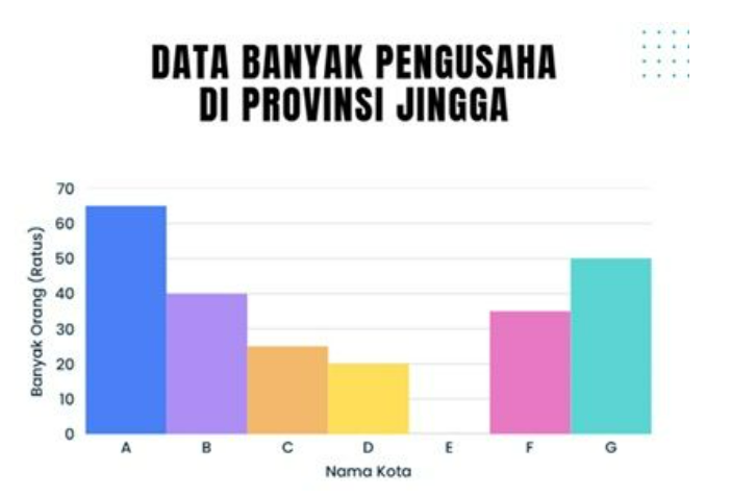

### Pertanyaan:
Berdasarkan informasi tersebut, banyak pengusaha di Kota E adalah ….

### Pilihan Jawaban:
- **[A]** 500 orang
- **[B]** 1.500 orang
- **[C]** 2.000 orang
- **[D]** 2.500 orang
- **[E]** 3.000 orang

---

## Soal No. 5 `[Pilihan Ganda]`

### Stimulus / Bacaan:
Perhatikan gambar berikut.

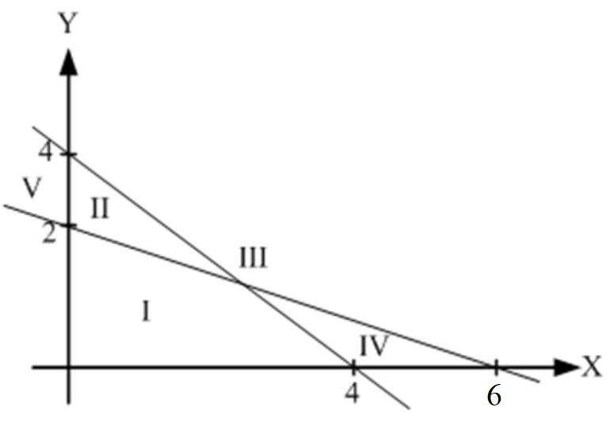

### Pertanyaan:
Daerah yang memenuhi sistem pertidaksamaan linear adalah ....

### Pilihan Jawaban:
- **[A]** I
- **[B]** II
- **[C]** III
- **[D]** IV
- **[E]** V

---

## Soal No. 6 `[Pilihan Ganda]`

### Stimulus / Bacaan:
Rina mulai berinvestasi melalui aplikasi Bobin. Terdapat beberapa pilihan produk investasi yang ditawarkan di aplikasi Bobin. Rina memilih produk investasi tipe B2026 karena pada setiap akhir tahun, bunga yang diperoleh langsung ditambahkan ke tabungan. Berikut disajikan brosur mengenai produk investasi tipe B2026:
Rina membeli produk investasi B2026 sebesar Rp7.000.000,00 dan berencana menyimpannya sampai jatuh tempo.

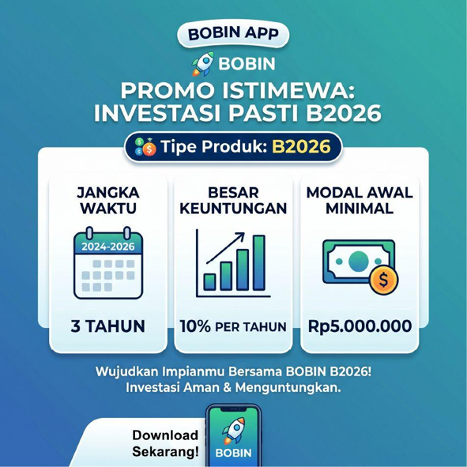

### Pertanyaan:
Berapakah uang yang diperoleh Rina setelah jatuh tempo?

### Pilihan Jawaban:
- **[A]** Rp8.470.000,00
- **[B]** Rp9.100.000,00
- **[C]** Rp9.240.000,00
- **[D]** Rp9.261.000,00
- **[E]** Rp9.317.000,00

---

## Soal No. 7 `[Pilihan Ganda]`

### Pertanyaan:
Diketahui fungsi f ( x ) = , dengan . Jika f –1 ( x ) adalah invers dari fungsi f ( x ), nilai dari f –1 (3) = ....

### Pilihan Jawaban:
- **[A]** $6$ 
- **[B]** $3$ 
- **[C]** $\frac {3} {2}$ 
- **[D]** $-\frac {1} {2}$ 
- **[E]** $-1$ 

---

## Soal No. 8 `[Pilihan Ganda]`

### Pertanyaan:
Fungsi f : R -> R dan g  R -> R . Jika g (x) = x - 1 dan ( f  o g ) (x) = x 3 – 4x , nilai dari f (2) = ….

### Pilihan Jawaban:
- **[A]** 9
- **[B]** 13
- **[C]** 15
- **[D]** 17
- **[E]** 25

---

## Soal No. 9 `[Pilihan Ganda]`

### Stimulus / Bacaan:
Seorang teknisi di bidang energi menghitung konsumsi energi sebuah alat listrik. Diketahui tegangan listrik sebesar
volt, arus listrik sebesar
ampere, dan waktu pemakaian selama
detik. Energi listrik dirumuskan dengan E= V x I x t.
dengan keterangan :
E
= energi listrik (Joule/J)
V
= tegangan listrik (Volt/V)
I
= kuat arus listrik (Ampere/A)
t
= waktu penggunaan listrik (detik)

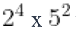

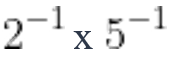

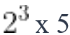

### Pertanyaan:
Namun, karena adanya rugi sistem sebesar  energi bersih yang dihasilkan menjadi E bersih= . maka energi bersih sama dengan ...

### Pilihan Jawaban:
- **[A]** ${2}^{8}\times \, {5}^{5}\, J$ 
- **[B]** ${2}^{4}\, \times \, {5}^{3}\, J$ 
- **[C]** $80\, J$ 
- **[D]** $32\, J$ 
- **[E]** $5\, J$ 

---

## Soal No. 10 `[Pilihan Ganda Kompleks]`

### Stimulus / Bacaan:
Sebuah piring besar akan ditata potongan buah dengan susunan melingkar seperti pada gambar berikut.
Tatanan potongan buah tersebut belum selesai dan akan dilanjutkan.

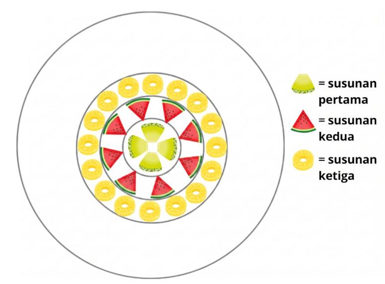

### Pertanyaan:
Tentukan manakah banyak potongan buah yang mungkin pada susunan berikutnya? Pilihlah semua jawaban yang benar! Jawaban benar lebih dari satu.

### Pilihan Jawaban:
- **[A]** 20 potongan buah
- **[B]** 24 potongan buah
- **[C]** 32 potongan buah
- **[D]** 64 potongan buah

---

## Soal No. 11 `[Pilihan Ganda]`

### Pertanyaan:
Bentuk rasional dari adalah ....

### Pilihan Jawaban:
- **[A]** 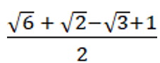
- **[B]** 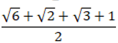
- **[C]** 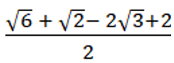
- **[D]** 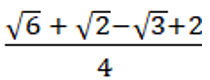
- **[E]** 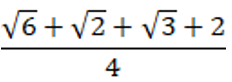

---

## Soal No. 12 `[Pilihan Ganda]`

### Pertanyaan:
Seorang peneliti melakukan pengamatan terhadap bakteri tertentu. Setiap hari bakteri membelah diri menjadi dua. Pada awal pengamatan terdapat 2 bakteri. Jika setiap 2 hari dari jumlah bakteri mati, banyaknya bakteri setelah tiga hari adalah....

### Pilihan Jawaban:
- **[A]** 48 bakteri
- **[B]** 64 bakteri
- **[C]** 96 bakteri
- **[D]** 128 bakteri
- **[E]** 192 bakteri

---

## Soal No. 13 `[Pilihan Ganda Kompleks]`

### Stimulus / Bacaan:
Proses pelumasan pada mesin merupakan hal penting yang harus dilakukan untuk menjaga performa kerja mesin. Kekentalan pelumas akan menurun seiring bertambahnya waktu operasi mesin. Hubungan antara waktu operasi
(jam) dan tingkat kekentalan pelumas
dapat dinyatakan oleh fungsi:
Adapun untuk keperluan pemeliharaan mesin, nilai kekentalan tersebut dapat dikategorikan menjadi tiga interval berikut:
Interval Nilai
Indikator Kekentalan
Interpretasi
Tinggi
Pelumas masih sangat kental, kondisi sangat baik
Sedang
Pelumas masih layak digunakan
Rendah
Pelumas mulai encer, perlu dipertimbangkan untuk diganti

### Pertanyaan:
Setelah mesin beroperasi berapa lamakah kekentalan pelumas pada mesin tersebut masuk pada indikator sedang?
Pilihlah semua jawaban yang benar! Jawaban benar lebih dari satu.

### Pilihan Jawaban:
- **[A]** 1 jam
- **[B]** 2 jam
- **[C]** 3 jam
- **[D]** 4 jam

---

## Soal No. 14 `[Pilihan Ganda]`

### Pertanyaan:
Dari selembar karton berbentuk persegi yang berukuran sisi 30 cm akan dibuat kotak tanpa tutup, dengan cara menggunting empat persegi di setiap pojok karton, seperti pada gambar. Volume kotak terbesar yang dapat dibuat adalah ....

### Pilihan Jawaban:
- **[A]** 2.000 cm³
- **[B]** 3.000 cm³
- **[C]** 4.000 cm³
- **[D]** 5.000 cm³
- **[E]** 6.000 cm³

---

## Soal No. 15 `[Pilihan Ganda]`

### Stimulus / Bacaan:
Perhatikan desain rak buku berikut!
sumber gambar: https://www.ufurnish.com/en-gb/p/a/16953815/decorotika-pisagor-corner-bookcase-shelving-unit-black-oak

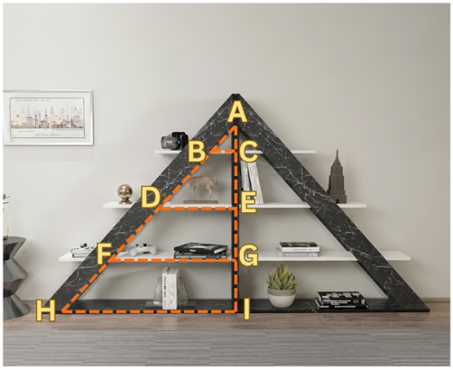

### Pertanyaan:
Manakah perbandingan yang sama dengan ?

### Pilihan Jawaban:
- **[A]** $\frac {AC} {AB}$ 
- **[B]** $\frac {BC} {DE}$ 
- **[C]** $\frac {BD} {CE}$ 
- **[D]** $\frac {AD} {AE}$ 
- **[E]** $\frac {AH} {HI}$ 

---

## Soal No. 16 `[Pilihan Ganda]`

### Stimulus / Bacaan:
Seorang teknisi sedang menyambung beberapa pipa untuk membuat saluran air lurus. Setiap pipa yang disambungkan tidak menambah panjang penuh, karena sebagian ujung pipa masuk ke dalam sambungan pipa sebelumnya sehingga panjang saluran pipa mengalami penambahan tetap. Berikut gambar panjang 1 pipa, 2 pipa yang tersambung, dan 3 pipa yang tersambung.

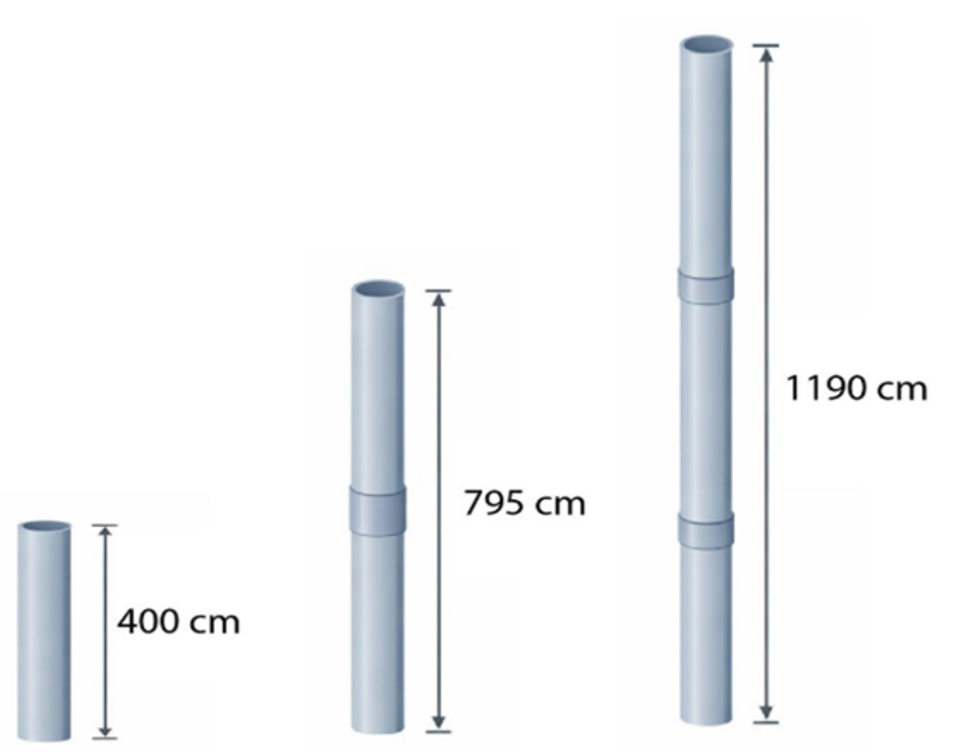

### Pertanyaan:
Berapa panjang pipa saluran air jika terdapat 8 pipa yang tersambung?

### Pilihan Jawaban:
- **[A]** 3.200 cm
- **[B]** 3.170 cm
- **[C]** 3.165 cm
- **[D]** 3.100 cm
- **[E]** 2.770 cm

---

## Soal No. 17 `[Pilihan Ganda]`

### Stimulus / Bacaan:
Pak Budi ingin membuka cabang baru kafe dalam waktu 12 bulan. Modal awal yang ia miliki saat ini adalah Rp50.000.000,00. Total dana yang dibutuhkan untuk pembukaan cabang baru adalah Rp200.000.000,00.
Untuk mencapai target tersebut, Pak Budi akan menyisihkan laba usahanya mulai bulan depan yaitu bulan Januari. Tabungan awal Pak Budi adalah Rp5.000.000,00. Karena bisnisnya sedang berkembang, ia berkomitmen untuk meningkatkan besar tabungannya secara tetap yaitu selalu bertambah sebesar Rp1.500.000,00 setiap bulannya. Berikut disajikan informasi mengenai hambatan yang dialami oleh Pak Budi:
Pada bulan ke-5 dan ke-9, Pak Budi harus mengeluarkan Rp5.000.000,00 dari tabungannya untuk biaya tak terduga.
Mulai bulan ke-7, kenaikan tabungan per bulan berkurang sebesar 20% dari kenaikan awal karena persaingan usaha.
Pak Budi hanya dapat membuka cabang baru jika total tabungan (termasuk modal awal) mencapai minimal Rp200.000.000,00 tanpa memperhitungkan uang yang sudah terpakai.

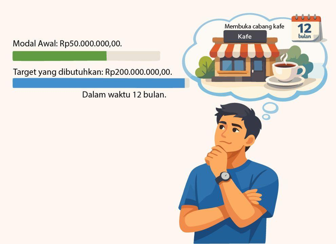

### Pertanyaan:
Kondisi seperti apakah yang dapat membuat Pak Budi membuka cabang baru kafe dalam waktu 12 bulan?
Tentukan benar atau salah pada setiap pernyataan berikut!

### Pilihan Jawaban:
- **[A]** Pernyataan
- **[B]** Dengan kendala yang ada, Pak Budi tetap dapat membuka cabang baru.
- **[C]** Pak Budi dapat membuka cabang baru dan membayar semua pengeluaran tak terduga jika tidak ada persaingan usaha.
- **[D]** Dengan meningkatkan jumlah tabungan secara tetap yaitu menjadi selalu bertambah sebesar Rp1.700.000,00 per bulan maka Pak Budi dapat membuka cabang baru dan membayar semua pengeluaran tak terduganya.

---

## Soal No. 18 `[Pilihan Ganda]`

### Stimulus / Bacaan:
Seorang desainer percetakan digital diminta membuat kemasan souvenir berikut yang akan dicetak menggunakan kertas laminasi.
Kemasan souvenir tersebut harus didesain pola bentuk (jaring-jaring) yang belum dirakit terlebih dahulu. Desainer bisa memodifikasi pola kemasan souvenir yang belum dirakit agar bisa dicetak tidak lebih dari 1 kertas untuk pola yang sama. Satu pola kemasan utuh yang belum dirakit hanya boleh dibuat posisi horizontal atau vertikal (tidak boleh diagonal). Tersedia pilihan kertas laminasi sebagai berikut.
Jenis Kertas
Ukuran (cm)
Harga per lembar
A3
29,7 x 42
Rp6.000,00
A3+
32,9 x 48,3
Rp8.000,00
Plano
61 x 86
Rp15.000,00

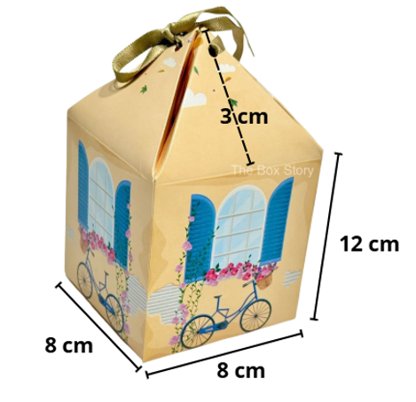

### Pertanyaan:
Dengan anggaran maksimal Rp1.200.000,00 berapakah paling banyak kotak souvenir yang bisa dibuat?

### Pilihan Jawaban:
- **[A]** 150 kotak kemasan.
- **[B]** 160 kotak kemasan.
- **[C]** 200 kotak kemasan.
- **[D]** 300 kotak kemasan.
- **[E]** 400 kotak kemasan.

---

## Soal No. 19 `[Pilihan Ganda]`

### Pertanyaan:
Diketahui sin A = , A adalah sudut tumpul. Nilai cos A = ….

### Pilihan Jawaban:
- **[A]** $\frac {a} {\sqrt {{a}^{2\, }+1}}$ 
- **[B]** $\frac {1} {\sqrt {{a}^{2}+1}}$ 
- **[C]** $\frac {\sqrt {{a}^{2}-1}} {a}$ 
- **[D]** $-\frac {\sqrt {{a}^{2}-1}} {a}$ 
- **[E]** $-\frac {\sqrt {{a}^{2}+1}} {a}$ 

---

## Soal No. 20 `[Pilihan Ganda]`

### Pertanyaan:
Diagram batang berikut menunjukkan produksi pakaian yang dikelola Bu Rahmi selama tahun 2020 dari bulan Januari sampai bulan Desember.

Peningkatan tertinggi jumlah produksi pakaian Bu Rahmi terjadi pada bulan ....

### Pilihan Jawaban:
- **[A]** April
- **[B]** Juni
- **[C]** Juli
- **[D]** September
- **[E]** November

---

## Soal No. 21 `[Pilihan Ganda]`

### Stimulus / Bacaan:
Analisis Pembebanan Struktur Jembatan
Dalam proyek pembangunan jembatan layang, tim insinyur struktur melakukan uji beban bertahap pada rangkaian balok penyangga (girder). Uji beban ini dilakukan dengan menempatkan beban statis di sepanjang titik tumpuan secara berurutan untuk melihat respons lendutan material.
(sumber: https://sindomakassar.com/read/sulsel/4974/uji-beban-240-ton-fly-over-pt-bms-dinilai-layak-digunakan-1697033442)
Pada tiga titik tumpuan pertama, beban yang diaplikasikan secara berturut-turut adalah 500 kg, 1.000 kg, 2.000 kg. Tim ahli mencatat bahwa peningkatan beban di setiap titik tumpuan berikutnya direncanakan mengikuti pola tertentu untuk menguji batas elastisitas tertinggi dari beton pracetak yang digunakan.

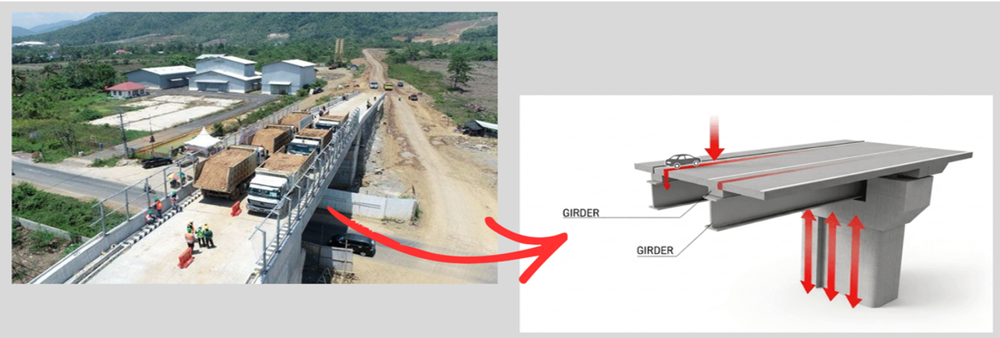

### Pertanyaan:
Berdasarkan pola berat beban yang diaplikasikan tersebut, beban pada titik tumpuan ke-4, 5, dan 6 berturut-turut adalah ....

### Pilihan Jawaban:
- **[A]** 3.000, 4.000, 5.000
- **[B]** 3.000, 6.000, 12.000
- **[C]** 4.000, 6.000, 8.000
- **[D]** 4.000, 6.000, 12.000
- **[E]** 4.000, 8.000, 16.000

---

## Soal No. 22 `[Pilihan Ganda]`

### Stimulus / Bacaan:
Toko Jaya menjual alat tulis sekolah. Tiga murid SMK Merdeka yaitu Maya, Sella, dan Elang membeli alat tulis di Toko Jaya dengan rincian sebagai berikut:

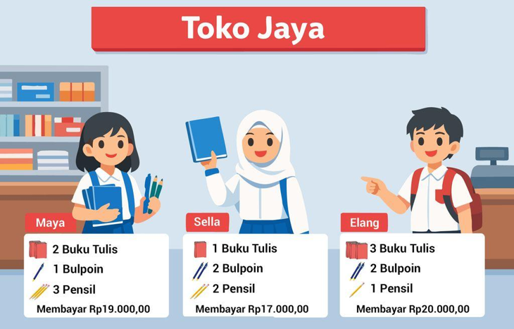

### Pertanyaan:
Apabila Nurul, murid dari sekolah yang sama ingin membeli ketiga alat tulis tersebut masing-masing 1 buah, maka banyaknya uang yang harus dibayarkan oleh Nurul adalah ...

### Pilihan Jawaban:
- **[A]** Rp9.000,00
- **[B]** Rp10.000,00
- **[C]** Rp10.500,00
- **[D]** Rp11.000,00
- **[E]** Rp12.000,00

---

## Soal No. 23 `[Pilihan Ganda]`

### Stimulus / Bacaan:
UMKM mendapatkan pesanan membuat alas piring untuk di meja makan seperti gambar berikut.
Ukuran diameter alas piring yang dibuat adalah 35 cm. Agar tampilan menjadi lebih menarik, di sekeliling alas tersebut akan dihiasi dengan pita berwarna emas.

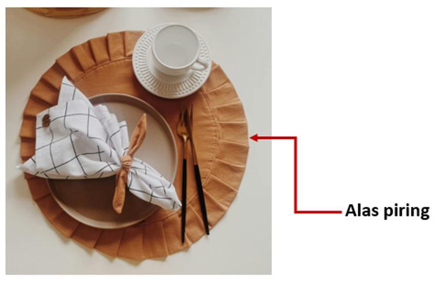

### Pertanyaan:
Jika harga satu meter pita emas Rp5.000,00 dan UMKM tersebut akan memproduksi sebanyak 180 buah, biaya yang dibutuhkan untuk membeli pita emas adalah ....

### Pilihan Jawaban:
- **[A]** Rp6.930.000,00
- **[B]** Rp1.980.000,00
- **[C]** Rp1.000.000,00
- **[D]** Rp990.000,00
- **[E]** Rp900.000,00

---

## Soal No. 24 `[Pilihan Ganda]`

### Pertanyaan:
Perhatikan data pada tabel nilai hasil ulangan matematika kelas XI SMA Z. Modus dari data tersebut adalah ....

### Pilihan Jawaban:
- **[A]** 64,0
- **[B]** 64,5
- **[C]** 65,0
- **[D]** 65,5
- **[E]** 66,0

---

## Soal No. 25 `[Pilihan Ganda]`

### Stimulus / Bacaan:
Analisis Pembebanan Struktur Jembatan
Dalam proyek pembangunan jembatan layang, tim insinyur struktur melakukan uji beban bertahap pada rangkaian balok penyangga (girder). Uji beban ini dilakukan dengan menempatkan beban statis di sepanjang titik tumpuan secara berurutan untuk melihat respons lendutan material.
(sumber: https://sindomakassar.com/read/sulsel/4974/uji-beban-240-ton-fly-over-pt-bms-dinilai-layak-digunakan-1697033442)
Pada tiga titik tumpuan pertama, beban yang diaplikasikan secara berturut-turut adalah 500 kg, 1.000 kg, 2.000 kg. Tim ahli mencatat bahwa peningkatan beban di setiap titik tumpuan berikutnya direncanakan mengikuti pola tertentu untuk menguji batas elastisitas tertinggi dari beton pracetak yang digunakan.

### Pertanyaan:
Standar Keamanan Bangunan menetapkan bahwa beton pracetak tersebut akan mengalami retak struktur jika diberi beban tunggal yang melampaui 128 ton pada satu titik. Pada titik tumpuan ke-berapakah beban yang diberikan untuk pertama kalinya mencapai batas keamanan struktur?

### Pilihan Jawaban:
- **[A]** Titik ke-7
- **[B]** Titik ke-8
- **[C]** Titik ke-9
- **[D]** Titik ke-10
- **[E]** Titik ke-11

---

## Soal No. 26 `[Pilihan Ganda Kompleks]`

### Stimulus / Bacaan:
Sebuah perusahaan mebel "Awet" memproduksi dua jenis produk yaitu meja dan kursi. Mengenai kebutuhan bahan dan tenaga kerja kedua produk tersebut. Berikut ini disajikan informasi mengenai kebutuhan bahan baku (kayu) dan tenaga kerja untuk pembuatan 1 unit meja dan 1 unit kursi:
Total kayu yang tersedia setiap harinya terbatas, yaitu maksimal 20 m
2
per hari dan total waktu yang tersedia adalah maksimal 48 jam per hari. Keuntungan bersih dari penjualan 1 unit meja adalah Rp500.000,00 dan keuntungan bersih dari penjualan 1 unit kursi adalah Rp300.000,00.

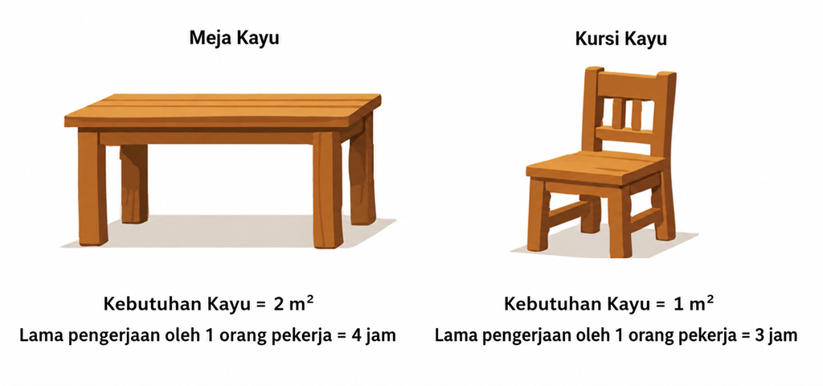

### Pertanyaan:
Berdasarkan kondisi tersebut, manakah pernyataan yang benar mengenai banyak meja dan kursi yang dapat diproduksi serta keuntungan yang diperoleh?
Pilihlah semua jawaban yang benar! Jawaban benar lebih dari satu.

### Pilihan Jawaban:
- **[A]** Mebel tidak dapat memproduksi 6 unit meja dan 5 unit kursi secara bersamaan.
- **[B]** Jika mebel hanya memproduksi kursi, jumlah maksimum yang dapat dihasilkan adalah 16 unit.
- **[C]** Memproduksi 2 meja dan 10 kursi menghasilkan keuntungan yang lebih besar daripada memproduksi 8 meja saja.
- **[D]** Keuntungan maksimum yang diperoleh adalah sebesar Rp5.400.00,00.

---

## Soal No. 27 `[Pilihan Ganda]`

### Stimulus / Bacaan:
Perhatikan kubus PQRS.TUVW berikut!
Panjang rusuk kubus tersebut 12 cm. Pada gambar terlihat bahwa titik O berada tepat pada perpotongan diagonal garis PR dan QS.

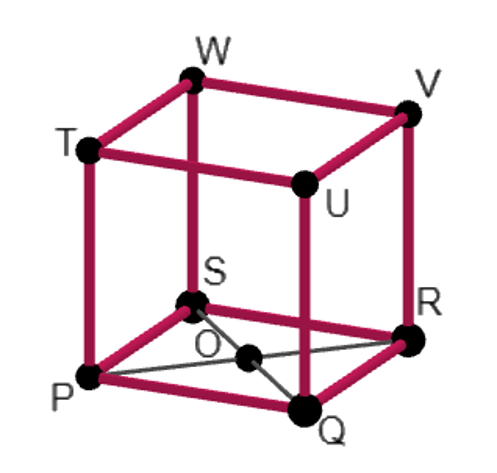

### Pertanyaan:
Jarak titik V ke O adalah ....

### Pilihan Jawaban:
- **[A]** $3\sqrt {6}\, cm$ 
- **[B]** $6\sqrt {2}\, cm$ 
- **[C]** $6\sqrt {6}\, cm$ 
- **[D]** $12\sqrt {2}\, cm$ 
- **[E]** $12\sqrt {3}\, cm$ 

---

## Soal No. 28 `[Pilihan Ganda]`

### Pertanyaan:
Sekolah P akan mengirim 2 perwakilan grup band untuk Pentas Musik Nusantara pada peringatan Hari Sumpah Pemuda. Sekolah tersebut memiliki 6 grup band putra dan 4 grup band putri. Berdasarkan penilaian, kemampuan grup band tersebut merata sehingga penentuan kedua perwakilan grup  band dilakukan dengan cara mengambil secara acak satu persatu. Peluang terambil grup band putra pada pengambilan pertama dan grup band putri pada pengambilan kedua adalah ....

### Pilihan Jawaban:
- **[A]** $\frac {1} {5}$ 
- **[B]** $\frac {6} {25}$ 
- **[C]** $\frac {4} {15}$ 
- **[D]** $\frac {2} {5}$ 
- **[E]** $\frac {13} {25}$ 

---

## Soal No. 29 `[Pilihan Ganda]`

### Stimulus / Bacaan:
Pada tahun 2025, sebuah perusahaan keju memproduksi dua jenis keju kemasan berbentuk gabungan bangun ruang seperti pada gambar berikut.
Karena permintaan pasar meningkat, manajer produksi mengusulkan aturan baru, yaitu:
"Mulai bulan Januari tahun depan, setiap kemasan akan diisi menjadi 75% volumenya tanpa mengubah ukuran kemasan".
Pada bulan Maret 2026, sebuah supermarket memesan 150 keju kemasan A dan 200 keju kemasan B.

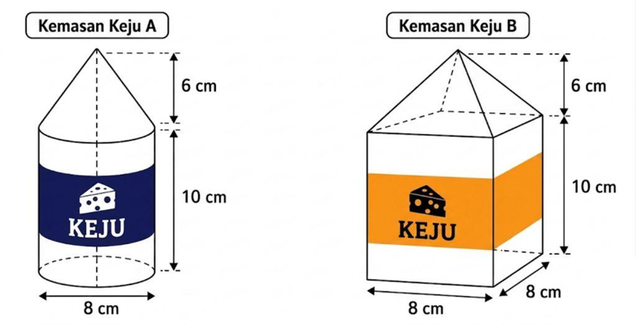

### Pertanyaan:
Apabila adonan keju yang tersedia adalah 220 liter, apakah usulan manajer produksi tersebut dapat diterapkan untuk memenuhi seluruh pesanan?

### Pilihan Jawaban:
- **[A]** Usulan tersebut tepat, karena meskipun aturan pengisian berubah, kebutuhan adonan tetap kurang dari 220 liter sehingga persediaan masih mencukupi.
- **[B]** Usulan tersebut tepat, karena penurunan volume hanya terjadi pada Keju Kemasan A sehingga tidak memengaruhi kecukupan persediaan secara keseluruhan.
- **[C]** Usulan tersebut kurang tepat, karena peningkatan aturan pengisian menyebabkan kebutuhan adonan bertambah, tetapi persediaan 220 liter masih mencukupi.
- **[D]** Usulan tersebut tidak tepat, karena peningkatan pengisian pada kedua jenis kemasan menyebabkan kebutuhan adonan melebihi 220 liter.
- **[E]** Usulan tersebut tidak tepat, karena perubahan aturan pengisian tidak memengaruhi kebutuhan adonan, melainkan hanya mengubah bentuk kemasan.

---

## Soal No. 30 `[Pilihan Ganda Kompleks]`

### Stimulus / Bacaan:
Analisis Pembebanan Struktur Jembatan
Dalam proyek pembangunan jembatan layang, tim insinyur struktur melakukan uji beban bertahap pada rangkaian balok penyangga (girder). Uji beban ini dilakukan dengan menempatkan beban statis di sepanjang titik tumpuan secara berurutan untuk melihat respons lendutan material.
(sumber: https://sindomakassar.com/read/sulsel/4974/uji-beban-240-ton-fly-over-pt-bms-dinilai-layak-digunakan-1697033442)
Pada tiga titik tumpuan pertama, beban yang diaplikasikan secara berturut-turut adalah 500 kg, 1.000 kg, 2.000 kg. Tim ahli mencatat bahwa peningkatan beban di setiap titik tumpuan berikutnya direncanakan mengikuti pola tertentu untuk menguji batas elastisitas tertinggi dari beton pracetak yang digunakan.

### Pertanyaan:
Konsultan pengawas ingin menghitung total akumulasi beban (tonase total) yang ditahan oleh jembatan selama pengujian di 5 hingga 7 titik tumpuan pertama untuk memastikan kekuatan fondasi dasar. Tim logistik kemudian menyiapkan beban statis seberat 32 ton. Pilihlah semua pernyataan yang benar terkait dengan tonase total dan persediaan beban statis tersebut. Jawaban benar lebih dari satu.

### Pilihan Jawaban:
- **[A]** Beban statis yang disediakan tim logistik cukup untuk pengujian tonase hingga titik tumpuan ke-6.
- **[B]** Diperlukan tambahan beban statis sebesar 30 ton apabila pengujian tonase dilakukan hingga titik tumpuan ke-7.
- **[C]** Terdapat sisa beban sebesar 15,5 ton setelah proses alokasi pengujian tonase hingga titik tumpuan ke-5 selesai.
- **[D]** Beton melewati batas beban setelah titik tumpuan ke-5 saat batas elastisitas kumulatif beton pracetak adalah 20 ton.

---

## Soal No. 31 `[Pilihan Ganda]`

### Stimulus / Bacaan:
Manajer pemasaran sebuah biro perjalanan di Pulau Wisata Numerasi sedang merancang strategi promosi untuk periode berikutnya. Ia harus memastikan bahwa anggaran iklan yang terbatas dialokasikan pada target pasar yang memiliki potensi jumlah wisatawan paling besar. Manajer tersebut menggunakan dua data berikut.
Tabel Aktivitas Favorit berdasarkan Negara Asal.
Negara Asal
Aktivitas Favorit
Australia
80% Wisata Budaya dan 20% Berselancar dan Pantai
China
40% Belanja dan 60% Wisata Kuliner
Malaysia
90% Perawatan Tubuh dan 10% Wisata Budaya
Jepang
70% Wisata Kuliner dan 30% Belanja

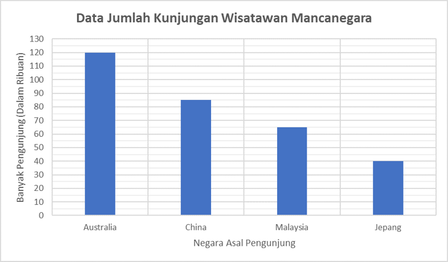

### Pertanyaan:
Berdasarkan data yang diberikan, bagaimana potensi jumlah wisatawan pada biro perjalanan tersebut?
Tentukan Benar atau Salah pada setiap pernyataan berikut!

### Pilihan Jawaban:
- **[A]** Pernyataan
- **[B]** Peningkatan iklan Berselancar untuk wisatawan Australia berpotensi mendatangkan volume wisatawan lebih besar daripada iklan Wisata Kuliner untuk wisatawan Jepang.
- **[C]** Target pasar wisatawan Perawatan Tubuh asal Malaysia lebih besar dibandingkan wisatawan Kuliner asal China.
- **[D]** Potensi wisatawan Belanja asal Jepang lebih kecil dibandingkan potensi wisatawan Belanja asal China.

---

## Soal No. 32 `[Pilihan Ganda]`

### Stimulus / Bacaan:
Perusahaan Kertas "Mayang" sedang merapikan data gaji bulanan karyawan tahun 2025 untuk bahan penyusunan laporan pajak. Namun, data pada salah satu rentang gaji tidak terbaca. Berikut data gaji bulanan karyawan di Perusahaan Kertas "Mayang":
Diketahui bahwa modus gaji karyawan di Perusahaan Kertas “Mayang” adalah Rp15.750.000,00.

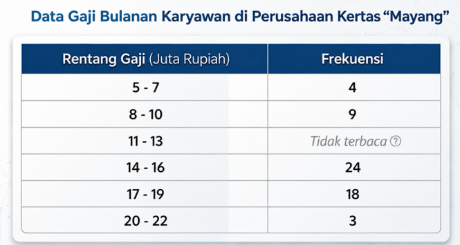

### Pertanyaan:
Berapakah nilai data yang tidak terbaca tersebut?

### Pilihan Jawaban:
- **[A]** 6
- **[B]** 14
- **[C]** 20
- **[D]** 21
- **[E]** 28

---

## Soal No. 33 `[Pilihan Ganda]`

### Stimulus / Bacaan:
Dalam sebuah acara pameran wisata internasional, panitia penyelenggara menyediakan
doorprize
untuk para pengunjung. Pengunjung yang berkesempatan mendapatkan hadiah
doorprize
adalah mereka yang termasuk 40 pengunjung pertama. Mereka akan diminta mengambil satu kupon secara acak. Apabila beruntung, kupon yang diperoleh bertuliskan salah satu jenis hadiah, sedangkan apabila belum beruntung maka akan memperoleh
voucher
kosong. Apabila kupon yang terambil adalah
voucher
kosong, maka kupon dimasukkan lagi ke dalam wadah.
Kupon
doorprize
yang disediakan adalah sebagai berikut:
5 tiket gratis pp Jakarta-Kuala Lumpur
5 tiket gratis pp Jakarta-Bangkok
10
voucher
menginap 3 malam di hotel bintang lima
10
voucher
menginap 3 malam di hotel bintang empat
10
voucher
kosong
Anto adalah orang ke-6 yang berkesempatan mengambil hadiah
doorprize
. Diketahui bahwa 1 tiket pp Jakarta-Kuala Lumpur, 1 tiket pp Jakarta-Bangkok, dan 2
voucher
menginap di hotel bintang empat sudah terambil. Adapun satu orang lainnya gagal mendapatkan
doorprize.
Selanjutnya Anto yang berkesempatan mengambil satu hadiah secara acak.

### Pertanyaan:
Berapa peluang Anto mendapatkan tiket gratis pp Jakarta-Kuala Lumpur?

### Pilihan Jawaban:
- **[A]** $\frac {1} {10}$ 
- **[B]** $\frac {1} {9}$ 
- **[C]** $\frac {4} {35}$ 
- **[D]** $\frac {5} {36}$ 
- **[E]** $\frac {1} {7}$ 

---

## Soal No. 34 `[Pilihan Ganda]`

### Stimulus / Bacaan:
Diketahui kubus ABCDEFGH seperti pada gambar.

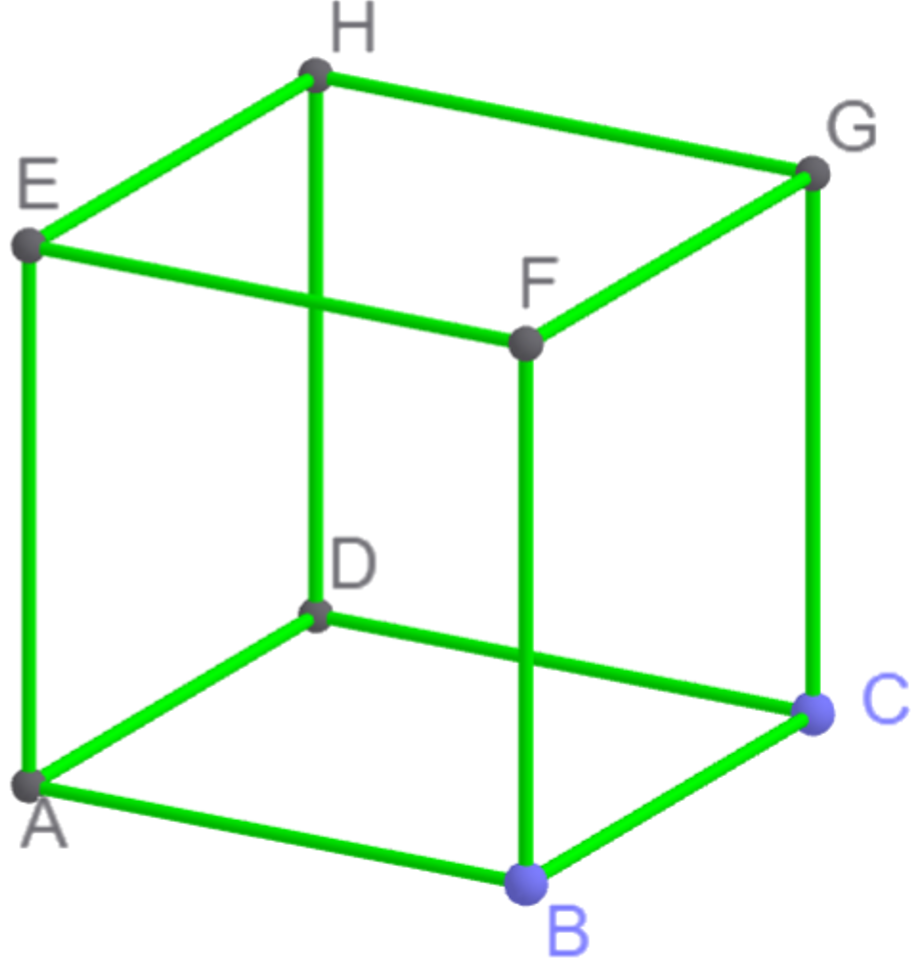

### Pertanyaan:
Bagaimana hubungan antara setiap rusuk atau setiap garis yang menghubungkan dua titik pada sudut tersebut?

### Pilihan Jawaban:
- **[A]** Pilihlah
- **[B]** AD tegak lurus FG
- **[C]** BC sejajar EH
- **[D]** EF memotong CG

---

## Soal No. 35 `[Pilihan Ganda]`

### Pilihan Jawaban:
- **[A]** $\frac {8} {21}$ 
- **[B]** $\frac {8} {11}$ 
- **[C]** $\frac {11} {12}$ 
- **[D]** $\frac {16} {21}$ 
- **[E]** $2\frac {8} {21}$ 

---

## Soal No. 36 `[Pilihan Ganda]`

### Stimulus / Bacaan:
Amel memiliki toko bunga. Amel selalu mencatat hasil penjualannya. Hasil penjualannya digunakan untuk bahan evaluasi dan pertimbangan saat membeli bunga. Berikut disajikan data mengenai keuntungan dari penjualan bunga dari bulan Januari sampai Juli 2025:

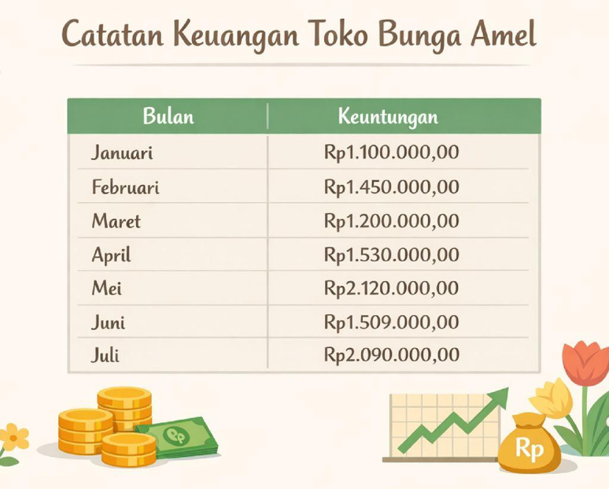

### Pertanyaan:
Berdasarkan data tersebut, keuntungan pada bulan manakah yang mengalami penurunan signifikan?

### Pilihan Jawaban:
- **[A]** Februari
- **[B]** Maret
- **[C]** April
- **[D]** Mei
- **[E]** Juni

---

## Soal No. 37 `[Pilihan Ganda]`

### Stimulus / Bacaan:
Mirna akan memproduksi dua jenis kue dengan modal Rp8.000.000,00. Biaya produksi kue bolu sebesar Rp15.000,00 per kotak dan dijual dengan laba 40%. Sedangkan biaya produksi kue brownies sebesar Rp20.000,00 per kotak dan dijual dengan laba 35%. Setiap harinya, Mirna dapat memproduksi paling banyak 500 kotak kue.

### Pertanyaan:
Apabila Mirna ingin memperoleh keuntungan maksimum, tentukan Benar atau Salah untuk setiap pernyataan berikut!

### Pilihan Jawaban:
- **[A]** Pernyataan
- **[B]** Mirna harus memproduksi 200 kotak kue bolu.
- **[C]** Mirna  harus  memproduksi  kue  brownies lebih banyak.
- **[D]** Keuntungan maksimum  yang dapat diperoleh Mirna adalah Rp3.100.000,00.

---

## Soal No. 38 `[Pilihan Ganda]`

### Stimulus / Bacaan:
Desain jendela kaca dari sebuah komplek perumahan (
cluster
) yang akan segera dibangun beserta ukurannya diberikan pada gambar berikut
Pihak pengembang konstruksi berencana akan membangun 20 rumah di dalam komplek tersebut. Setiap rumah memiliki satu desain jendela seperti pada gambar.

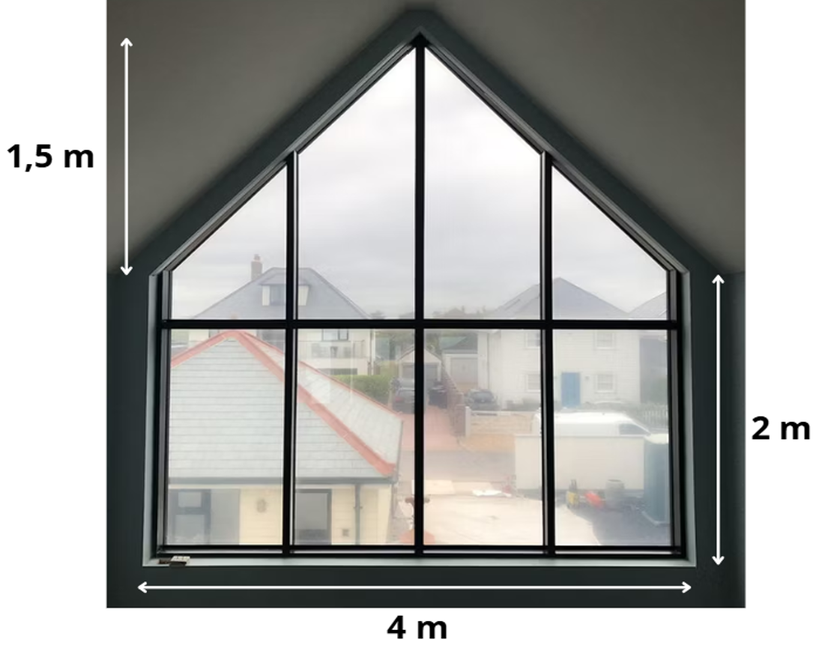

### Pertanyaan:
Berdasarkan jumlah rumah dan desain jendela yang akan dibangun, maka total luas kebutuhan kaca yang harus dipersiapkan pihak pengembang adalah ....

### Pilihan Jawaban:
- **[A]** $11\, {m}^{2}$ 
- **[B]** $14\, {m}^{2}$ 
- **[C]** $140\, {m}^{2}$ 
- **[D]** $220\, {m}^{2}$ 
- **[E]** $280\, {m}^{2}$ 

---

## Soal No. 39 `[Pilihan Ganda]`

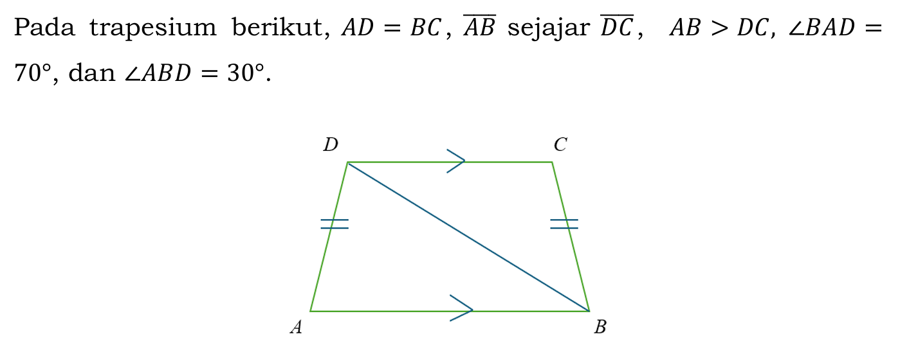

### Pertanyaan:
Tentukan Benar atau Salah untuk setiap pernyataan berikut terkait dengan besar sudut pada trapesium 𝐴𝐵𝐶𝐷!

### Pilihan Jawaban:
- **[A]** Pernyataan
- **[B]** 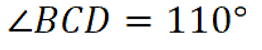
- **[C]** 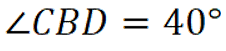
- **[D]** 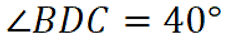

---

## Soal No. 40 `[Pilihan Ganda]`

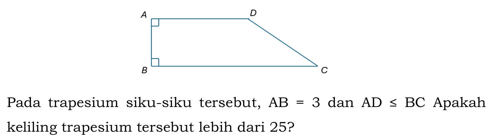

### Pertanyaan:
Putuskan apakah dengan tambahan informasi Pernyataan (1) dan Pernyataan (2) berikut cukup untuk menjawab pertanyaan tersebut! (1)  Luas trapesium ABCD = 24. (2)  BC = 10 dan CD = 5.

### Pilihan Jawaban:
- **[A]** Pernyataan (1) SAJA cukup untuk menjawab pertanyaan, tetapi Pernyataan (2) SAJA tidak cukup.
- **[B]** Pernyataan (2) SAJA cukup untuk menjawab pertanyaan, tetapi Pernyataan (1) SAJA tidak cukup.
- **[C]** DUA pernyataan BERSAMA-SAMA cukup untuk menjawab pertanyaan, tetapi SATU pernyataan SAJA tidak cukup.
- **[D]** Pernyataan (1) SAJA cukup untuk menjawab pertanyaan dan Pernyataan (2) SAJA cukup.
- **[E]** Pernyataan (1) dan Pernyataan (2) tidak cukup untuk menjawab pertanyaan.

---

## Soal No. 41 `[Pilihan Ganda]`

### Stimulus / Bacaan:
Suatu tangga dengan panjang 6 meter disandarkan pada dinding vertikal. Sudut yang dibentuk tangga dengan lantai adalah 60°.

### Pertanyaan:
Tinggi dinding yang disentuh ujung atas tangga adalah ....

### Pilihan Jawaban:
- **[A]** 3 meter
- **[B]** 3√2 meter
- **[C]** 3√3 meter
- **[D]** 4√2 meter
- **[E]** 4√3 meter

---

## Soal No. 42 `[Pilihan Ganda Kompleks]`

### Stimulus / Bacaan:
Rata-rata nilai ulangan 17 murid dari skala 100 adalah 83. Ada 3 murid yang mengikuti ujian susulan sehingga rata-rata nilai ulangan dari 20 murid menjadi 82.

### Pertanyaan:
Tentukan semua pernyataan berikut yang benar terkait dengan nilai ketiga murid yang mengikuti ujian susulan! Jawaban benar lebih dari satu.

### Pilihan Jawaban:
- **[A]** Jumlah nilai ketiga murid yang mengikuti ujian susulan adalah 229.
- **[B]** Rata-rata nilai ketiga murid yang mengikuti ujian susulan lebih dari 70.
- **[C]** Nilai terendah dari ketiga murid yang mengikuti ujian susulan tidak kurang dari 29.
- **[D]** Nilai tertinggi dari ketiga murid yang mengikuti ujian susulan lebih dari 76.
- **[E]** Jangkauan data nilai ketiga murid yang mengikuti ujian susulan lebih dari dari 72.

---

## Soal No. 43 `[Pilihan Ganda]`

### Stimulus / Bacaan:
Fungsi didefinisikan oleh

### Pertanyaan:
Tentukan Benar atau Salah pada setiap pernyataan berikut yang terkait dengan grafik fungsi !

### Pilihan Jawaban:
- **[A]** Pernyataan
- **[B]** Grafik fungsi ƒ terbuka ke atas.
- **[C]** Grafik fungsi ƒ  memotong garis 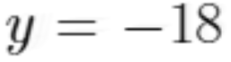
- **[D]** Grafik fungsi ƒ  tidak melalui kuadran tiga.

---

## Soal No. 44 `[Pilihan Ganda Kompleks]`

### Stimulus / Bacaan:
Tagihan listrik bulanan di sebuah apartemen dihitung berdasarkan jumlah energi listrik (dalam kWh) yang digunakan. Apartemen tersebut masih menggunakan meteran listrik yang berbeda dari penggunaan token.
Biaya tagihan listrik dihitung dengan rumus:
Keterangan:
: total tagihan listrik (dalam rupiah)
: jumlah pemakaian energi listrik (kwh)
Andi merupakan salah satu penghuni apartemen tersebut yang menerima tagihan pembayaran listrik seperti terlihat pada gambar berikut:
Dia menyadari bahwa penggunaan listrik sebulan terakhir lebih dari penggunaan listrik biasanya.

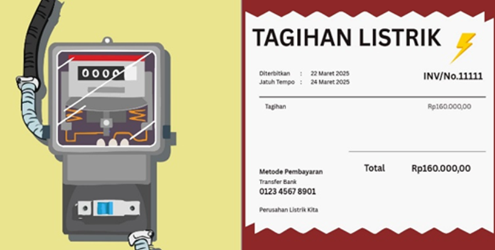

### Pertanyaan:
Berdasarkan informasi tersebut, biasanya berapa besar penggunaan listrik di apartemen Andi?
Pilihlah jawaban yang benar! Jawaban benar lebih dari satu.

### Pilihan Jawaban:
- **[A]** 85 kWh
- **[B]** 90 kWh
- **[C]** 100 kWh
- **[D]** 120 kWh
- **[E]** 137 kWh

---

## Soal No. 45 `[Pilihan Ganda]`

### Stimulus / Bacaan:
Pak Andi akan mempresentasikan desain gedung berukuran 60 cm × 60 cm menggunakan proyektor ke layar berukuran 2,4 meter × 1,8 meter yang dipasang di depan ruang rapat (orientasi horizontal). Proyektor menghasilkan pembesaran proporsional tergantung jaraknya dari layar.
Pak Andi menempatkan proyektor dengan jarak yang menghasilkan skala pembesaran seperti terlihat pada gambar berikut:

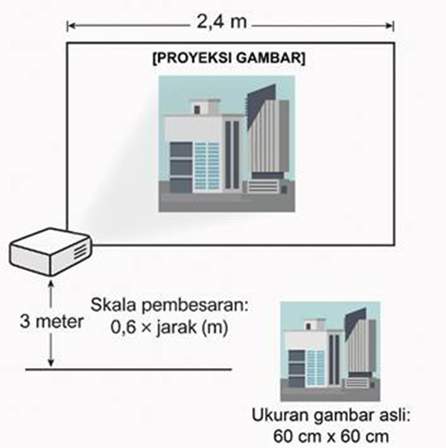

### Pertanyaan:
Bagaimanakah tampilan desain gedung di layar?
Tentukan Benar atau Salah pada setiap pernyataan berikut!

### Pilihan Jawaban:
- **[A]** Pernyataan
- **[B]** Perbandingan ukuran tampilan desain di layar adalah 1 : 1.
- **[C]** Ukuran panjang dan lebar tampilan desain pada layar adalah lebih dari 1 meter.
- **[D]** Terdapat bagian gambar asli desain yang terpotong dalam tampilan pada layar.

---

## Soal No. 46 `[Pilihan Ganda]`

### Stimulus / Bacaan:
Luki adalah panitia bazar di sekolahnya. Dia mendapat tugas dari ketua pelaksana untuk membuat kupon. Dia ingin di setiap kupon memiliki kode akses yang unik. Kode akses kupon bazar itu memiliki lima karakter dengan format sebagai berikut:

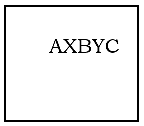

### Pertanyaan:
dengan A, B, dan C menyatakan huruf, serta X dan Y menyatakan angka. Tidak boleh ada angka dan huruf yang diulang. Berapakah berapa banyak kode akses berbeda yang dapat dibuat?

### Pilihan Jawaban:
- **[A]** 1.263.600
- **[B]** 1.352.000
- **[C]** 1.404.000
- **[D]** 1.423.656
- **[E]** 1.757.600

---
