# Kumpulan Soal Simulasi TKA - Matematika Paket 2
**Jenjang:** SMK / SMA / MA / Sederajat (Mata Pelajaran Wajib)
**Total Soal:** 25 butir
**Sumber:** Portal Pusmendik Kemendikdasmen (Simulasi ANBK / TKA)

---

## Soal No. 1 `[Pilihan Ganda]`

### Stimulus / Bacaan:
Diberikan tiga himpunan bilangan sebagai berikut:

### Pertanyaan:
Berdasarkan himpunan-himpunan tersebut, hasil dari adalah ....

### Pilihan Jawaban:
- **[A]** {2, 3, 5, 7}
- **[B]** {0, 2, 3, 5, 7}
- **[C]** {2, 3, 4, 5, 7}
- **[D]** {0, 2, 3, 4, 5, 7}
- **[E]** {2, 3, 4, 5, 7, 10}

---

## Soal No. 2 `[Pilihan Ganda]`

### Pertanyaan:
Bentuk sederhana dari adalah ....

### Pilihan Jawaban:
- **[A]** $\frac {1} {42}$ 
- **[B]** $\frac {2} {3}$ 
- **[C]** $\frac {4} {3}$ 
- **[D]** 6
- **[E]** 12

---

## Soal No. 3 `[Pilihan Ganda]`

### Stimulus / Bacaan:
Operasi biner
didefinisikan sebagai
untuk setiap bilangan real tidak negatif
dan
.

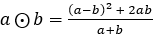

### Pertanyaan:
Jika , tentukan Benar atau Salah pada setiap pernyataan berikut!

### Pilihan Jawaban:
- **[A]** Pernyataan
- **[B]** $a$ merupakan kelipatan dari 3. 
- **[C]** $a$ merupakan bilangan prima. 
- **[D]** 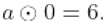

---

## Soal No. 4 `[Pilihan Ganda]`

### Stimulus / Bacaan:
Seorang peneliti memodelkan peningkatan suhu akibat pemanasan global yang terjadi dengan fungsi linear berikut:
dengan
mewakili tahun dan
mewakili peningkatan suhu dalam derajat Celsius.

### Pertanyaan:
Pada tahun berapakah peningkatan suhu diperkirakan mencapai 0,7 o C?

### Pilihan Jawaban:
- **[A]** Tahun 2000.
- **[B]** Tahun 2003.
- **[C]** Tahun 2025.
- **[D]** Tahun 2030.
- **[E]** Tahun 2345.

---

## Soal No. 5 `[Pilihan Ganda]`

### Stimulus / Bacaan:
Tempat Les Pintarku memberikan potongan biaya kursus kepada 50 pendaftar pertama, sedangkan harga normal berlaku untuk pendaftar lainnya. Biaya kursus setelah mendapatkan potongan harga dapat dihitung dengan fungsi berikut:
dengan
adalah biaya kursus mula-mula dan
adalah biaya setelah potongan harga.
Selain itu, bagi siswa yang berprestasi akan mendapat tambahan potongan harga yang besarnya disesuaikan dengan nilai rapor mereka. Setelah mendapatkan tambahan potongan harga maka biaya akhir kursus menjadi sebagai berikut:
dengan
adalah biaya akhir setelah tambahan diskon.
Salah satu siswa bernama Fira, merupakan pendaftar ke-50 dan membayar biaya kursus sebesar Rp180.000,00.
Setelah itu, datang empat siswa lainnya yang juga ingin mengikuti kursus dengan informasi berikut:

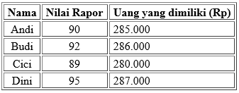

### Pertanyaan:
Dengan uang yang dimiliki, siapakah siswa yang pasti dapat mengikuti kursus?

### Pilihan Jawaban:
- **[A]** Dini.
- **[B]** Dini dan Budi.
- **[C]** Dini, Budi dan Andi.
- **[D]** Dini, Cici, Budi dan Andi.
- **[E]** Cici dan Andi.

---

## Soal No. 6 `[Pilihan Ganda]`

### Stimulus / Bacaan:
Pada saat pertandingan sepak bola Indonesia melawan Jepang, kelompok pendukung tim Indonesia akan duduk membentuk koreo dengan beberapa orang memegang kertas berwarna yang dibentangkan. Total kertas berwarna yang dipegang oleh pendukung di barisan kursi paling bawah adalah sebanyak 400 lembar, kemudian di baris kedua sebanyak 550 lembar, dan semakin bertambah pada barisan kursi berikutnya dengan pola penambahan yang sama.

### Pertanyaan:
Jika pola penambahan tersebut berlaku sampai pada baris kursi ketujuh, maka berapa banyak penonton yang memegang kertas koreo di baris ke-5?

### Pilihan Jawaban:
- **[A]** 700 orang.
- **[B]** 850 orang.
- **[C]** 1.000 orang.
- **[D]** 1.150 orang.
- **[E]** 1.300 orang.

---

## Soal No. 7 `[Pilihan Ganda Kompleks]`

### Stimulus / Bacaan:
Seorang pasien dengan kadar asam urat tinggi menjalani terapi menggunakan obat penurun kadar asam urat. Pada hari pertama, kadar asam urat dalam darah tercatat 13 mg/dL. Obat bekerja menurunkan kadar asam urat sebesar 20% setiap hari secara konsisten. Beberapa hal yang perlu diperhatikan dalam mengonsumsi obat penurun asam urat:
- Pasien mulai merasa lebih nyaman saat kadar asam urat ada di bawah 7 mg/dL.
- Pasien dianggap sembuh secara klinis jika kadar asam urat telah mencapai kurang dari 5 mg/dL.

### Pertanyaan:
Pada hari keberapa berapa pasien merasa nyaman namun belum dianggap sembuh secara klinis? Klik pada setiap jawaban benar! Jawaban benar lebih dari satu.

### Pilihan Jawaban:
- **[A]** Hari ke-2
- **[B]** Hari ke-3
- **[C]** Hari ke-4
- **[D]** Hari ke-5
- **[E]** Hari ke-6

---

## Soal No. 8 `[Pilihan Ganda]`

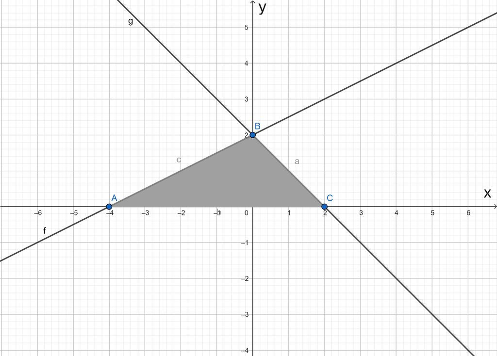

### Pertanyaan:
Daerah yang diarsir pada gambar tersebut merupakan himpunan penyelesaian dari sistem pertidaksamaan ....

### Pilihan Jawaban:
- **[A]** ${\{ }^{{}^{x\, -\, 2y\, \geq \, -\, 4}_{x\, +\, y\, \leq \, 2\, }}_{{}^{x\, \geq \, 0}_{y\, \geq \, 0}}$ 
- **[B]** ${\{ }^{{}^{x\, -\, 2y\, \geq \, -4}_{x\, +\, y\, \leq \, 2}}_{{}^{y\, \geq \, 0}}$ 
- **[C]** ${\{ }^{{}^{x\, -\, 2y\, \geq \, -4}_{x\, +\, y\, \geq \, 2}}_{{}^{y\, \geq \, 0}}\} $ 
- **[D]** $\{ {{}_{}}_{}{}^{{}^{2x\, -\, y\, \leq \, 4}_{x\, +\, y\, \leq \, 2}}_{{}^{y\, \geq \, 0}}$ 
- **[E]** $\{ {}^{{}^{2x\, -\, y\, \geq \, 4}_{x\, +\, y\, \leq \, 2}}_{{}^{x\, \geq \, 0}_{y\, \geq \, 0}}$ 

---

## Soal No. 9 `[Pilihan Ganda]`

### Stimulus / Bacaan:
Bu Silma adalah seorang perangkai bunga yang disusun dalam buket bunga. Di tokonya, ia memiliki bunga mawar, lili, dan anyelir. Harga buket ditentukan dari total harga bunga yang digunakan dalam buket tersebut. Adapun tiga jenis buket yang biasa ia siapkan dengan komposisi ketiga bunga beserta harga per buketnya diberikan pada gambar berikut.

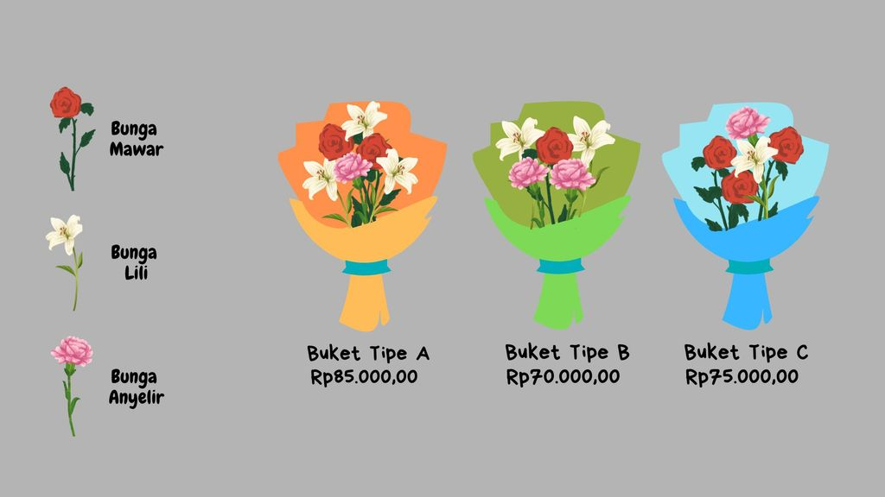

### Pertanyaan:
Bila seorang pembeli ingin membeli buket bunga tipe C namun ingin menambah 2 tangkai lili dan 1 tangkai anyelir dengan harga satuan, maka total harga yang harus dibayar pembeli tersebut adalah ....

### Pilihan Jawaban:
- **[A]** Rp75.000,00
- **[B]** Rp102.000,00
- **[C]** Rp110.000,00
- **[D]** Rp115.000,00
- **[E]** Rp116.000,00

---

## Soal No. 10 `[Pilihan Ganda Kompleks]`

### Stimulus / Bacaan:
Perhatikan gambar berikut!

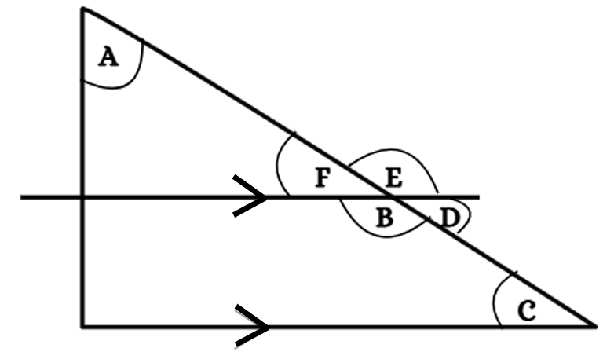

### Pertanyaan:
Berdasarkan gambar tersebut, pasangan sudut manakah yang membentuk sudut 180 o ? Klik pada setiap jawaban benar! Jawaban benar lebih dari satu.

### Pilihan Jawaban:
- **[A]** ∠A dan ∠B
- **[B]** ∠A dan ∠E
- **[C]** ∠B dan ∠C
- **[D]** ∠B dan ∠D
- **[E]** ∠E dan ∠C

---

## Soal No. 11 `[Pilihan Ganda Kompleks]`

### Stimulus / Bacaan:
Zara ingin menata kembali kamarnya dengan menambahkan papan jadwal di dinding. Papan jadwal tidak diletakkan pada dinding yang sejajar dengan rak buku gantung. Posisi rak buku gantung dapat dilihat pada gambar berikut.

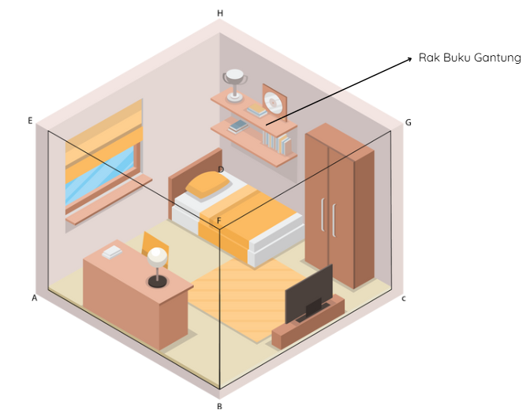

### Pertanyaan:
Berdasarkan posisi yang diinginkan, pada dinding manakah papan jadwal akan diletakkan? Klik pada setiap jawaban benar! Jawaban benar lebih dari satu.

### Pilihan Jawaban:
- **[A]** CDHG
- **[B]** BCGF
- **[C]** ABFE
- **[D]** BCFA
- **[E]** ADHE

---

## Soal No. 12 `[Pilihan Ganda]`

### Stimulus / Bacaan:
Perhatikan gambar berikut!

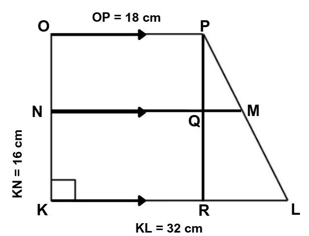

### Pertanyaan:
Diketahui trapesium KLMN dan NMPO sebangun. Berdasarkan informasi tersebut, berapakah panjang sisi LM?

### Pilihan Jawaban:
- **[A]** $6\sqrt {5\, }\, cm$ 
- **[B]** $8\sqrt {5}\, cm$ 
- **[C]** $9\sqrt {5}\, cm$ 
- **[D]** $10\sqrt {5}\, cm$ 
- **[E]** $14\sqrt {5}\, cm$ 

---

## Soal No. 13 `[Pilihan Ganda]`

### Stimulus / Bacaan:
Tim adiwiyata SMA Gemilang sedang menata sayuran di kebun sekolah. Mereka menanam beberapa tanaman obat keluarga (toga) seperti jahe, kunyit dan lengkuas. Setiap tanaman ditempatkan di pot yang berbeda-beda ukurannya. Pot tersebut akan diletakkan di salah satu sisi kebun seperti pada ilustrasi berikut.
Ukuran diameter pot yang digunakan untuk jahe berukuran 15 cm, kunyit berukuran 26 cm dan lengkuas berukuran 30 cm.

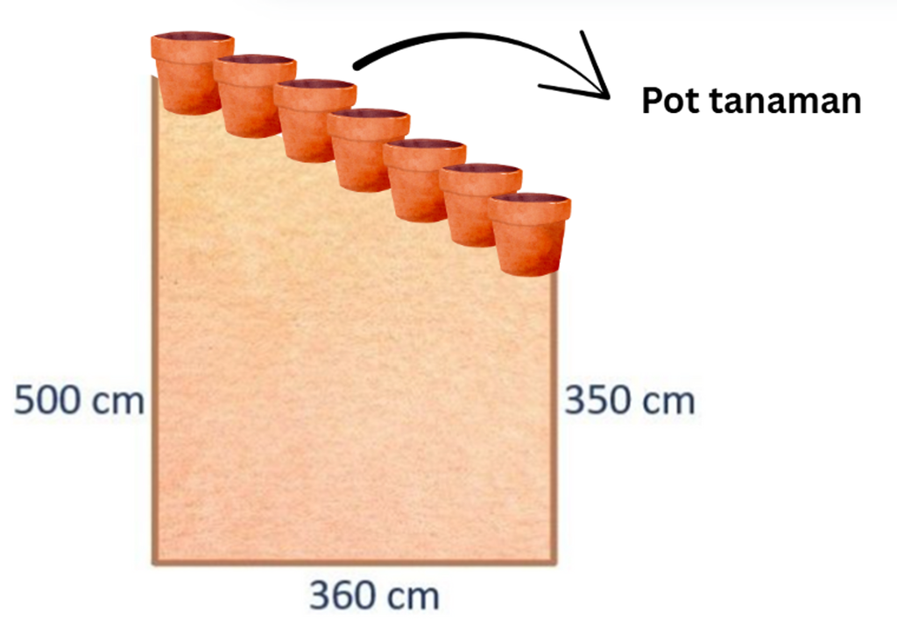

### Pertanyaan:
Berdasarkan ilustrasi, tentukan benar atau salah pernyataan berkaitan dengan ukuran sisi kebun yang ditanami tanaman toga tersebut!

### Pilihan Jawaban:
- **[A]** Banyak Tanaman
- **[B]** Ada 25 tanaman jahe yang bisa ditanam.
- **[C]** Ada 15 tanaman kunyit yang bisa ditanam.
- **[D]** Ada 10 tanaman lengkuas yang bisa ditanam.

---

## Soal No. 14 `[Pilihan Ganda]`

### Stimulus / Bacaan:
Perhatikan gambar berikut.

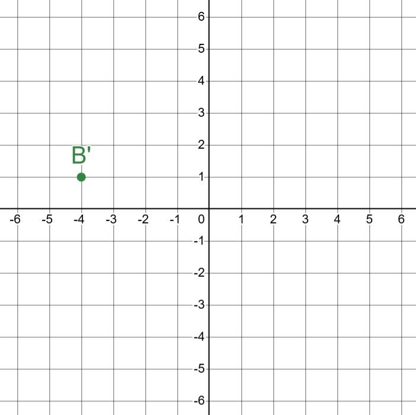

### Pertanyaan:
Titik B direfleksikan oleh garis y=1, kemudian dirotasi dengan pusat di O(0,0) sebesar 180º searah jarum jam. Titik B' pada gambar merupakan bayangan titik B hasil komposisi kedua transformasi tersebut. Gambar titik B yang sesuai adalah ....

### Pilihan Jawaban:
- **[A]** 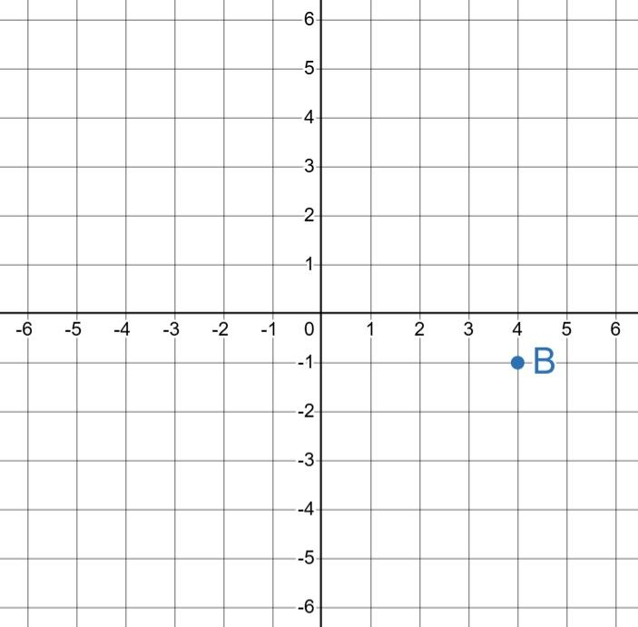
- **[B]** 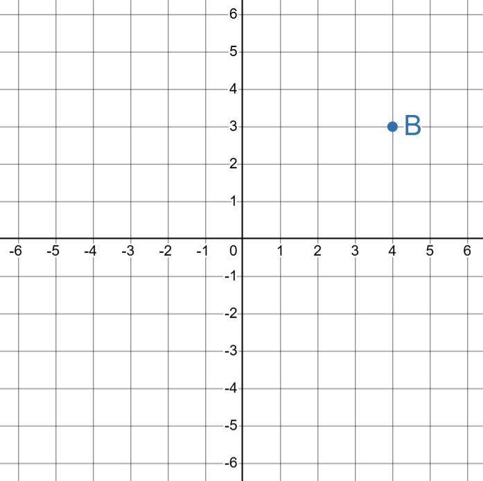
- **[C]** 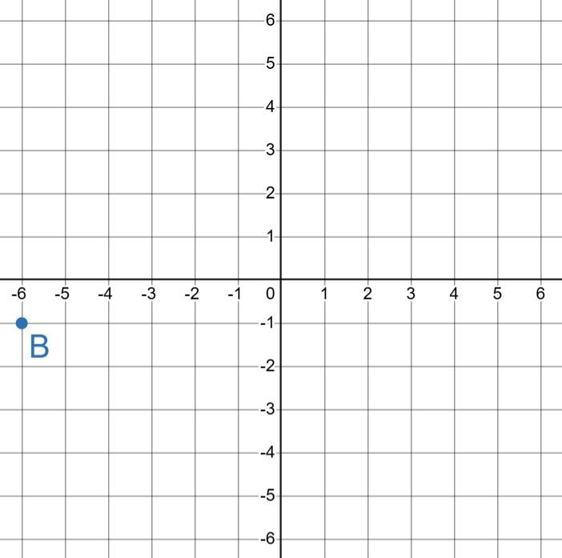
- **[D]** 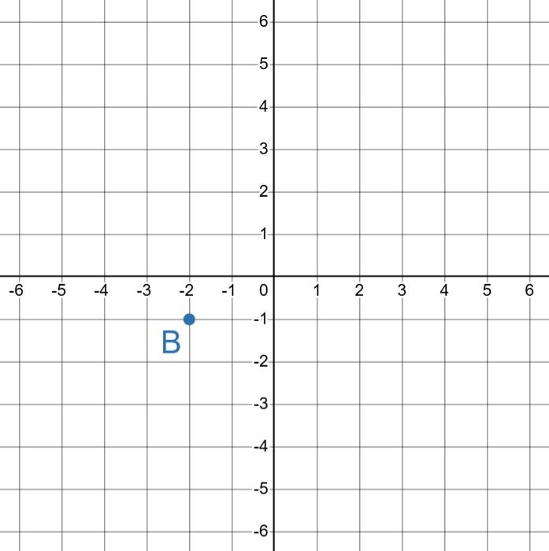
- **[E]** 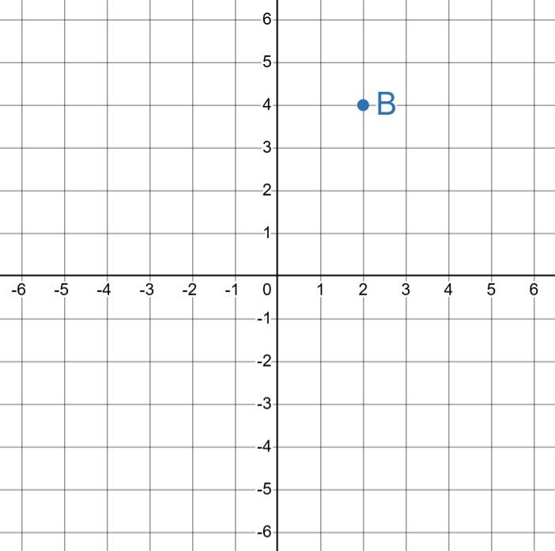

---

## Soal No. 15 `[Pilihan Ganda]`

### Stimulus / Bacaan:
SD Jaya Makmur baru saja mendapat ruangan kelas baru. Murid-murid ingin menghias kelasnya dengan memasang tali hiasan pada bagian langit-langit kelas. Tali hiasan dipasang dari pojok dinding pintu masuk ke bagian tengah langit-langit dinding papan tulis seperti pada gambar berikut.
Mereka akan membuat tali kedua yang sama seperti tali hiasan pertama untuk dipasang ke pojok yang lain pada dinding pintu.

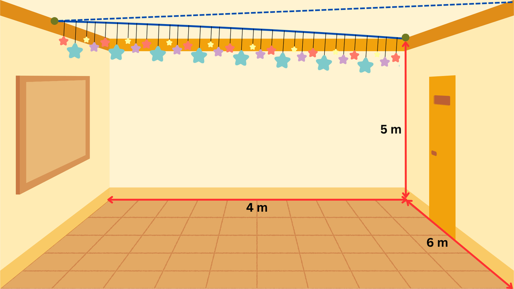

### Pertanyaan:
Apabila mereka membeli gulungan tali yang panjangnya 20 meter, berapakah sisa tali yang tidak terpakai?

### Pilihan Jawaban:
- **[A]** 6 m.
- **[B]** 10 m.
- **[C]** 11 m.
- **[D]** 13 m.
- **[E]** 15 m.

---

## Soal No. 16 `[Pilihan Ganda]`

### Stimulus / Bacaan:
Arif, seorang desain interior akan membuat suatu desain ornamen jam dinding baru. Ornamen tersebut memiliki bentuk dasar gabungan segitiga dan lingkaran. Adapun bentuk ornamen jam dan ukuran yang akan dibuat diberikan pada gambar berikut.

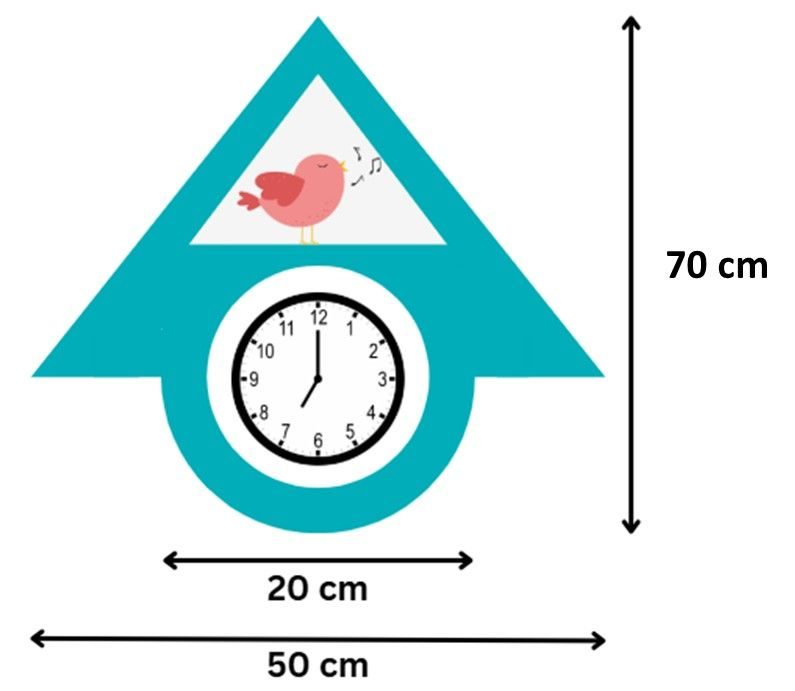

### Pertanyaan:
Di sekeliling ornamen jam tersebut akan ditempel kayu tipis untuk menambah efek tiga dimensi. Apabila Arif akan membuat dua buah ornamen jam dinding untuk dijadikan model contoh, berapa panjang kayu tipis yang ia perlukan?

### Pilihan Jawaban:
- **[A]** 322,8 cm.
- **[B]** 352,8 cm.
- **[C]** 362,8 cm.
- **[D]** 382,8 cm.
- **[E]** 445,6 cm.

---

## Soal No. 17 `[Pilihan Ganda]`

### Stimulus / Bacaan:
Perhatikan permasalahan dalam kotak berikut!
Panjang salah satu diagonal suatu layang-layang adalah 20 cm.
Berapakah keliling layang-layang tersebut?

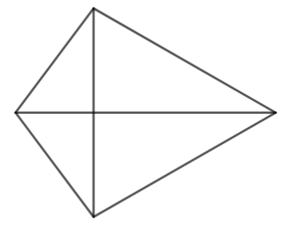

### Pertanyaan:
Putuskan apakah pernyataan (1) dan pernyataan (2) berikut cukup untuk menjawab permasalahan dalam kotak tersebut! (1) Luas layang-layang adalah 160 cm 2 . (2) Panjang salah satu sisi layang-layang adalah 10 cm.

### Pilihan Jawaban:
- **[A]** Pernyataan (1) SAJA cukup untuk menjawab pertanyaan, tetapi pernyataan (2) SAJA tidak cukup.
- **[B]** Pernyataan (2) SAJA cukup untuk menjawab pertanyaan, tetapi pernyataan (1) SAJA tidak cukup.
- **[C]** DUA pernyataan BERSAMA-SAMA cukup untuk menjawab pertanyaan, tetapi SATU pernyataan SAJA tidak cukup
- **[D]** Pernyataan (1) SAJA cukup untuk menjawab pertanyaan dan pernyataan (2) SAJA cukup.
- **[E]** Pernyataan (1) dan pernyataan (2) tidak cukup untuk menjawab pertanyaan.

---

## Soal No. 18 `[Pilihan Ganda]`

### Stimulus / Bacaan:
Pak Omar adalah seorang distributor helm. Hari ini, ia mendapat pesanan untuk mengirimkan helm yang sama dalam jumlah besar menggunakan truk. Agar kualitas terjaga, helm dikemas dalam wadah kardus helm. Adapun ukuran kardus helm dan bak truk diberikan pada gambar berikut.
Pak Omar memberikan arahan pada kurir untuk mengatur posisi atas kardus helm tidak boleh dibalik (tempat masuk kepala harus menghadap ke bawah). Semua kardus helm disusun menghadap depan (seperti pada gambar) atau menghadap samping (apabila gambar diputar 90°). Namun, apabila masih terdapat ruang kosong yang mungkin, maka penyusunan kardus helm dengan posisi berbeda untuk mengisi ruang kosong tersebut dapat dilakukan.

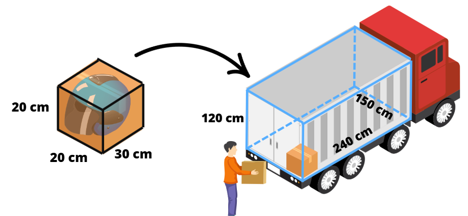

### Pertanyaan:
Berdasarkan posisi susunan tersebut, berapa paling banyak kardus helm yang dapat dimuat di truk tersebut?

### Pilihan Jawaban:
- **[A]** 336 kardus.
- **[B]** 360 kardus.
- **[C]** 384 kardus.
- **[D]** 432 kardus.
- **[E]** 504 kardus.

---

## Soal No. 19 `[Pilihan Ganda]`

### Stimulus / Bacaan:
Bu Sita, seorang desainer interior, sedang mengerjakan proyek pribadi untuk mempercantik kamar tidurnya. Ia berencana membuat beberapa hiasan lampu tidur dari bahan akrilik. Setiap hiasan akan berbentuk tabung berongga (tanpa alas dan tutup) dengan diameter 14 cm dan tinggi 25 cm. Bagian luar hiasan tabung ini akan dilapisi dengan stiker vinil motif bunga seperti pada gambar berikut.

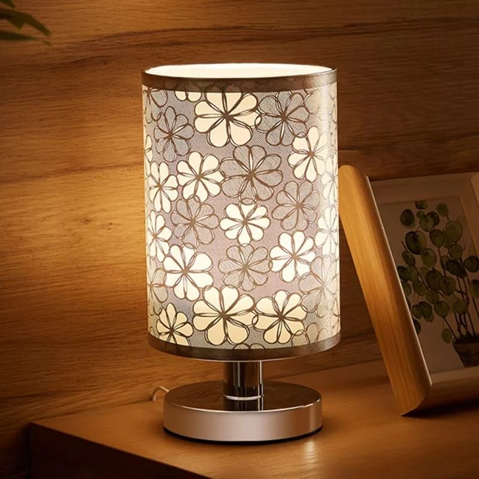

### Pertanyaan:
Stiker vinil dijual dalam lembaran, dan harga satu lembarnya adalah Rp9.000,00. Setiap lembar stiker vinil mampu menutupi area seluas 300 cm 2 . Jika Bu Sita berencana membuat 8 buah hiasan lampu tidur, berapakah biaya minimal yang harus dikeluarkan Bu Sita untuk membeli stiker vinil tersebut?

### Pilihan Jawaban:
- **[A]** Rp72.000,00.
- **[B]** Rp108.000,00.
- **[C]** Rp252.000,00.
- **[D]** Rp270.000,00.
- **[E]** Rp288.000,00.

---

## Soal No. 20 `[Pilihan Ganda]`

### Stimulus / Bacaan:
Perhatikan gambar berikut.

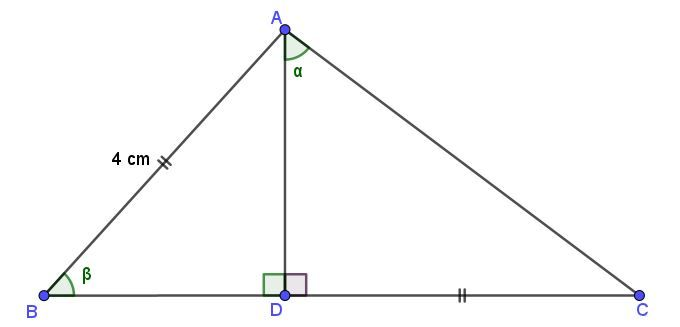

### Pertanyaan:
Jika diketahui nilai tentukan Benar atau Salah terkait perbandingan trigonometri berikut!

### Pilihan Jawaban:
- **[A]** Pernyataan
- **[B]** $\sin {(\beta )\, =\, \frac {\sqrt {7}} {4}}$ 
- **[C]** $\cos {(\beta )\, =\, \frac {\sqrt {7}} {5}}$ 
- **[D]** $\tan {(\beta )\, =\, }\frac {3\sqrt {7}} {7}$ 

---

## Soal No. 21 `[Pilihan Ganda Kompleks]`

### Stimulus / Bacaan:
Banyak siswa yang lulus di sekolah Yayasan Cahaya beragam setiap tahunnya. Berikut adalah data banyak lulusan di tiga sekolah menengah swasta milik Yayasan Cahaya.

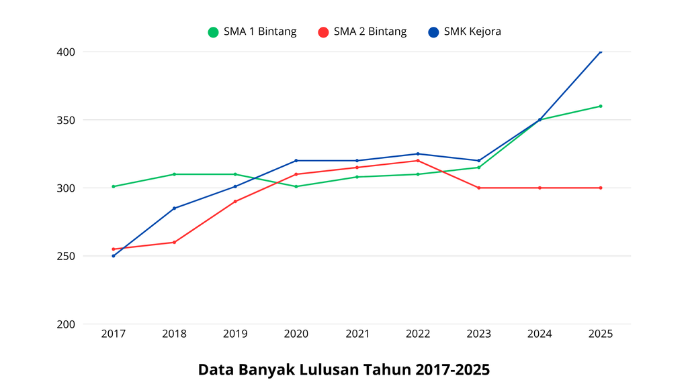

### Pertanyaan:
Berdasarkan grafik tersebut, berikut ini pernyataan mana saja yang tepat mendeskripsikan banyak lulusan di ketiga sekolah milik Yayasan Cahaya? Pilih setiap jawaban benar! Jawaban benar lebih dari satu.

### Pilihan Jawaban:
- **[A]** Banyak siswa SMA 1 Bintang yang lulus selalu bertambah mulai tahun 2020.
- **[B]** Pada tahun 2017-2020, banyak lulusan dari ketiga sekolah di yayasan Cahaya selalu bertambah.
- **[C]** Banyak lulusan SMK Kejora konsisten naik selama lima tahun terakhir.
- **[D]** Banyak lulusan SMA 2 Bintang tetap sama selama tiga tahun terakhir.
- **[E]** Banyak lulusan ketiga sekolah di tahun 2023 menurun dibanding tahun sebelumnya.

---

## Soal No. 22 `[Pilihan Ganda]`

### Stimulus / Bacaan:
Di sebuah acara bazar yang diadakan oleh suatu sekolah, terdapat 5 stan yang masing-masing dikelola oleh pedagang yang berbeda.

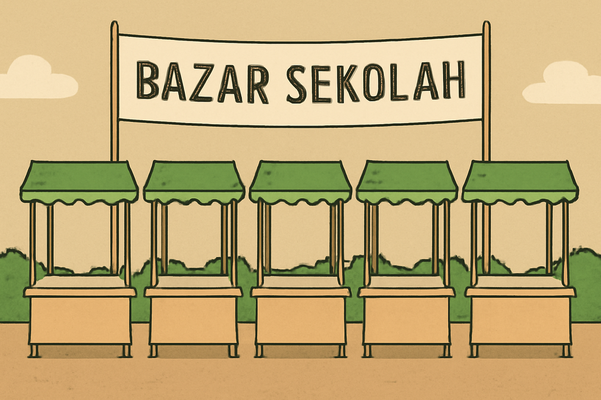

### Pertanyaan:
Dalam bazar tersebut, stan pedagang C ingin berada di antara pedagang A dan pedagang D. Banyak kemungkinan susunan atau penataan stan sesuai keinginan pedagang C tersebut adalah ....

### Pilihan Jawaban:
- **[A]** 6 susunan
- **[B]** 12 susunan
- **[C]** 120 susunan
- **[D]** 240 susunan
- **[E]** 720 susunan

---

## Soal No. 23 `[Pilihan Ganda]`

### Stimulus / Bacaan:
Perhatikan tabel distribusi data jumlah pengunjung perpustakaan Desa Sukamaju pada minggu ke-1 bulan Januari!
Pada minggu ke-1 bulan Januari tersebut, diketahui informasi sebagai berikut:
1) rata-rata pengunjung perpustakaan setiap hari adalah 6 orang,
2) selalu ada minimal dua pengunjung perpustakaan namun tidak pernah melebihi 10 pengunjung pada setiap hari buka (Senin-Jumat), dan
3) median dari data pada tabel adalah 6.

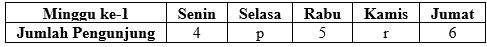

### Pertanyaan:
Tentukan Benar atau Salah pada setiap pernyataan berikut terkait jumlah pengunjung perpustakaan pada minggu ke-1 bulan Januari tersebut!

### Pilihan Jawaban:
- **[A]** Pernyataan
- **[B]** Banyak pengunjung pada hari Selasa pasti selalu lebih banyak dibandingkan hari lain.
- **[C]** Banyak pengunjung pada hari Kamis pasti lebih dari 5 orang.
- **[D]** Banyak pengunjung pada hari Jumat dan Kamis mungkin saja sama.

---

## Soal No. 24 `[Pilihan Ganda]`

### Stimulus / Bacaan:
Dalam rangka memperingati Tahun Baru Imlek, sebuah supermarket membuat kotak undian yang berisi hadiah untuk para pelanggannya. Terdapat 60 angpao yang dimasukkan ke dalam kotak tersebut. Hadiahnya terbagi dalam dua kategori, yaitu kupon belanja dan peralatan rumah tangga. Untuk hadiah kupon belanja, terdapat 15 angpao berisi kupon senilai Rp25.000,00 dan 12 angpao berisi kupon senilai Rp50.000,00. Untuk hadiah peralatan rumah tangga, terdapat 10 angpao berisi set sendok-garpu, 8 angpao berisi pemanas air, dan sisanya angpao kosong.
Rini menjadi orang pertama yang berkesempatan mengambil satu angpao secara acak dari kotak tersebut

### Pertanyaan:
Berapakah peluang Rini mengambil angpao yang kosong?

### Pilihan Jawaban:
- **[A]** $\frac {1} {15}$ 
- **[B]** $\frac {1} {5}$ 
- **[C]** $\frac {1} {4}$ 
- **[D]** $\frac {1} {3}$ 
- **[E]** $\frac {5} {11}$ 

---

## Soal No. 25 `[Pilihan Ganda]`

### Stimulus / Bacaan:
Sebuah kantin sekolah mengadakan undian berhadiah.
Hanya kertas yang kosong yang akan selalu dikembalikan lagi ke dalam kotak meskipun terambil berkali-kali . Ani akan mengambil satu buah kertas dari kotak undian. Ani adalah orang kelima yang mengambil kertas undian.

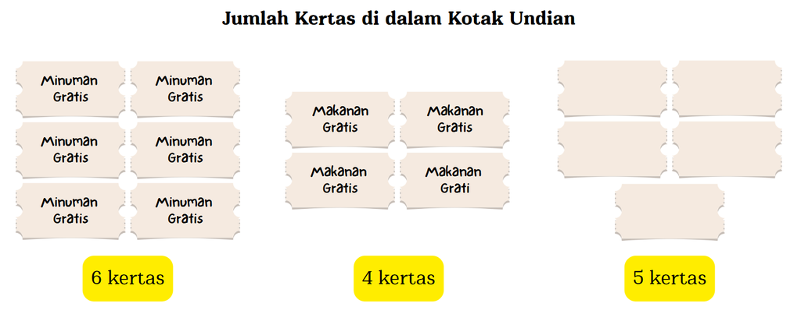

### Pertanyaan:
Kertas apa sajakah yang mungkin sudah terambil oleh orang-orang sebelumnya sehingga peluang Ani memperoleh minuman atau makanan adalah

### Pilihan Jawaban:
- **[A]** 1 minuman gratis, 1 makanan gratis, dan 2 kertas kosong.
- **[B]** 2 makanan gratis dan 2 minuman gratis.
- **[C]** 2 minuman gratis dan 2 kertas kosong.
- **[D]** 4 kertas kosong.
- **[E]** 4 minuman gratis.

---
