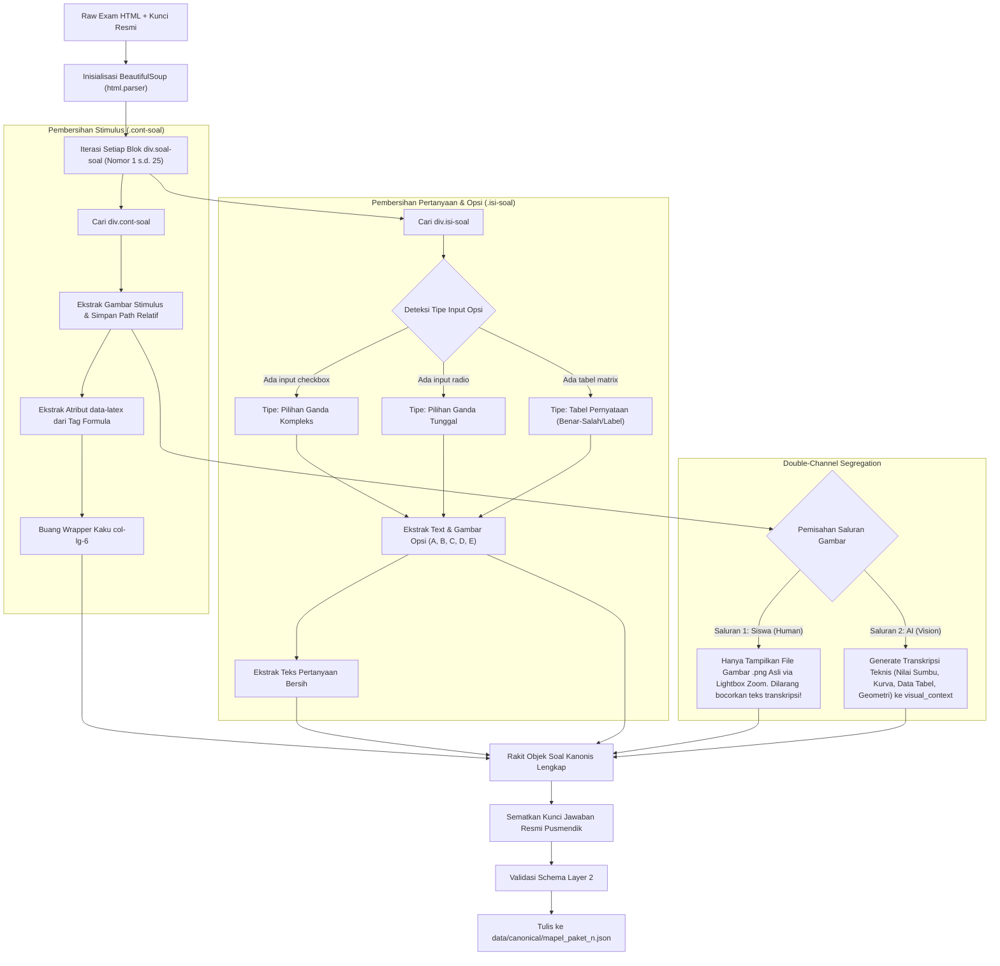
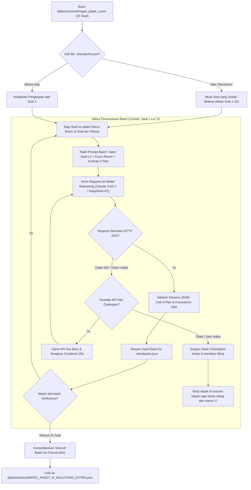
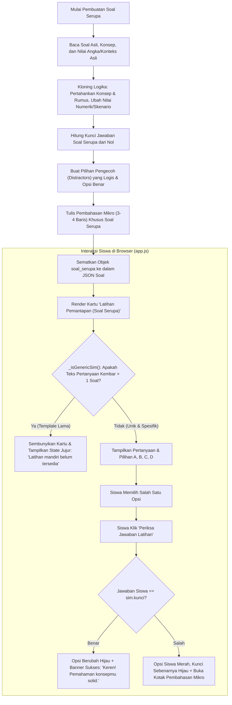
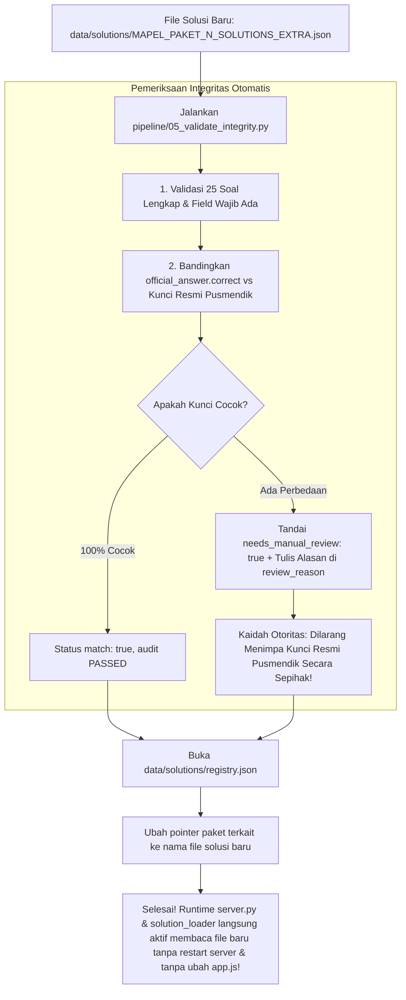
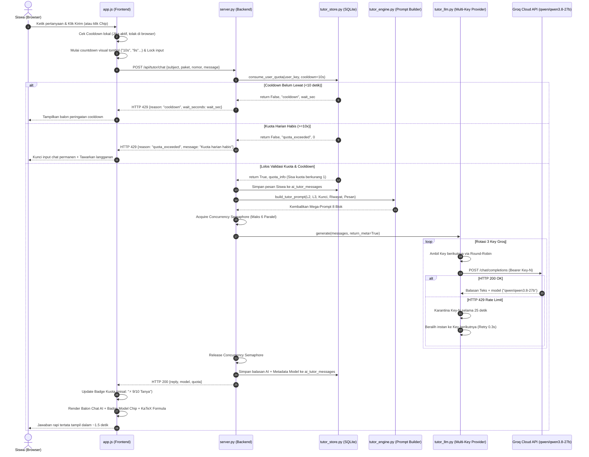

# DOKUMEN SPESIFIKASI LENGKAP & MASTER FLOWCHART END-TO-END
## SISTEM SIMULASI TKA, PIPELINE SCRAPING, DATA ENGINE KANONIS, & AI TUTOR RESILIEN
> Dokumen arsitektur teknis absolut: Tanpa simplifikasi, merinci setiap tahap dari nol (scratch) hingga produksi siap pakai, disertai flowchart visual komprehensif untuk setiap subsistem.

---

# DAFTAR ISI
1. [Master Architecture: Siklus Hidup End-to-End](#1-master-architecture-siklus-hidup-end-to-end)
2. [Fase 1: Protokol Ingress & Scraping Portal Pusmendik](#2-fase-1-protokol-ingress--scraping-portal-pusmendik)
3. [Fase 2: Normalisasi Kanonis & Double-Channel Vision Processing (Layer 2)](#3-fase-2-normalisasi-kanonis--double-channel-vision-processing-layer-2)
4. [Fase 3: Generasi Solusi Pedagogis 5 Pilar (Layer 3) & Token Resilience](#4-fase-3-generasi-solusi-pedagogis-5-pilar-layer-3--token-resilience)
5. [Fase 4: Sistem Soal Serupa (Isomorphic Drill Practice) & Anti-Pattern Guard](#5-fase-4-sistem-soal-serupa-isomorphic-drill-practice--anti-pattern-guard)
6. [Fase 5: Audit, Verifikasi Kunci Otoritatif, & Registry Hot-Swapping](#6-fase-5-audit-verifikasi-kunci-otoritatif--registry-hot-swapping)
7. [Fase 6: Runtime Serving Engine (Client CBT, Mega-Prompt, & 3-Key Groq Rotation)](#7-fase-6-runtime-serving-engine-client-cbt-mega-prompt--3-key-groq-rotation)
8. [Fase 7: Topologi Folder, File, & Skema Database SQLite](#8-fase-7-topologi-folder-file--skema-database-sqlite)

---

# 1. Master Architecture: Siklus Hidup End-to-End

Berikut adalah alur komprehensif dari awal website Pusmendik diakses hingga sistem aktif melayani siswa dengan AI Tutor di browser:

### Diagram Visual Alur Sistem (Tampilan Langsung di Mode Editor Teks):
```text
┌────────────────────────────────────────────────────────────────────────┐
│                      PORTAL RESMI PUSMENDIK CBT                        │
│             https://pusmendik.kemendikdasmen.go.id/tka/                │
└───────────────────────────────────┬────────────────────────────────────┘
                                    │
                                    ▼
┌────────────────────────────────────────────────────────────────────────┐
│                   FASE 1: SCRAPER AUTOMATION (PLAYWRIGHT)              │
│  1. Pilih Jenjang (SMA/SMP/SD) & Jenis Mapel (Wajib/Pilihan)           │
│  2. Bypass Login Demo CBT & Ambil Token via Tombol "Refresh"           │
│  3. Submit Form Data Peserta -> Masuk ke Bilik Ujian 25 Soal           │
│  4. Sedot Raw HTML Soal + Unduh Seluruh Gambar ke Lokal                │
│  5. Jump ke Soal 25 -> Selesaikan Ujian -> Sedot Kunci Resmi Pusmendik │
└───────────────────────────────────┬────────────────────────────────────┘
                                    │
                                    ▼
┌────────────────────────────────────────────────────────────────────────┐
│              FASE 2: NORMALISASI DATA KANONIS (LAYER 2)                │
│  1. Parsing HTML: Pisahkan Stimulus, Pertanyaan, dan Tabel Opsi        │
│  2. Ekstraksi Formula Matematika dari Atribut data-latex Resmi         │
│  3. Double-Channel Image Segregation:                                  │
│     ├── Channel Siswa : Gambar asli lokal (.png) via Lightbox Zoom     │
│     └── Channel AI    : Transkripsi teknis disimpan di visual_context  │
│  4. Normalisasi Tipe: PG Tunggal, PG Kompleks, Tabel Benar-Salah       │
│  5. Simpan ke: data/canonical/mapel_paket_n.json                       │
└───────────────────────────────────┬────────────────────────────────────┘
                                    │
                                    ▼
┌────────────────────────────────────────────────────────────────────────┐
│               FASE 3: GENERASI SOLUSI 5 PILAR (LAYER 3)                │
│  1. Micro-Batching: Dicicil per 5 soal agar token tidak habis          │
│  2. Model Reasoning (Claude 3.5/3.7 Sonnet / DeepSeek-R1)              │
│  3. Bangun 5 Pilar: Konsep, Glosarium, Alur Pikir, Langkah, Tips       │
│  4. Kunci Jawaban Resmi Pusmendik dikunci sebagai Ground Truth         │
│  5. Checkpoint Disk (.checkpoint.json) -> Auto-Resume jika terputus    │
└───────────────────────────────────┬────────────────────────────────────┘
                                    │
                                    ▼
┌────────────────────────────────────────────────────────────────────────┐
│               FASE 4: GENERASI SOAL SERUPA (DRILL PRACTICE)            │
│  1. Kloning Konsep Asli dengan Nilai Angka/Skenario Cerita Baru        │
│  2. Hitung Kunci Baru & Buat Opsi Pengecoh yang Logis                  │
│  3. Sediakan Pembahasan Mikro khusus untuk Soal Serupa                 │
│  4. Anti-Pattern Guard (_isGenericSim): Tolak template kembar lama!   │
└───────────────────────────────────┬────────────────────────────────────┘
                                    │
                                    ▼
┌────────────────────────────────────────────────────────────────────────┐
│             FASE 5: AUDIT, VERIFIKASI & REGISTRY INGESTION             │
│  1. Validasi Skema JSON (Semua field wajib 5 pilar terisi)             │
│  2. Cross-Check Kunci: Kunci AI vs Kunci Resmi Pusmendik               │
│     ├── Jika Cocok : match: true                                       │
│     └── Jika Beda  : Flag needs_manual_review: true (Kunci tak diubah) │
│  3. Daftarkan File Solusi Baru di data/solutions/registry.json         │
│  4. Hot-Reload Aktif Otomatis tanpa restart server / ubah kode frontend│
└───────────────────────────────────┬────────────────────────────────────┘
                                    │
                                    ▼
┌────────────────────────────────────────────────────────────────────────┐
│                  FASE 6: RUNTIME SERVING & AI TUTOR                    │
│  1. Web App CBT (index.html, style.css, app.js)                        │
│  2. Tab Tata Cara: Render Kartu 5 Pilar + Formula KaTeX                │
│  3. Kartu Latihan: Interaksi Evaluasi Mandiri Siswa (Benar/Salah)      │
│  4. Sidebar AI Tutor:                                                  │
│     ├── Proteksi User: Cooldown 10s + Kuota Harian (10x Free / 100x Sub│
│     ├── Mega-Prompt Assembly: Injeksi L2 + L3 + Kunci + Riwayat        │
│     ├── Queue Concurrency: Maksimal 6 request paralel ke Groq          │
│     └── Rotasi 3 Key Groq: Auto-quarantine 25s bila kena HTTP 429     │
│  5. Balasan Rapi dengan Formula KaTeX + Badge Model Aktual Dinamis     │
└────────────────────────────────────────────────────────────────────────┘
```

### Versi Mermaid (Tekan Ctrl+Shift+V untuk Grafik Render):
flowchart TD
    subgraph S1["FASE 1: SCRAPING PUSMENDIK"]
        A1["URL Pusmendik Simulasi TKA"] --> A2["Pilih Jenjang (SD/SMP/SMA) & Jenis Mapel (Wajib/Pilihan)"]
        A2 --> A3["Bypass Login Demo CBT & Handshake Sesi"]
        A3 --> A4["Refresh Token & Isi Konfirmasi Data Peserta"]
        A4 --> A5["Bilik Ujian: Sedot Raw HTML + Download Semua Gambar Lokal"]
        A5 --> A6["Jump Soal 25: Selesai Tes & Sedot Kunci Resmi Pusmendik"]
    end

    subgraph S2["FASE 2: NORMALISASI KANONIS (LAYER 2)"]
        A5 --> B1["Parser Ekstraksi: Pisahkan Stimulus, Prompt, dan Opsi"]
        A6 --> B1
        B1 --> B2["Ekstraksi Tag data-latex ke Array Formula KaTeX"]
        B1 --> B3["Double-Channel Vision Processing"]
        B3 --> B3a["Channel Siswa: Gambar Bersih Lokal Tanpa Transkrip Mentah"]
        B3 --> B3b["Channel AI: Transkrip Visual Teknis Disimpan di visual_context"]
        B1 --> B4["Normalisasi Tipe: PG Tunggal, PG Kompleks, Tabel Benar-Salah"]
        B2 & B3a & B3b & B4 --> B5["Simpan ke data/canonical/mapel_paket_n.json"]
    end

    subgraph S3["FASE 3 & 4: REASONING GENERATION & SOAL SERUPA"]
        B5 --> C1["Micro-Batching (Cicil 5 Soal per Prompt)"]
        C1 --> C2["Prompting ke Model Reasoning (Claude 3.5/3.7 / DeepSeek-R1)"]
        C2 --> C3["Hasilkan 5 Pilar Solusi: Konsep, Glosarium, Alur Pikir, Langkah 1-2-3, Tips, Jebakan"]
        C2 --> C4["Hasilkan Soal Serupa Unik (Isomorphic Question + Kunci + Pembahasan)"]
        C3 & C4 --> C5["Checkpointing Disk (.checkpoint.json) & Auto-Resume jika Kuota Habis"]
    end

    subgraph S4["FASE 5: AUDIT & REGISTRY INGESTION"]
        C5 --> D1["Audit Integritas Skema JSON (Semua Field Wajib Valid)"]
        D1 --> D2{"Kunci AI == Kunci Resmi Pusmendik?"}
        D2 -- "Ya (Match)" --> D3["Status match: true, lolos otomatis"]
        D2 -- "Beda (Mismatch)" --> D4["Flag needs_manual_review: true + Catatan Audit (Kunci Resmi Terkunci)"]
        D3 & D4 --> D5["Daftarkan File di data/solutions/registry.json"]
    end

    subgraph S5["FASE 6: RUNTIME SERVING ENGINE"]
        D5 --> E1["Backend HTTP Server (server.py)"]
        E1 --> E2["Frontend CBT Web App (HTML5, Vanilla CSS, app.js)"]
        E2 --> E3["Tab Tata Cara: Render Timeline 5 Pilar + Lightbox Zoom + KaTeX"]
        E2 --> E4["Kartu Soal Serupa: Evaluasi Interaktif Mandiri Siswa"]
        E2 --> E5["Sidebar AI Tutor Interaktif 2-Arah"]
        E5 --> E6["Gate Proteksi User: Cooldown 10s + Kuota Harian (SQLite)"]
        E6 --> E7["Mega-Prompt Assembly (Konteks L2 + Solusi L3 + Riwayat + Guardrails)"]
        E7 --> E8["Queue Semaphore (Maks 6 Paralel)"]
        E8 --> E9["Rotasi 3-Key Groq (Round Robin + Karantina 25s pada HTTP 429)"]
        E9 --> E10["Kirim Jawaban Rapi + Badge Model Dinamis ke UI Siswa"]
    end
```

---

# 2. Fase 1: Protokol Ingress & Scraping Portal Pusmendik

Portal Pusmendik (`https://pusmendik.kemendikdasmen.go.id/tka/simulasi_tka/`) memiliki gerbang multi-sesi yang ketat. Skrip otomatisasi Playwright (`pipeline/01_scraper_exam.py` dan `pipeline/02_scraper_kunci.py`) beroperasi dengan algoritma berikut:

### Diagram Visual Alur Fase 1 (Tampilan Langsung di Mode Editor Teks):
```text
[Buka Browser Playwright]
       │
       ▼
[Navigasi ke: https://pusmendik.kemendikdasmen.go.id/tka/simulasi_tka/]
       │
       ▼
[Pilih Dropdown #jenjang: 'sma' | 'smp' | 'sd']
       │
       ▼
[Pilih Dropdown #jenis_mapel: '1' (Wajib) | '2' (Pilihan)]
       │
       ▼
[Klik Dropdown Kustom #mapel_toggle -> Klik Opsi .mapel-option[data-value='...']]
       │
       ▼
[Klik Tombol 'Mulai Simulasi' -> Dialihkan ke Halaman /login/]
       │
       ▼
[Klik Tombol 'Login' -> Kredensial Demo Terisi Otomatis]
       │
       ▼
[Masuk ke Halaman: /konfirmasi_data/]
       │
       ▼
[Wajib: Klik Tombol 'Refresh' pada Box Token (Tunggu 1.5 detik)]
       │
       ▼
[Regex Token 6 Karakter: r"Token\s*[:=]\s*([A-Z0-9]{6})"]
       │
       ▼
[Isi Form: Nama='Peserta Simulasi', Tgl='01', Bulan='01', Tahun='2005', Token=Hasil Regex]
       │
       ▼
[Klik 'Submit' -> Dialihkan ke Halaman /konfirmasi_tes/]
       │
       ▼
[Klik Tombol 'Mulai' -> Masuk ke Bilik Ujian CBT]
       │
       ▼
[Tunggu Kontainer .soal-soal Termuat Penuh]
       │
       ├─────────────────────────────────────────┐
       ▼                                         ▼
[Sedot Seluruh innerHTML 25 Soal]       [Unduh Seluruh Gambar ke Lokal]
       │                                         │
       └────────────────────┬────────────────────┘
                            │
                            ▼
[Lompat ke Soal Nomor 25 -> Klik 'Selesai Tes' -> Konfirmasi 'Ya, Selesai']
                            │
                            ▼
[Masuk ke Halaman Rekap Hasil Ujian Pusmendik]
                            │
                            ▼
[Ekstrak Seluruh Kunci Jawaban Resmi dari Tabel Hasil Ujian]
                            │
                            ▼
[Simpan ke File: raw_html_soal.html & kunci_resmi.json]
```

### Flowchart Rinci Fase 1 (Versi Mermaid untuk Preview Ctrl+Shift+V):

```mermaid
flowchart TD
    Start(["Mulai Scraper Playwright"]) --> NavHome["Navigasi ke /tka/simulasi_tka/ (Timeout 45s)"]
    NavHome --> SelJenjang["Pilih #jenjang: 'sma', 'smp', atau 'sd'"]
    SelJenjang --> SelJenis["Pilih #jenis_mapel: '1' (Wajib) atau '2' (Pilihan)"]
    SelJenis --> ClickToggle["Klik Dropdown Kustom #mapel_toggle"]
    ClickToggle --> WaitOption["Tunggu Opsi .mapel-option Muncul"]
    WaitOption --> ClickMapel["Pilih .mapel-option data-value Spesifik"]
    ClickMapel --> ClickSimulasi["Klik button.custom-btn 'Mulai Simulasi'"]
    ClickSimulasi --> WaitLogin["Tunggu Redirect ke Halaman /login/"]
    
    WaitLogin --> ClickLogin["Klik 'Login' (Kredensial Demo Terisi Otomatis)"]
    ClickLogin --> WaitKonfirmData["Tunggu Redirect ke /konfirmasi_data/"]
    WaitKonfirmData --> ClosePopups["Tutup Modal Notifikasi / Pop-up Google jika Muncul"]
    
    ClosePopups --> ClickRefresh["Wajib: Klik Tombol 'Refresh' pada Box Token"]
    ClickRefresh --> WaitToken["Tunggu 1.5 Detik agar Token Terbarukan"]
    WaitToken --> RegexToken["Regex Body Text: r'Token\\s*[:=]\\s*([A-Z0-9]{6})'"]
    RegexToken --> FillPeserta["Isi #nama_peserta: 'Peserta Simulasi'"]
    FillPeserta --> FillDOB["Pilih #tgl: '01', #bulan: '01', #tahun: '2005'"]
    FillDOB --> FillTokenInput["Isi #input-token dengan Nilai Token Hasil Regex"]
    FillTokenInput --> SubmitData["Klik 'Submit'"]
    
    SubmitData --> WaitKonfirmTes["Tunggu Redirect ke /konfirmasi_tes/"]
    WaitKonfirmTes --> ClickMulai["Klik Tombol 'Mulai'"]
    ClickMulai --> WaitBilik["Tunggu Selector .soal-soal atau #soal-no-1 Muncul"]
    
    WaitBilik --> ScrapeExam["Ekstrak innerHTML Bilik Ujian (25 Soal Lengkap)"]
    ScrapeExam --> DownloadImgs["Download Seluruh Tag img ke data/media/... Lokal"]
    
    DownloadImgs --> JumpQ25["Navigasi Langsung ke Soal Terakhir (Nomor 25)"]
    JumpQ25 --> ClickSelesai["Klik Tombol 'Selesai Tes'"]
    ClickSelesai --> ConfirmSelesai["Konfirmasi 'Ya, Selesai' pada Dialog Konfirmasi"]
    ConfirmSelesai --> WaitHasil["Tunggu Halaman Rekap Hasil Ujian Terbuka"]
    WaitHasil --> ExtractKeys["Ekstrak Tabel Kunci Jawaban Resmi Pusmendik"]
    ExtractKeys --> SaveRaw["Simpan Raw HTML Soal & File Kunci Resmi JSON"]
    SaveRaw --> End(["Fase 1 Selesai"])
```


### Aturan Teknis Lapangan (Gotchas) Fase 1:
1. **Aturan Refresh Token**: Jika scraper langsung mengisi token default yang tampil tanpa mengklik tombol "Refresh", Pusmendik sering kali menolak dengan galat *"Token tidak valid atau kadaluarsa"*. Skrip **wajib** mengeksekusi klik `Refresh` dan menunggu minimal 1500 ms sebelum regex dijalankan.
2. **Normalisasi Path Gambar**: Gambar di Pusmendik ditulis relatif (`src="images/soal_1.png"`). Scraper mengunduh fisik file tersebut dan menyimpannya dengan skema:
   `soal_{nomor:02d}_{tipe}_{index:02d}.png`
3. **Penyedotan Kunci Bersih**: Kunci jawaban tidak diambil dari tebakan melainkan dari tabel DOM halaman reviu setelah tes diselesaikan, sehingga akurasinya 100% otoritatif.

---

# 3. Fase 2: Normalisasi Kanonis & Double-Channel Vision Processing (Layer 2)

HTML mentah dari bilik ujian tidak boleh langsung dipakai di aplikasi karena formatnya kaku (`col-lg-6` dengan inline CSS yang membuat layout rusak di HP/tablet). File mentah ini diproses menjadi **Layer 2 Canonical JSON**.

### Diagram Visual Alur Fase 2 (Tampilan Langsung di Mode Editor Teks):
```text
┌────────────────────────────────────────────────────────┐
│                   RAW EXAM HTML PUSMENDIK              │
└───────────────────────────┬────────────────────────────┘
                            │
                            ▼
            [BeautifulSoup: Loop Setiap .soal-soal]
                            │
       ┌────────────────────┴────────────────────┐
       ▼                                         ▼
[Blok Stimulus (.cont-soal)]              [Blok Pertanyaan (.isi-soal)]
 • Bersihkan wrapper col-lg-6              • Ekstrak teks pertanyaan bersih
 • Ekstrak tag img & simpan lokal          • Ekstrak tabel opsi (A s.d. E)
 • Ekstrak atribut data-latex              • Deteksi tipe: PG, Kompleks, B-S
       │                                         │
       └────────────────────┬────────────────────┘
                            │
                            ▼
        [DOUBLE-CHANNEL IMAGE PROCESSING]
        ┌───────────────────┴───────────────────┐
        ▼                                       ▼
 [CHANNEL 1: SISWA (HUMAN)]              [CHANNEL 2: AI (VISION)]
 • Siswa HANYA melihat gambar            • Transkripsikan isi gambar:
   asli lokal (.png).                      - Nilai sumbu grafik X & Y
 • Fitur Klik Zoom (Lightbox).             - Bentuk kurva & gradien
 • DILARANG membocorkan teks               - Angka ukuran / data tabel
   transkripsi bahasa Inggris            • Simpan di field "visual_context"
   ke pandangan siswa!                   • Murni sebagai mata bagi AI
        │                                       │
        └───────────────────┬───────────────────┘
                            │
                            ▼
    [Rakit Objek Soal Kanonis Lengkap (Layer 2 Single Truth)]
                            │
                            ▼
     [Simpan ke: data/canonical/sma/mapel_paket_n.json]
```

### Flowchart Rinci Fase 2 (Versi Mermaid untuk Preview Ctrl+Shift+V):


### Struktur Objek Soal Kanonis (Layer 2)
```json
{
  "id": "mtk_p2_q01",
  "nomor": 1,
  "tipe_soal": "Pilihan Ganda",
  "stimulus": {
    "html": "<p>Teks stimulus resmi...</p>",
    "images": [{"filename": "soal_01_stimulus_01.png", "rel_path": "images/soal_01_stimulus_01.png"}]
  },
  "pertanyaan": {
    "text": "Hasil dari (A ∩ B) ∪ C adalah...",
    "html": "<div class='prompt-html'>...</div>"
  },
  "formulas": [
    {"latex": "(A \\cap B) \\cup C", "source": "official data-latex"}
  ],
  "visual_context": {
    "unresolved": [],
    "items": [
      {
        "kind": "diagram",
        "description": "Diagram Venn 3 himpunan A, B, dan C dengan irisan di tengah.",
        "confidence": "high"
      }
    ]
  },
  "opsi_jawaban": [
    {"key": "A", "text": "{1, 2, 3, 4, 5}"},
    {"key": "B", "text": "{0, 2, 4, 6}"},
    {"key": "C", "text": "{2, 3, 4, 5, 7}"}
  ],
  "kunci_jawaban": "C"
}
```

---

# 4. Fase 3: Generasi Solusi Pedagogis 5 Pilar (Layer 3) & Token Resilience

Solusi pengerjaan tidak boleh berupa template generic kosong. Setiap nomor soal harus dipecahkan secara spesifik, manusiawi, dan terstruktur.

### Diagram Visual Alur Fase 3 (Tampilan Langsung di Mode Editor Teks):
```text
[Mulai Generator Solusi: data/canonical/mapel_paket_n.json]
                         │
                         ▼
           [Periksa File: .checkpoint.json]
                         │
             ┌───────────┴───────────┐
             ▼                       ▼
   [Ada File Checkpoint]    [Belum Ada Checkpoint]
   Baca soal yang sudah     Mulai pengerjaan dari
   selesai (misal no 1-10)  soal nomor 1
             │                       │
             └───────────┬───────────┘
                         │
                         ▼
        [Bagi Soal ke Micro-Batch (5 Soal per Siklus)]
        Batch 1: Soal 1-5   | Batch 2: Soal 6-10
        Batch 3: Soal 11-15 | Batch 4: Soal 16-20 | Batch 5: Soal 21-25
                         │
                         ▼
        [Rakit Prompt Pedagogis 5 Pilar + Kunci Resmi]
                         │
                         ▼
        [Panggil Model Reasoning: Claude 3.5/3.7 / DeepSeek-R1]
                         │
             ┌───────────┴───────────┐
             ▼                       ▼
     [Respons Berhasil 200]   [Galat 429 / Kuota Token Habis]
     • Validasi Schema JSON   • Cek API Key Cadangan
     • Tulis ke checkpoint    • Jika ada: Switch key & Cooldown 25s
             │                • Jika habis: Simpan checkpoint disk
             │                  dan pause aman (BISA DI-RESUME!)
             ▼
     [Apakah Ada Batch Berikutnya?]
             │
     ┌───────┴───────┐
     ▼               ▼
   [Ya]            [Tidak (Selesai 25 Soal)]
 Ulangi ke      Konsolidasikan seluruh batch ke:
 Batch Baru     data/solutions/MAPEL_PAKET_N_SOLUTIONS_EXTRA.json
```

### Flowchart Rinci Fase 3 (Versi Mermaid untuk Preview Ctrl+Shift+V):


### Standar 5 Pilar Pedagogis:
1. **Konsep Kunci**: Teori esensial Kurikulum Merdeka yang mendasari soal.
2. **Glosarium Istilah**: Definisi istilah teknis / simbol matematika yang muncul di soal.
3. **Alur Pikir Siswa (Reasoning Intuition)**: Menjawab pertanyaan *"Kenapa kita memulai dari langkah ini?"*.
4. **Langkah Penyelesaian Terstruktur (Steps)**: Tahapan konkret, bernomor `1.`, `2.`, ringkas, dan mudah dicerna.
5. **Trik Cepat & Jebakan Soal**:
   - `tips`: Jalan pintas ujian (15–30 detik).
   - `common_mistakes`: Jebakan yang sering mengecoh murid memilih opsi salah tertentu.
6. **Aturan Fleksibilitas Diketahui & Ditanyakan**:
   - Digunakan **hanya jika** soal berbentuk hitungan matematis/aljabar konkret.
   - **Dilarang dipaksakan** pada soal narasi kasus, analisis kurva ekonomi, atau teks bahasa.

---

# 5. Fase 4: Sistem Soal Serupa (Isomorphic Drill Practice) & Anti-Pattern Guard

Siswa yang selesai membaca pembahasan wajib diuji pemahamannya secara mandiri menggunakan **Soal Serupa**.

### Diagram Visual Alur Fase 4 (Tampilan Langsung di Mode Editor Teks):
```text
┌────────────────────────────────────────────────────────┐
│                   SOAL ASLI PUSMENDIK                  │
│     Konsep: Operasi Irisan & Gabungan Himpunan         │
│     Angka : A={1..5}, B={genap}, C={prima <= 10}       │
└───────────────────────────┬────────────────────────────┘
                            │
                            ▼
        [PROSES KLONING LOGIKA ISOMORFIK]
 • Pertahankan Konsep Inti 100% SAMA
 • Ubah Nilai Numerik/Variabel:
   P={1..7}, Q={ganjil}, R={prima <= 7}
 • Hitung Ulang Jawaban Benar dari Nol -> Kunci Baru: "A"
 • Buat Opsi Pilihan A, B, C, D dengan Pengecoh Realistis
 • Buat Pembahasan Mikro Ringkas (3 Baris)
                            │
                            ▼
       [Sematkan ke Objek JSON: "soal_serupa"]
                            │
                            ▼
           [INTERAKSI SISWA DI BROWSER]
                            │
                            ▼
        [Pemeriksaan Anti-Pattern: _isGenericSim()]
         Apakah teks kembar di lebih dari 1 soal?
               ┌────────────┴────────────┐
               ▼                         ▼
            [Ya]                       [Tidak]
   Sembunyikan kartu latihan      Tampilkan Pertanyaan &
   agar tidak menyesatkan!        Pilihan Opsi A, B, C, D
                                         │
                                         ▼
                             [Siswa Memilih Opsi]
                                         │
                                         ▼
                       [Klik: 'Periksa Jawaban Latihan']
                                         │
                         ┌───────────────┴───────────────┐
                         ▼                               ▼
                  [Jawaban Benar]                 [Jawaban Salah]
               • Opsi berubah HIJAU            • Opsi siswa berubah MERAH
               • Banner Sukses                 • Opsi benar berubah HIJAU
                                               • Tampilkan Pembahasan Mikro
```

### Flowchart Rinci Fase 4 (Versi Mermaid untuk Preview Ctrl+Shift+V):


---

# 6. Fase 5: Audit, Verifikasi Kunci Otoritatif, & Registry Hot-Swapping

Sebelum dokumen solusi dikonsumsi oleh siswa dan AI Tutor, sistem menjalankan audit independen.

### Diagram Visual Alur Fase 5 (Tampilan Langsung di Mode Editor Teks):
```text
┌────────────────────────────────────────────────────────┐
│     FILE SOLUSI BARU: MAPEL_PAKET_N_EXTRA.json        │
└───────────────────────────┬────────────────────────────┘
                            │
                            ▼
            [Jalankan Skrip Audit Integritas]
                            │
       ┌────────────────────┴────────────────────┐
       ▼                                         ▼
[Uji Kelengkapan 5 Pilar]                 [Uji Kesesuaian Kunci Resmi]
• concept_kunci tidak kosong              • Bandingkan kunci hasil AI vs
• glossary berisi istilah                   kunci resmi Pusmendik
• steps berisi langkah nyata              • Kunci resmi = MUTLAK!
       │                                         │
       └────────────────────┬────────────────────┘
                            │
                            ▼
             [Apakah Kunci AI Sesuai Kunci Resmi?]
               ┌────────────┴────────────┐
               ▼                         ▼
           [Cocok]                   [Berbeda]
      Tandai status:            Tandai flag:
      match: true               needs_manual_review: true
                                Tulis alasan di review_reason.
                                DILARANG ubah kunci Pusmendik!
               │                         │
               └────────────┬────────────┘
                            │
                            ▼
           [Daftarkan File di: registry.json]
           "mapel_paket_n": {
              "active_source": "MAPEL_PAKET_N_EXTRA.json"
           }
                            │
                            ▼
         [HOT-RELOAD INSTAN DI RUNTIME SERVER]
 • server.py & solution_loader membaca registry secara dinamis.
 • Tab Tata Cara & AI Tutor LANGSUNG beralih ke solusi baru
   tanpa perlu restart server dan tanpa ubah sebaris pun kode frontend!
```

### Flowchart Rinci Fase 5 (Versi Mermaid untuk Preview Ctrl+Shift+V):


---

# 7. Fase 6: Runtime Serving Engine (Client CBT, Mega-Prompt, & 3-Key Groq Rotation)

Di sinilah seluruh sistem hidup dan berinteraksi secara real-time dengan pengguna.

### Diagram Visual Alur Fase 6 (Tampilan Langsung di Mode Editor Teks):
```text
[Siswa Mengetik Pertanyaan di Sidebar AI Tutor & Klik Kirim]
                             │
                             ▼
            [Pemeriksaan Cooldown Lokal di Browser]
            Apakah countdown 10 detik sedang aktif?
                 ┌───────────┴───────────┐
                 ▼                       ▼
               [Ya]                    [Tidak]
         Abaikan klik &           Mulai hitung mundur tombol
         tunggu hitungan          ("10s", "9s"...) & Lock input
                                         │
                                         ▼
                        [POST /api/tutor/chat ke Server]
                                         │
                                         ▼
                 [Validasi Kuota & Cooldown di Database SQLite]
                       consume_user_quota(user_key)
                 ┌───────────────────────┴───────────────────────┐
                 ▼                                               ▼
         [Ditolak Server]                                 [Disetujui Server]
   • Masih cooldown -> HTTP 429                   • Kuota harian terpotong 1x
   • Kuota harian habis -> HTTP 429               • Simpan pesan ke DB SQLite
                                                                 │
                                                                 ▼
                                                  [Rakit Mega-Prompt 8 Blok]
                                                  Injeksi Soal (L2) + Solusi (L3)
                                                  + Kunci + Riwayat Chat
                                                                 │
                                                                 ▼
                                                [Antrean Concurrency Semaphore]
                                                Maksimal 6 panggilan paralel ke Groq
                                                                 │
                                                                 ▼
                                                [Rotasi 3 API Key Groq]
                                                Key 1 -> Key 2 -> Key 3
                                                                 │
                                                                 ▼
                                                [Kirim ke Model: qwen/qwen3.8-27b]
                                                                 │
                                                 ┌───────────────┴───────────────┐
                                                 ▼                               ▼
                                         [HTTP 200 Sukses]               [HTTP 429 Limit]
                                      Simpan balasan ke DB            Karantina key 25 detik,
                                      + Ambil nama model aktual       otomatis alihkan ke key
                                                 │                    berikutnya secara instan!
                                                 ▼
                                     [Kirim JSON ke Browser]
                                     • Balasan teks rapi KaTeX
                                     • Badge nama model aktual
                                     • Sisa kuota harian terupdate
                                     (Tampil dalam ~1.5 detik!)
```

### Sequence Diagram: Alur Request Chat Siswa ke AI Tutor (Versi Mermaid untuk Preview Ctrl+Shift+V):


---

# 8. Fase 7: Topologi Folder, File, & Skema Database SQLite

Berikut adalah tata letak fisik direktori proyek terstandarisasi untuk skala multi-subject dan multi-jenjang:

```text
SCRAPE_TKA/
│
├── core/                         # ENGINE UTAMA BACKEND (Universal lintas mapel)
│   ├── server.py                 # HTTP Server, Endpoint Router, & Semaphore Concurrency
│   ├── tutor_engine.py           # Mega-Prompt 8 Blok, Deteksi Intent, & Guardrails Format
│   ├── tutor_llm.py              # Provider LLM, Rotasi 3 Key Groq, & HTTP 429 Auto-Quarantine
│   ├── tutor_store.py            # SQLite Manager: ai_tutor_users, sessions, kuota, cooldown
│   └── solution_loader.py        # Dynamic Registry Reader & Validator
│
├── pipeline/                     # PIPELINE OTOMASI OFFLINE (Bisa dijalankan per Mapel)
│   ├── 01_scraper_exam.py        # Playwright: Scraping bilik ujian, soal, & download gambar
│   ├── 02_scraper_kunci.py       # Playwright: Selesaikan ujian & panen kunci resmi Pusmendik
│   ├── 03_build_canonical.py     # Parser: Normalisasi HTML mentah -> Layer 2 Canonical JSON
│   ├── 04_generate_layer3.py     # Batch Reasoning Generator: Pembuatan 5 Pilar Solusi & Soal Serupa
│   └── 05_validate_integrity.py  # Audit Runner: Cross-check kunci resmi & verifikasi schema
│
├── web/                          # FRONTEND INTERFACE LENGKAP
│   ├── index.html                # UI CBT Pusmendik modern + Sidebar AI Tutor
│   ├── style.css                 # Desain antarmuka, tipografi interaktif, chip model, KaTeX
│   └── app.js                    # Core app logic, navigasi soal, engine matematika, chat stream
│
├── data/                         # PENYIMPANAN DATA PERSISTEN
│   ├── ai_tutor.db               # SQLite Database pengguna, tier, kuota, dan riwayat chat
│   │
│   ├── raw_html/                 # Backup tangkapan mentah HTML bilik ujian dari Pusmendik
│   │   └── sma/
│   │       ├── matematika/
│   │       └── ekonomi/
│   │
│   ├── media/                    # Seluruh aset gambar soal & pilihan jawaban
│   │   └── sma/
│   │       ├── matematika/paket_1/images/ & paket_2/images/
│   │       └── ekonomi/paket_1/images/ & paket_2/images/
│   │
│   ├── canonical/                # LAYER 2: Single-Truth Canonical Questions (JSON)
│   │   └── sma/
│   │       ├── matematika_paket_1.json
│   │       ├── matematika_paket_2.json
│   │       ├── ekonomi_paket_1.json
│   │       └── ekonomi_paket_2.json
│   │
│   └── solutions/                # LAYER 3: Dokumen Pembahasan 5 Pilar Pedagogis Human-Readable
│       ├── registry.json         # Master Router penentu file solusi aktif per paket
│       ├── MTK_PAKET_2_SOLUTIONS_EXTRA.json
│       ├── EKO_PAKET_2_SOLUTIONS_EXTRA.json
│       └── ...
│
└── tests/                        # AUTOMATED PYTEST SUITE
    ├── test_api_server.py
    ├── test_tutor_conversation.py
    └── test_solution_integrity.py
```

### Skema Database SQLite (`data/ai_tutor.db`)

#### Tabel 1: `ai_tutor_users` (Pelacakan Kuota & Cooldown per Pengguna)
```sql
CREATE TABLE IF NOT EXISTS ai_tutor_users (
    user_key           TEXT PRIMARY KEY,             -- Cookie HMAC anonim atau ID Akun Login
    tier               TEXT NOT NULL DEFAULT 'free', -- 'free' (10x/hari) | 'subscriber' (100x/hari)
    daily_date         TEXT,                         -- Format 'YYYY-MM-DD' untuk reset harian
    daily_count        INTEGER NOT NULL DEFAULT 0,   -- Jumlah pertanyaan yang sudah diajukan hari ini
    last_request_time  REAL NOT NULL DEFAULT 0,      -- Timestamp unix untuk validasi cooldown 10 detik
    created_at         TEXT NOT NULL,
    updated_at         TEXT NOT NULL
);
```

#### Tabel 2: `ai_tutor_conversations` (Sesi Percakapan per Soal)
```sql
CREATE TABLE IF NOT EXISTS ai_tutor_conversations (
    id                    INTEGER PRIMARY KEY AUTOINCREMENT,
    user_key              TEXT NOT NULL,
    canonical_question_id TEXT NOT NULL,
    subject               TEXT NOT NULL,
    paket                 INTEGER NOT NULL,
    question_number       INTEGER NOT NULL,
    title                 TEXT,
    summary               TEXT,                         -- Rolling summary percakapan panjang
    message_count         INTEGER NOT NULL DEFAULT 0,
    created_at            TEXT NOT NULL,
    updated_at            TEXT NOT NULL,
    status                TEXT NOT NULL DEFAULT 'active'
);
```

#### Tabel 3: `ai_tutor_messages` (Riwayat Pesan & Metadata Model Aktual)
```sql
CREATE TABLE IF NOT EXISTS ai_tutor_messages (
    id              INTEGER PRIMARY KEY AUTOINCREMENT,
    conversation_id INTEGER NOT NULL REFERENCES ai_tutor_conversations(id),
    role            TEXT NOT NULL CHECK (role IN ('user','assistant','system')),
    content         TEXT NOT NULL,
    seq             INTEGER NOT NULL,
    request_id      TEXT,                               -- Proteksi idempotensi / double-click
    created_at      TEXT NOT NULL,
    metadata        TEXT                                -- JSON: {"model": "qwen/qwen3.8-27b", "provider": "openai_compatible", ...}
);
```

---

# 9. Ringkasan Kunci Keberhasilan (The Golden Rules)

| No | Komponen | Aturan Emas yang Menjamin Keberhasilan |
| :---: | :--- | :--- |
| **1** | **Scraping** | Wajib klik `Refresh` token sebelum submit formulir data peserta. |
| **2** | **Kunci Jawaban** | Diserap langsung dari halaman rekap hasil tes Pusmendik (Ground Truth Otoritatif). |
| **3** | **Gambar Siswa** | Tampilan siswa murni menampilkan gambar visual; transkrip teknis bahasa Inggris disembunyikan khusus untuk AI. |
| **4** | **Rumus** | Rumus diekstrak dari atribut `data-latex` agar tidak pecah oleh OCR. |
| **5** | **Pengerjaan Solusi**| Dicicil 5 soal per batch dengan checkpoint disk agar tidak terkena pemotongan token. |
| **6** | **Soal Serupa** | Dilarang keras memakai template kembar; wajib kloning konsep unik dengan angka berbeda. |
| **7** | **AI Concurrency** | Dibatasi maksimal 6 request simultan ke Groq; siswa diberi jeda cooldown 10 detik. |
| **8** | **Rotasi Key** | Otomatis rotasi 3 API key Groq; jika terkena HTTP 429, key dikarantina 25 detik secara transparan. |
